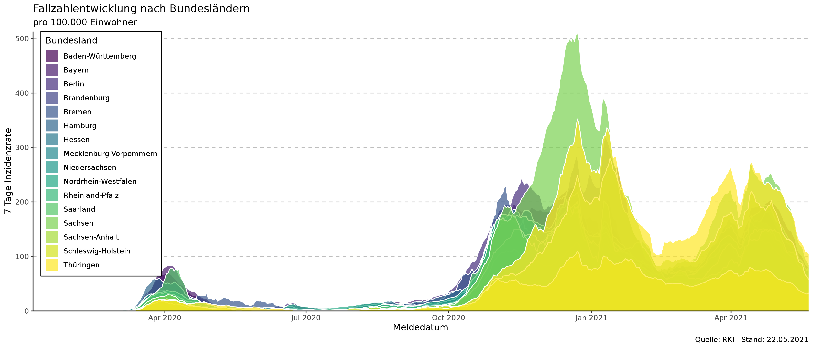
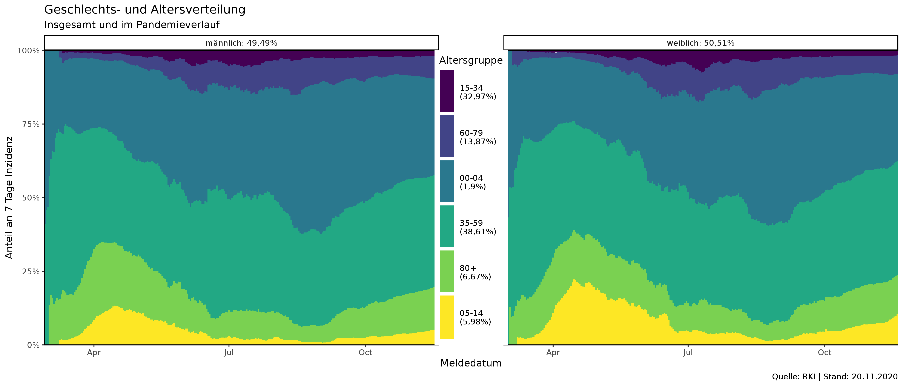
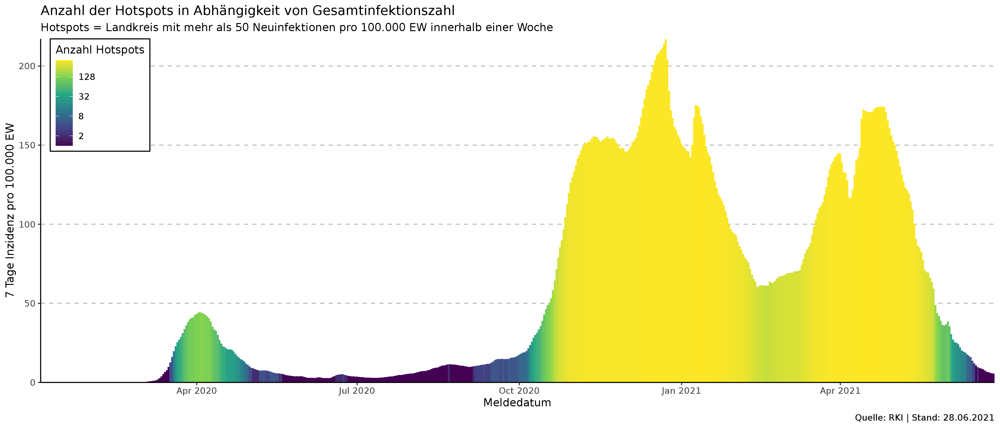
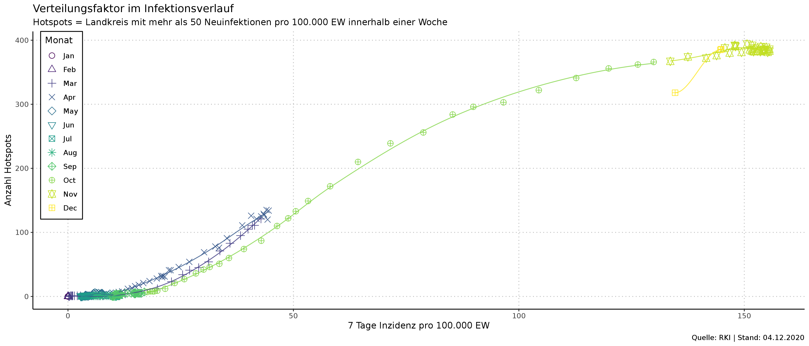

# COVID-19 Infektionen in Deutschland
Das Rohland-Koch Institut veröffentlicht seit Anfang März 2020 
auf ihrer [Website](https://www.rki.de/DE/Content/InfAZ/N/Neuartiges_Coronavirus/Fallzahlen.html) tagesaktuell die Anzahl an bekannten Corona-infizierten, aufgeschlüsselt nach Bundesland.
Diese Repo dient dazu, den Verlauf zu protokollieren, da zwar eine [Historie](https://www.rki.de/DE/Content/InfAZ/N/Neuartiges_Coronavirus/Situationsberichte/Gesamt.html) 
in PDF Dokumenten erstellt, aber keine historiesierte CSV zur verfügung gestellt wird. Das Gleiche gilt für das [Datenhub](https://npgeo-corona-npgeo-de.hub.arcgis.com/datasets/dd4580c810204019a7b8eb3e0b329dd6_0), auch hier werden nur die täglich neu übermittelten Fälle gekennzeichnet, eine Historisierung findet jedoch nicht statt. Diese
Lücke soll hier geschlossen werden.

Die Abfrage auf das Datenhub erfolgt täglich 5:00 Uhr. Es wird eine CSV erstellt, die kummulierte Infektionen und Todesfälle je Bundesland historisiert, so wie sie das RKI täglich veröffentlicht. Gleichzeitig werden die zu Grunde liegenden Daten aufbereitet. In den zusätzlichen Tabellen werden also auch Fälle berücksichtigt, die dem RKI erst später bekannt werden.

