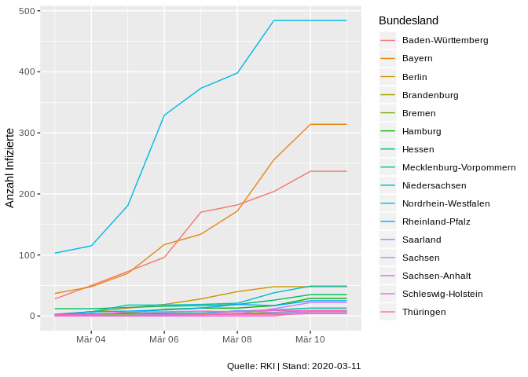

# COVID-19 Infektionen in Deutschland
Das Rohland-Koch Institut veröffentlicht seit Anfang März 2020 
auf ihrer Website tagesaktuell die Anzahl an bekannten Corona-infizierten, aufgeschlüsselt nach Bundesland.
Diese Repo dient dazu, den Verlauf zu protokollieren, da zwar eine Historie 
in PDF Dokumenten erstellt, aber keine CSV zur verfügung gestellt wird. Diese
Lücke soll hier geschlossen werden.

Hinterlegt werden die Anzahl der Infizierten und Todesfälle.

Das RKI aktualisiert jedoch teilweise verzögert, daher werden um 23:30 Uhr werden  die vom RKI am Tag veröffentlichten Daten abgefragt und in eine
CSV eingetragen. 

### Der zeitliche Verlauf
<!-- -->

Datenlieferung für NRW am 10.03.2020 scheint unvollständig zu sein. 

### Der Aktuelle Stand 
<!--html_preserve-->

<script type="application/json" data-for="htmlwidget-912557793bd1ab7c1c18">{"x":{"options":{"crs":{"crsClass":"L.CRS.EPSG3857","code":null,"proj4def":null,"projectedBounds":null,"options":{}}},"calls":[{"method":"addTiles","args":["//{s}.tile.openstreetmap.org/{z}/{x}/{y}.png",null,null,{"minZoom":0,"maxZoom":18,"tileSize":256,"subdomains":"abc","errorTileUrl":"","tms":false,"noWrap":false,"zoomOffset":0,"zoomReverse":false,"opacity":1,"zIndex":1,"detectRetina":false,"attribution":"&copy; <a href=\"http://openstreetmap.org\">OpenStreetMap<\/a> contributors, <a href=\"http://creativecommons.org/licenses/by-sa/2.0/\">CC-BY-SA<\/a>"}]},{"method":"addPolygons","args":[[[[{"lng":[9.65046024322521,9.65683937072754,9.64039993286161,9.65202808380133,9.64653968811035,9.65254974365229,9.64107894897461,9.64140987396246,9.63018035888678,9.64740753173822,9.63645935058599,9.63150024414068,9.63746929168707,9.67188930511497,9.68297863006609,9.68196868896484,9.70482921600347,9.71578884124762,9.73471069335966,9.75723075866694,9.75661087036127,9.79583930969233,9.8072690963748,9.80200862884527,9.83686828613281,9.84346008300793,9.83248996734619,9.83292961120617,9.83863925933861,9.83308029174799,9.83921813964849,9.86216926574735,9.88053894042969,9.86345005035406,9.86928939819364,9.84678936004633,9.85333061218273,9.82529926300043,9.8255796432498,9.86581993103027,9.87679004669184,9.87067890167231,9.88166046142595,9.92124938964872,9.90511894226097,9.93358993530285,9.9281587600708,9.93385028839128,9.92842960357666,9.93437862396246,9.92366027832031,9.93542957305931,9.9245786666873,9.94201946258545,10.0216703414918,10.0325603485108,10.0606698989869,10.0660009384158,10.042959213257,10.0710792541507,10.0708284378052,10.0937585830688,10.0998191833498,10.0829687118533,10.0891504287721,10.1290397644044,10.1067199707033,10.1304388046265,10.1078987121585,10.1025485992431,10.1426296234131,10.1486701965333,10.1430883407594,10.1606082916262,10.1551504135134,10.1724386215213,10.1556901931763,10.1271190643311,10.11593914032,10.1338491439822,10.116660118103,10.111349105835,10.1288299560546,10.1515302658082,10.1575202941894,10.1462087631226,10.1409692764283,10.1626691818239,10.1417598724367,10.1300907135012,10.1414203643802,10.13000869751,10.1190185546876,10.1419305801392,10.1306791305542,10.1363792419435,10.1369390487671,10.1484308242798,10.1485881805421,10.1315994262696,10.2007598876955,10.2068395614626,10.2237787246707,10.241008758545,10.2411603927613,10.2642698287967,10.2702894210815,10.253189086914,10.2420101165772,10.2247695922851,10.2135591506959,10.2595386505129,10.2597303390502,10.2539300918582,10.2483205795289,10.2713899612428,10.2603797912598,10.2774887084963,10.2948904037478,10.3062591552734,10.312189102173,10.335298538208,10.3466701507571,10.3639802932739,10.3584299087525,10.3700704574584,10.3644399642947,10.3874692916871,10.3934898376467,10.4166193008426,10.4224691390992,10.4167490005495,10.4167490005495,10.4335994720461,10.4446592330933,10.4669809341434,10.4501791000366,10.4669189453126,10.4668598175048,10.4387702941895,10.4387083053589,10.4667186737063,10.4610185623168,10.4665088653564,10.4383983612061,10.4383296966552,10.4607696533203,10.4550590515138,10.4606504440308,10.4437408447267,10.4325304031373,10.4324893951417,10.4437198638919,10.4380292892459,10.4436292648317,10.4211196899416,10.4379081726074,10.4266490936282,10.4266080856324,10.4490718841553,10.4546394348147,10.4715385437012,10.4658975601198,10.4770593643189,10.4883089065553,10.4938383102417,10.5050697326662,10.4599885940552,10.4205894470215,10.4149894714357,10.4318799972535,10.4263095855715,10.4319686889648,10.4432096481324,10.448868751526,10.4151191711426,10.398189544678,10.3981008529664,10.3586006164551,10.3474788665772,10.330499649048,10.324809074402,10.2791891098025,10.2734603881836,10.2791976928713,10.2619886398318,10.2734804153445,10.2620086669922,10.2792100906373,10.2734889984134,10.301978111267,10.3301782608033,10.3019104003909,10.3075494766236,10.3018903732299,10.3018493652345,10.3187599182129,10.3186588287353,10.32430934906,10.3073301315308,10.3072481155397,10.3185195922852,10.3015394210817,10.2562789916992,10.2505702972413,10.233570098877,10.2449407577516,10.1834497451782,10.1891498565673,10.1780185699463,10.1331901550295,10.1217489242553,10.1104898452762,10.0881795883178,10.0938386917114,10.0602903366089,10.0377902984621,10.043549537659,10.0324802398682,10.0438003540039,10.0215396881104,10.0161504745486,9.97167015075684,9.97184753417963,9.98318004608149,9.98865890502935,9.99991989135748,10.0002193450927,10.0114803314208,10.045768737793,10.0683403015139,10.0630407333374,10.0742492675782,10.0632390975952,10.0690689086917,10.0802192687989,10.0859804153445,10.0863485336306,10.0919103622437,10.1091203689577,10.120379447937,10.1370601654055,10.1427507400515,10.1372289657593,10.1428098678588,10.1372985839846,10.1431999206544,10.1267108917237,10.1379194259644,10.1213893890381,10.1161098480225,10.093999862671,10.083058357239,10.0886793136598,10.1108999252321,10.1054487228395,10.1110887527468,10.1000576019289,10.105770111084,10.0782289505007,10.0838308334351,10.1058502197266,10.089409828186,10.0949506759643,10.1059293746949,10.1114883422853,10.1004600524905,10.1336984634402,10.1116590499878,10.1171998977663,10.0896196365358,10.0896501541137,10.0676698684695,10.0842208862306,10.0787296295168,10.1172885894775,10.1117887496948,10.1283702850343,10.1394691467285,10.122850418091,10.1285381317142,10.0951404571535,10.0841302871705,10.0895986557009,10.0785303115845,10.0730514526368,10.0674781799318,10.0730514526368,10.0621109008789,10.0567207336428,10.0295095443728,10.0240516662598,9.99692058563249,9.96449089050299,9.84401988983177,9.82763957977301,9.8331775665286,9.82787895202659,9.80062961578369,9.79540920257585,9.74668979644798,9.74108982086176,9.74649810791021,9.70850086212164,9.6920175552371,9.69185829162626,9.67562007904047,9.65905857086176,9.65374946594233,9.63733863830561,9.64306926727306,9.6266002655031,9.61582946777366,9.60344600677496,9.56746578216547,9.54205894470226,9.52198410034191,9.49927425384544,9.46969223022489,9.4179744720459,9.35617828369158,9.3151683807373,9.25240802764915,9.23386669158958,9.22443294525152,9.14111900329601,9.06715583801275,9.0440149307251,9.03195667266851,9.0713529586796,9.17700290679937,9.18398857116705,9.2128696441651,9.22113990783703,9.18757057189953,9.18576335906982,9.16733264923135,9.16409492492704,9.10437965393112,9.11173820495634,9.10383987426763,8.99164009094244,8.98626041412359,9.01010417938232,8.96129608154325,8.94136524200445,8.99672508239775,9.00636959075928,8.94187164306635,8.89183425903354,8.87891864776611,8.8703937530517,8.85385227203369,8.85585689544712,8.87569618225143,8.87410640716581,8.84865188598678,8.84465408325241,8.82344055175776,8.82443237304688,8.8081903457641,8.80821609497116,8.77115821838385,8.77280521392862,8.80809783935553,8.79735946655302,8.79814815521246,8.72789001464878,8.7375059127811,8.71335124969505,8.72465801239059,8.74229717254639,8.73044586181663,8.71407508850137,8.69027328491211,8.68304729461676,8.65626907348667,8.6461324691773,8.64870643615728,8.62976264953613,8.61684894561768,8.61983776092529,8.5777988433839,8.56867599487316,8.5623283386231,8.57622814178472,8.48770904541027,8.47270584106451,8.45263099670416,8.45429229736334,8.40571308135986,8.41963577270531,8.40448093414307,8.44554328918463,8.46668815612804,8.47172641754162,8.47868061065685,8.47510719299322,8.49193286895752,8.53253173828136,8.5327262878418,8.56407642364508,8.58033275604265,8.60148429870611,8.62895870208746,8.60562229156506,8.61533355712885,8.60709667205833,8.59684658050554,8.605869293213,8.58468627929688,8.56145668029785,8.57277584075922,8.55906963348394,8.52091407775885,8.50571537017839,8.45824337005638,8.46831130981451,8.48888015747093,8.49561595916759,8.43740367889433,8.39876842498796,8.38215827941895,8.32952022552496,8.29652976989775,8.2908353805542,8.25600814819342,8.22502517700212,8.20481967926031,8.16558361053472,8.10732173919683,8.09852123260492,8.08783435821562,8.06853294372581,8.02059745788591,7.95824003219599,7.94407176971435,7.91199398040777,7.90931510925299,7.89072084426891,7.84006214141851,7.82077217102062,7.79305410385149,7.71908807754517,7.69595718383789,7.66949319839506,7.63238382339495,7.67984914779669,7.66410684585594,7.67056083679211,7.6391968727113,7.61894178390509,7.60777091979986,7.56735515594499,7.52467393875122,7.51212692260765,7.5438866615296,7.54859018325817,7.53022813796997,7.56240320205717,7.55772924423229,7.58251523971575,7.58263397216803,7.62215709686302,7.60858297348017,7.56859016418486,7.577859401703,7.59889745712309,7.59949970245384,7.64184999465937,7.66615104675321,7.69393682479853,7.74523162841814,7.73096609115606,7.73354673385631,7.76616191864036,7.76686811447161,7.80516195297247,7.8050093650819,7.84504365921021,7.89625167846702,7.96174192428589,7.97024869918835,8.01747703552275,8.03185653686523,8.06241321563743,8.08701515197782,8.10106849670433,8.14156818389915,8.1973962783814,8.24143028259289,8.29529953002935,8.31444931030268,8.36223983764654,8.37555980682396,8.36905860900885,8.38468074798612,8.38399887084967,8.40528869628952,8.40489006042492,8.38828754425043,8.38765907287592,8.49136924743652,8.45091915130632,8.4504289627078,8.49458980560297,8.50492954254145,8.49897861480741,8.46553993225098,8.46494865417509,8.49855995178245,8.5085897445681,8.49693870544456,8.44558811187756,8.4451694488526,8.46752929687494,8.44389915466331,8.41882896423334,8.42903900146484,8.46900939941435,8.55720901489286,8.59151935577415,8.62510871887201,8.61321926116938,8.60663890838617,8.59504890441895,8.60035991668718,8.69777870178217,8.68675041198736,8.69816017150873,8.70419025421143,8.68713092803983,8.68750858306885,8.68175888061552,8.7291202545166,8.74616146087641,8.7981796264649,8.80371093750006,8.82665061950701,8.82132911682157,8.83306026458746,8.83867073059088,8.90207862854021,8.90248870849632,8.8796501159668,8.86233997344971,8.86804866790766,8.8620796203615,8.82772922515892,8.83992004394554,8.83437919616705,8.81714916229254,8.80575084686291,8.81162929534912,8.80016899108887,8.81763935089106,8.84040069580072,8.84634876251226,8.85784053802496,8.89778041839611,8.90316963195829,8.90908908843988,8.92646980285639,8.93204879760737,8.95515060424822,8.93756866455101,8.93735980987555,8.94873905181896,8.95458984375006,8.96017837524437,8.95417976379395,8.98318767547607,8.98882865905784,8.99475955963152,9.04689025878912,9.06943988800066,9.08693027496338,9.10418987274176,9.110339164734,9.13329029083263,9.12137031555204,9.09233856201183,9.09220027923584,9.10375022888195,9.09790039062494,9.10931968688982,9.10894870758085,9.12640857696545,9.16664981842041,9.20138835906982,9.25874996185325,9.25291061401367,9.27009963989258,9.27552032470703,9.29259872436523,9.28067874908464,9.29791927337675,9.29765892028814,9.30913925170893,9.31462955474871,9.34930896759056,9.37195873260521,9.39526081085228,9.41805934906012,9.42918968200701,9.40589714050287,9.43382835388206,9.42761993408209,9.39859962463379,9.39357852935808,9.36501026153593,9.3647289276123,9.3531990051269,9.38728809356695,9.30702877044683,9.33554077148449,9.32351970672613,9.36345958709728,9.38025856018083,9.40331077575706,9.43115901947021,9.44816017150896,9.45429039001493,9.47140026092541,9.48773002624529,9.5102796554566,9.52180957794201,9.51671981811523,9.53388881683344,9.55047893524193,9.56198883056658,9.56256961822527,9.57377910614019,9.57923889160162,9.56760025024431,9.57227897644043,9.60031032562256,9.65565872192411,9.65614891052263,9.65046024322521],"lat":[49.7763404846192,49.7614517211914,49.7501411437988,49.7427597045898,49.7389907836914,49.7315711975099,49.7352218627932,49.7277488708499,49.727668762207,49.7203407287598,49.7127990722656,49.6978416442871,49.6904220581056,49.6831817626954,49.6907005310059,49.7130584716797,49.7131996154786,49.7244491577148,49.6836013793946,49.6912002563478,49.7061004638675,49.7249794006348,49.725078582764,49.7138710021973,49.6992492675781,49.677001953125,49.6657600402835,49.6546211242678,49.6546707153322,49.6509017944338,49.6398010253906,49.6362915039065,49.6030616760254,49.6029090881348,49.5992507934571,49.5916404724121,49.569450378418,49.5580711364746,49.5506591796876,49.5399398803712,49.5511512756347,49.5621910095218,49.5734214782716,49.5811805725098,49.5551109313966,49.5553703308105,49.547920227051,49.5479698181152,49.5405197143556,49.5331802368164,49.5145797729493,49.5036087036135,49.4887199401857,49.4778099060061,49.4785690307617,49.4934310913089,49.5047416687013,49.5158615112307,49.5230522155763,49.5343589782714,49.5417518615724,49.5382385253907,49.5272102355959,49.5196914672854,49.5049896240237,49.5053100585938,49.4903793334964,49.4611091613771,49.4535408020021,49.442440032959,49.4354286193848,49.4244384765625,49.420711517334,49.4061393737794,49.3987312316897,49.391529083252,49.3803405761718,49.3837509155275,49.3762817382814,49.3470115661622,49.3505210876465,49.335762023926,49.3212089538575,49.3251190185547,49.3141517639161,49.3103599548342,49.2919197082522,49.2792892456055,49.2588500976562,49.2697601318359,49.273551940918,49.2734413146972,49.254951477051,49.2515106201174,49.2440414428712,49.2440986633301,49.2183914184573,49.2148399353028,49.207489013672,49.1999702453614,49.1713218688965,49.1530303955078,49.1642189025879,49.1607208251955,49.1533889770508,49.1426200866699,49.1279907226564,49.1241607666017,49.1093711853028,49.1128616333008,49.0980720520022,49.0912094116211,49.0802116394044,49.0838203430177,49.0764312744141,49.0693397521974,49.0398902893069,49.0474014282227,49.036590576172,49.0440406799316,49.0331115722659,49.0260200500489,49.0334701538087,49.0299911499023,49.0189399719239,49.0117301940921,49.0043411254883,49.0045814514161,48.9899787902833,48.9865608215333,48.9792709350586,48.9792289733889,48.9682197570802,48.9717903137209,48.9495506286624,48.9382896423341,48.9384307861328,48.9272117614747,48.916130065918,48.9089889526368,48.9015998840334,48.8939704895022,48.879249572754,48.8570404052735,48.8498992919923,48.838809967041,48.8349189758304,48.8165092468262,48.8127593994141,48.8018417358398,48.8056297302246,48.7982521057129,48.7981414794924,48.7834205627444,48.7796707153321,48.776191711426,48.7612495422364,48.7576713562015,48.7502784729004,48.7426719665529,48.7315292358398,48.7387619018556,48.7351188659669,48.7165298461915,48.7164306640625,48.6941986083985,48.6903915405274,48.6686515808105,48.6653518676758,48.6728019714357,48.6726303100588,48.6874618530273,48.6948013305665,48.690990447998,48.6983299255372,48.7023620605469,48.6914405822754,48.6729621887208,48.6585922241212,48.6956214904787,48.6957321166993,48.6883888244629,48.7103996276855,48.7030296325684,48.6920700073243,48.6846008300781,48.677360534668,48.6699485778808,48.6590385437013,48.6516799926759,48.6406211853027,48.6145591735842,48.6111488342286,48.6074104309082,48.6074600219728,48.5963897705079,48.5851211547853,48.5629501342776,48.5628814697266,48.555690765381,48.5372085571291,48.5297012329102,48.5224914550782,48.5267295837402,48.5157203674317,48.5194587707519,48.5008888244629,48.4812507629395,48.4739418029785,48.4662704467774,48.4616203308107,48.4799118041992,48.4833717346193,48.4717903137207,48.4682006835939,48.4601097106935,48.4633598327638,48.452362060547,48.4410095214844,48.4338302612307,48.4222717285157,48.4073295593262,48.3842201232911,48.3731002807617,48.3658905029297,48.3734092712404,48.369899749756,48.351329803467,48.3478202819824,48.3000793457031,48.2855606079102,48.2631301879885,48.259578704834,48.2482414245605,48.2296791076661,48.2298393249514,48.215000152588,48.1851501464845,48.1852188110352,48.1368713378907,48.1220512390137,48.1184692382812,48.1035804748537,48.0997886657716,48.0960998535157,48.0923118591311,48.0512619018556,48.0361595153809,48.0213203430176,48.0099601745607,47.9800109863281,47.9760589599612,47.961009979248,47.9498596191406,47.9388694763183,47.9276084899902,47.912712097168,47.9088706970216,47.8827590942383,47.8712921142578,47.8601303100587,47.8678092956544,47.8489799499513,47.8452796936035,47.856601715088,47.8491706848146,47.8453407287598,47.8194389343263,47.8117599487305,47.8043212890625,47.8078193664552,47.8003311157227,47.7889099121094,47.7778205871583,47.7740287780763,47.7631111145022,47.7217712402344,47.7069396972659,47.7070999145508,47.6918716430666,47.6770401000978,47.6689109802247,47.6763191223147,47.6650619506835,47.6573905944826,47.638500213623,47.6459693908692,47.6611213684083,47.6648292541506,47.6836700439455,47.6761589050294,47.6911621093751,47.6837005615236,47.6538085937499,47.6790313720703,47.6751518249512,47.6715011596681,47.6603202819825,47.6525993347168,47.6377220153809,47.6074790954592,47.6147994995118,47.6185798645021,47.6031799316409,47.6066093444824,47.6140289306641,47.606330871582,47.6134719848635,47.605899810791,47.6055488586426,47.5905685424805,47.5939712524416,47.5823020935061,47.5888748168948,47.5864715576173,47.6003532409668,47.6379928588867,47.6525230407716,47.6517791748047,47.6698684692383,47.6640434265137,47.6769676208499,47.708381652832,47.7250671386721,47.7482109069825,47.776496887207,47.8199272155764,47.8236885070801,47.8126983642578,47.7835350036622,47.7377548217775,47.7095603942872,47.6899528503417,47.6681518554688,47.6692504882814,47.6577377319338,47.66219329834,47.6535835266113,47.6899032592773,47.695022583008,47.7048873901368,47.747985839844,47.742515563965,47.7301635742188,47.7419967651367,47.7318229675295,47.7102661132812,47.6950912475588,47.6619606018066,47.6552238464358,47.6586837768557,47.6791305541995,47.6837692260744,47.6998825073244,47.697406768799,47.7076416015625,47.7058677673342,47.7162895202638,47.7156372070312,47.7214698791504,47.729228973389,47.7416801452637,47.7197685241699,47.7114639282228,47.6992340087891,47.6904220581056,47.6799087524415,47.6968421936037,47.7212409973144,47.7356224060061,47.7497825622559,47.7527999877929,47.7661094665529,47.770793914795,47.7629127502444,47.7914848327637,47.8057861328126,47.7965354919435,47.7710456848145,47.7659721374514,47.7894515991211,47.8040428161621,47.8068428039552,47.8143997192384,47.7999725341797,47.7890777587891,47.7796821594239,47.7700996398926,47.7461814880372,47.7297210693359,47.706298828125,47.689395904541,47.6793937683106,47.6593856811523,47.6615524291994,47.6434631347657,47.6445465087891,47.6544380187989,47.647472381592,47.6506462097171,47.6667861938476,47.6749572753907,47.6676750183105,47.6770133972168,47.6513519287109,47.6419715881348,47.6501846313476,47.6566619873048,47.6471939086914,47.6168937683107,47.6003112792971,47.6036682128906,47.6163330078127,47.6276054382324,47.6380958557129,47.621463775635,47.6053199768068,47.5884513854982,47.5930137634278,47.5851631164553,47.5714073181153,47.5801811218262,47.5702171325684,47.5749244689944,47.5935287475587,47.6139068603517,47.6202774047852,47.6114692687991,47.6262741088868,47.6002693176271,47.5874557495117,47.5659523010255,47.5628852844239,47.5705261230469,47.5564270019532,47.5641746520998,47.5497016906739,47.5563659667969,47.5783195495607,47.5936355590823,47.5888862609863,47.5946998596194,47.5638275146484,47.5488815307618,47.5373649597167,47.5371170043945,47.5624237060548,47.5709114074708,47.5878753662109,47.5932617187502,47.5970420837403,47.5809135437012,47.5809593200686,47.6317367553713,47.6601943969727,47.6960906982422,47.722583770752,47.735408782959,47.7834434509277,47.841018676758,47.8809471130371,47.8982620239258,47.9298896789552,47.9736595153809,48.0003242492676,48.0363388061526,48.1213912963868,48.1354293823242,48.1556320190429,48.2039947509768,48.2210998535156,48.3021202087405,48.3298263549806,48.3822059631348,48.3986854553224,48.4639739990237,48.4868011474611,48.5135002136232,48.5931930541992,48.6455307006837,48.6672096252442,48.72025680542,48.7562294006348,48.7627525329592,48.7881469726562,48.7891883850098,48.8020133972169,48.8158149719239,48.8960723876953,48.9571037292483,48.9688415527346,49.0041503906251,49.0569992065431,49.0996894836427,49.1560287475587,49.1706504821779,49.1898422241211,49.2009620666503,49.2203521728516,49.2277297973634,49.2233886718752,49.2344818115236,49.3012886047363,49.3218307495117,49.3328514099123,49.3602485656738,49.3863220214844,49.3934288024902,49.3775291442872,49.3922004699708,49.4044418334961,49.441478729248,49.4483985900879,49.4502601623535,49.4612503051758,49.4730415344241,49.4942512512208,49.5521888732911,49.5856208801271,49.5906219482422,49.523811340332,49.524971008301,49.5517120361329,49.5659904479982,49.5951004028321,49.598388671875,49.6132316589358,49.6272010803224,49.608570098877,49.6125602722167,49.601749420166,49.5939521789551,49.5793113708497,49.5791397094728,49.522029876709,49.5298118591309,49.5165519714356,49.5276222229004,49.5317993164062,49.5097999572754,49.4991188049316,49.506530761719,49.5113410949707,49.4894485473632,49.4744987487793,49.4741897583007,49.4779396057129,49.4887695312501,49.4771308898927,49.4409599304199,49.4299316406249,49.4295387268067,49.4256401062011,49.4184989929201,49.4182319641113,49.4040908813479,49.4154891967775,49.4046897888184,49.4049110412598,49.4310302734376,49.452980041504,49.4457588195801,49.4459686279297,49.4569816589355,49.4608688354492,49.471649169922,49.4826087951661,49.4937019348146,49.4901084899902,49.5011405944825,49.5120506286621,49.5087013244629,49.5160789489746,49.5088119506838,49.5055122375489,49.5350112915042,49.5277290344238,49.5314521789552,49.513038635254,49.5204010009766,49.5388412475585,49.5461387634278,49.5534896850587,49.5535316467287,49.5571899414062,49.5645904541015,49.5830001831057,49.5756912231445,49.5830917358398,49.5755920410157,49.5864486694338,49.5901718139648,49.5938110351562,49.6085815429688,49.6159210205078,49.6344604492188,49.6344108581545,49.6455116271974,49.6454696655273,49.6565589904786,49.6453704833987,49.6564292907714,49.6415710449221,49.6452293395998,49.6563415527343,49.671199798584,49.6934204101563,49.7119598388672,49.7304916381837,49.704559326172,49.7045822143556,49.715690612793,49.719409942627,49.726791381836,49.7379608154298,49.7416305541992,49.7675399780273,49.7675209045411,49.7786407470703,49.7675399780273,49.7861289978027,49.7861709594728,49.771339416504,49.7676696777345,49.7863006591797,49.7863998413089,49.7790222167969,49.7641105651858,49.7567520141602,49.764289855957,49.7569122314453,49.7420196533203,49.7420997619629,49.7458610534669,49.7569503784182,49.7793502807618,49.7758712768556,49.7875595092773,49.7763710021974,49.7763404846192]}],[{"lng":[8.7083730697633,8.72245121002237,8.69212532043457,8.67433071136514,8.66130828857416,8.67653846740728,8.66724967956583,8.7083730697633],"lat":[47.7155570983887,47.6965293884278,47.6993370056152,47.6902046203613,47.6952133178713,47.7036056518556,47.7170295715333,47.7155570983887]}]],[[{"lng":[10.1338596343996,10.1398000717164,10.1515598297119,10.1515007019045,10.1809291839602,10.1749897003177,10.1808490753174,10.2043199539185,10.2044086456298,10.2338600158691,10.2281093597415,10.2340097427368,10.2574987411502,10.3105297088624,10.3339891433715,10.3340482711793,10.3458290100098,10.3400993347168,10.3696708679199,10.3814201354982,10.3696889877319,10.4050197601318,10.405089378357,10.3875188827517,10.3935203552246,10.4287796020508,10.4405002593995,10.4404382705689,10.4580583572388,10.4640998840332,10.4994697570804,10.4936704635622,10.5171489715576,10.5230798721315,10.534730911255,10.5582895278931,10.5525188446045,10.5643205642701,10.6054887771609,10.5938987731935,10.6116285324098,10.5999088287354,10.6058187484741,10.5941286087037,10.6058902740478,10.6000604629517,10.6177597045901,10.6060485839843,10.6120214462283,10.6413898468019,10.6647691726685,10.6647987365723,10.6881475448609,10.7230186462405,10.7345790863039,10.734558105469,10.7460699081421,10.7575893402102,10.8036184310913,10.80938911438,10.8266582489015,10.8553800582887,10.8495588302612,10.8093004226684,10.803539276123,10.8092708587649,10.7747898101809,10.7172508239747,10.7343101501464,10.7341499328615,10.7168912887576,10.7222986221316,10.7570104599,10.7911491394042,10.8085298538207,10.8313302993774,10.8716192245484,10.8772802352905,10.8946590423586,10.9404602050781,10.963680267334,10.998330116272,11.003999710083,10.9924793243411,10.9981107711792,11.038369178772,11.0326986312866,11.044249534607,11.0843896865848,11.0901098251342,11.1132392883301,11.1190185546877,11.1189889967614,11.1421594619752,11.1363382339479,11.1594104766845,11.1593885421756,11.1306791305542,11.1308002471923,11.1423797607421,11.1826391220094,11.1712799072268,11.1884889602663,11.1883802413943,11.199760437012,11.2516689300537,11.2632608413697,11.2519788742065,11.269528388977,11.2580900192261,11.264100074768,11.2757482528687,11.2642889022827,11.2818202972412,11.2819471359253,11.276300430298,11.2646903991702,11.2706003189089,11.2590188980103,11.2710485458375,11.2478399276733,11.2537498474121,11.2481184005737,11.2891092300417,11.294899940491,11.3008508682252,11.3242597579958,11.324499130249,11.3479309082032,11.3421602249148,11.3480606079102,11.4300909042359,11.441628456116,11.4356594085694,11.4180994033816,11.4236803054811,11.4175081253055,11.4523897171021,11.446418762207,11.4641780853271,11.4817886352541,11.4874496459963,11.4813194274905,11.5165004730225,11.5220499038699,11.5929584503173,11.6337585449219,11.6984300613404,11.7044582366945,11.727830886841,11.7456903457643,11.7690401077272,11.7516498565673,11.7870292663574,11.8157596588136,11.833299636841,11.8213691711426,11.8271007537844,11.8683385848999,11.8864107131958,11.9392709732057,11.9559593200683,11.9497070312501,11.9838867187501,11.988684654236,11.9758920669557,11.9813232421877,11.9988594055177,11.9984741210938,12.0319147109986,12.0313110351563,12.0874691009521,12.1034984588623,12.1250181198122,12.1296453475952,12.1371698379519,12.1087608337404,12.0858602523804,12.1003665924072,12.1017799377444,12.1156959533694,12.1172370910645,12.1605157852176,12.162516593933,12.1989192962647,12.2102804183959,12.1933689117433,12.1990604400638,12.2612371444704,12.2727289199831,12.2560300827026,12.3157844543459,12.3256998062135,12.3472356796264,12.3472499847412,12.3644390106201,12.4370203018191,12.4322977066043,12.4683113098146,12.4753007888795,12.4891490936281,12.4972295761111,12.4866008758548,12.4727621078493,12.475679397583,12.5477361679077,12.5513439178467,12.5196847915651,12.5192785263061,12.5025863647461,12.5015106201175,12.4842281341553,12.4725999832154,12.4783086776733,12.4780988693238,12.4682626724243,12.4720726013185,12.4087495803836,12.4028902053832,12.4197702407836,12.4312286376953,12.4437732696536,12.4796829223633,12.4992504119875,12.5278596878052,12.5336008071901,12.5204849243164,12.5316495895386,12.5253705978396,12.5366601943971,12.5338973999024,12.5648183822635,12.5588493347169,12.5803709030154,12.5739097595218,12.5880517959595,12.5962038040162,12.6458301544191,12.6458053588867,12.6328067779542,12.6540441513062,12.6610746383668,12.7103748321534,12.7117662429812,12.7597303390505,12.7590599060059,12.7823019027709,12.7841053009035,12.8483085632326,12.8763008117676,12.8826551437378,12.8767499923707,12.952889442444,12.9932184219361,12.9986486434937,13.0103893280029,13.0101089477539,13.0335893630984,13.0379295349122,13.0613994598391,13.0609884262087,13.0957698822022,13.092511177063,13.114272117615,13.1175355911256,13.1386289596558,13.1623096466064,13.1804609298705,13.186179161072,13.1802101135254,13.2142601013185,13.2441282272342,13.295909881592,13.3393602371217,13.3604993820192,13.3769292831421,13.3819503784183,13.4037294387817,13.407247543335,13.4127588272096,13.4067811965942,13.4224300384521,13.4016208648682,13.4226007461551,13.4238376617433,13.4589939117434,13.4676227569581,13.4811859130859,13.4965877532958,13.5095376968384,13.5101985931399,13.5885057449343,13.5981464385986,13.6312599182129,13.6250286102297,13.652955055237,13.6665048599244,13.6713304519653,13.7230730056763,13.7329483032226,13.7324380874634,13.7513427734377,13.7628049850466,13.7899856567382,13.7947196960449,13.7888803482057,13.8099899291993,13.804204940796,13.8358602523804,13.8179349899292,13.8104391098025,13.7987489700317,13.8042993545532,13.7870588302612,13.8144683837893,13.8162641525271,13.8101291656496,13.8257198333741,13.8158273696902,13.8012895584107,13.8099441528321,13.8021497726443,13.7804431915286,13.7633152008056,13.7578821182252,13.7508506774902,13.7400226593019,13.7319316864015,13.7210922241212,13.6615772247315,13.6476106643676,13.5944290161136,13.5671548843384,13.5194892883301,13.5031585693359,13.4970188140872,13.5019989013674,13.4849691390991,13.4743194580078,13.4738492965698,13.4572982788089,13.4470901489258,13.4357490539551,13.4350700378421,13.4507093429567,13.4443502426147,13.4545402526857,13.4238700866699,13.4366741180421,13.4106187820437,13.285719871521,13.2471275329592,13.1848526000979,13.1412687301636,13.0905942916871,13.0208892822268,12.9631881713867,12.8682146072388,12.8559894561767,12.8388795852662,12.8385992050173,12.8035259246828,12.7871484756471,12.7648601531983,12.7644681930541,12.7530288696291,12.7575492858887,12.8597087860107,12.8812990188599,12.9114542007447,12.9220476150514,12.9389362335206,13.0011472702028,12.9656887054444,12.9376850128174,12.9493198394775,12.9363584518433,12.9238319396975,12.9112672805788,12.9307203292847,12.951469421387,12.9565286636353,12.9852981567385,13.015259742737,13.0435390472415,13.0629940032962,13.0815553665161,13.0781211853027,13.105588912964,13.0660963058474,13.0764503479004,13.0478792190552,13.0533599853515,13.0647792816164,13.0363512039185,13.0533008575442,13.0537500381471,13.0240888595583,13.0134639739992,12.9791488647462,12.9792404174807,12.9698638916016,12.9130592346193,12.8848085403443,12.8572196960451,12.8459272384645,12.8229141235354,12.7998180389404,12.7813129425051,12.7988595962525,12.8266773223877,12.7710886001586,12.7645530700684,12.7791461944582,12.7827720642091,12.7610292434695,12.7366971969607,12.6739892959596,12.6529502868652,12.6276702880861,12.6053342819214,12.5773468017578,12.5323839187622,12.5060644149783,12.4667396545411,12.4402570724487,12.435962677002,12.3654851913453,12.3297185897829,12.2587795257568,12.2480497360232,12.2705392837525,12.2542791366578,12.231908798218,12.2098093032837,12.1743516921998,12.2165622711182,12.2208938598635,12.2092800140382,12.1874589920045,12.1875505447387,12.1489486694336,12.0883808135989,12.0718708038331,12.038829803467,12.0387983322146,12.0277900695801,12.016809463501,11.9837388992312,11.9231481552125,11.8624801635742,11.8568687438967,11.7962799072266,11.7792091369629,11.7768526077273,11.6676912307742,11.6363439559938,11.6253585815431,11.6143302917482,11.6087598800662,11.5929555892947,11.5976009368898,11.5810203552246,11.5258703231812,11.5148181915283,11.4872293472291,11.4540290832522,11.4484701156617,11.4373798370361,11.388031959534,11.413872718811,11.4240808486941,11.3416061401369,11.3244533538821,11.2938966751101,11.2905902862552,11.2739000320436,11.224139213562,11.257429122925,11.2460584640505,11.1511888504029,11.1104898452759,10.9775209426879,10.9648666381836,10.9786701202395,10.9785099029542,10.9218807220461,10.9265089035037,10.8629989624023,10.8704023361207,10.9185943603516,10.8976507186889,10.8831329345706,10.8453111648561,10.7720251083374,10.7463674545289,10.6914138793946,10.6862201690676,10.6268491744998,10.6000604629517,10.5814208984376,10.5752992630005,10.5613813400271,10.4911098480225,10.4534292221069,10.4777336120608,10.4322452545167,10.4334115982059,10.4517965316776,10.4363927841187,10.4332342147831,10.4384460449219,10.462830543518,10.4715690612795,10.4357910156254,10.4229297637944,10.4335803985596,10.4173393249513,10.3899993896484,10.3841800689698,10.3510694503785,10.3452501297,10.323238372803,10.285008430481,10.2747497558597,10.263249397278,10.231559753418,10.1975507736205,10.1701688766483,10.1646881103515,10.1707086563113,10.1925182342529,10.209129333496,10.1930608749391,10.2317285537724,10.2268695831302,10.209810256958,10.178505897522,10.1606607437137,10.1173496246338,10.0959606170654,10.0806608200077,10.0843296051028,10.0688323974612,10.0948190689087,10.1008195877076,10.0907554626466,10.0666103363041,10.0499105453495,10.0438995361333,9.99733829498297,9.99221038818405,9.96118831634521,9.97118663787859,9.95506381988537,9.92060565948532,9.9060583114624,9.8810024261474,9.87366962432867,9.81312942504883,9.82386589050333,9.81830024719284,9.82261180877686,9.801539421082,9.77421855926536,9.76340961456305,9.747239112854,9.74744033813471,9.7356328964234,9.71459484100353,9.68952083587658,9.68718624114996,9.66073417663608,9.61636924743658,9.61108493804971,9.6266002655031,9.64306926727306,9.63733863830561,9.65374946594233,9.65905857086176,9.67562007904047,9.69185829162626,9.69201755523727,9.70303058624262,9.7355489730835,9.74649810791021,9.74122905731207,9.75757026672363,9.75202083587652,9.79540920257602,9.80068874359176,9.79521942138666,9.82787895202677,9.83317756652878,9.82763957977301,9.84401988983194,9.96449089050299,9.99692058563267,10.0240516662598,10.029509544373,10.0567207336428,10.0621109008789,10.0730514526368,10.0674781799318,10.0730514526368,10.0785303115845,10.0895986557009,10.0841302871705,10.0951404571535,10.1285381317143,10.1228504180912,10.1394691467285,10.1283702850343,10.1117887496948,10.1172885894775,10.0787296295169,10.0842208862306,10.0676698684697,10.0896501541137,10.0896196365358,10.1171998977665,10.1116590499878,10.1336984634403,10.1004600524905,10.1114883422853,10.1059293746949,10.0949506759643,10.089409828186,10.1058502197266,10.0838308334351,10.0782289505007,10.105770111084,10.1000576019289,10.1110887527468,10.1054487228395,10.1108999252321,10.0886793136598,10.083058357239,10.093999862671,10.1161098480225,10.1213893890381,10.1379194259644,10.1267108917237,10.1431999206544,10.1372985839846,10.1428098678588,10.1372289657593,10.1427507400515,10.1370601654055,10.120379447937,10.1091203689577,10.0919103622437,10.0863485336306,10.0859804153445,10.0802192687989,10.0690689086917,10.0632390975952,10.0742492675782,10.0630407333374,10.0683403015139,10.045768737793,10.0114803314208,10.0002193450927,9.99991989135748,9.98865890502935,9.98318004608149,9.97184753417963,9.97167015075684,10.0161504745486,10.0215396881104,10.0438003540039,10.0324802398682,10.043549537659,10.0377902984621,10.0602903366089,10.0938386917114,10.0881795883178,10.1104898452762,10.1217489242553,10.1331901550295,10.1780185699463,10.1891498565673,10.1834497451782,10.2449407577516,10.233570098877,10.2505702972413,10.2562789916992,10.3015394210817,10.3185195922852,10.3072481155397,10.3073301315308,10.32430934906,10.3186588287353,10.3187599182129,10.3018493652345,10.3018903732299,10.3075494766236,10.3019104003909,10.3301782608033,10.301978111267,10.2734889984134,10.2792100906373,10.2620086669922,10.2734804153445,10.2619886398318,10.2791976928713,10.2734603881836,10.2791891098025,10.324809074402,10.330499649048,10.3474788665772,10.3586006164551,10.3981008529664,10.398189544678,10.4151191711426,10.448868751526,10.4432096481324,10.4319686889648,10.4263095855715,10.4318799972535,10.4149894714357,10.4205894470215,10.4599885940552,10.5050697326662,10.4938383102417,10.4883089065553,10.4770593643189,10.4658975601198,10.4715385437012,10.4546394348147,10.4490718841553,10.4266080856324,10.4266490936282,10.4379081726074,10.4211196899416,10.4436292648317,10.4380292892459,10.4437198638919,10.4324893951417,10.4325304031373,10.4437408447267,10.4606504440308,10.4550590515138,10.4607696533203,10.4383296966552,10.4383983612061,10.4665088653564,10.4610185623168,10.4667186737063,10.4387083053589,10.4387702941895,10.4668598175048,10.4669189453126,10.4501791000366,10.4669809341434,10.4446592330933,10.4335994720461,10.4167490005495,10.4167490005495,10.4224691390992,10.4166193008426,10.3934898376467,10.3874692916871,10.3644399642947,10.3700704574584,10.3584299087525,10.3639802932739,10.3466701507571,10.335298538208,10.312189102173,10.3062591552734,10.2948904037478,10.2774887084963,10.2603797912598,10.2713899612428,10.2483205795289,10.2539300918582,10.2597303390502,10.2595386505129,10.2135591506959,10.2247695922851,10.2420101165772,10.253189086914,10.2702894210815,10.2642698287967,10.2411603927613,10.241008758545,10.2237787246707,10.2068395614626,10.2007598876955,10.1315994262696,10.1485881805421,10.1484308242798,10.1369390487671,10.1363792419435,10.1306791305542,10.1419305801392,10.1190185546876,10.13000869751,10.1414203643802,10.1300907135012,10.1417598724367,10.1626691818239,10.1409692764283,10.1462087631226,10.1575202941894,10.1515302658082,10.1288299560546,10.111349105835,10.116660118103,10.1338491439822,10.11593914032,10.1271190643311,10.1556901931763,10.1724386215213,10.1551504135134,10.1606082916262,10.1430883407594,10.1486701965333,10.1426296234131,10.1025485992431,10.1078987121585,10.1304388046265,10.1067199707033,10.1290397644044,10.0891504287721,10.0829687118533,10.0998191833498,10.0937585830688,10.0708284378052,10.0710792541507,10.042959213257,10.0660009384158,10.0606698989869,10.0325603485108,10.0216703414918,9.9817104339599,9.95921039581316,9.9245786666873,9.93542957305931,9.92366027832031,9.93437862396246,9.92842960357666,9.93385028839128,9.9281587600708,9.93358993530285,9.90497970581066,9.92124938964872,9.88166046142595,9.87067890167231,9.87679004669184,9.86581993103027,9.8255796432498,9.82529926300043,9.85333061218273,9.84678936004633,9.88039970397978,9.86216926574735,9.83921813964849,9.83248996734619,9.84346008300793,9.84302043914795,9.81342983245855,9.80200862884527,9.8072690963748,9.75661087036127,9.75723075866694,9.74041080474876,9.72245979309082,9.71578884124762,9.70482921600347,9.68196868896484,9.68297863006609,9.66048812866228,9.63150024414068,9.63645935058599,9.64757919311546,9.63018035888678,9.64140987396246,9.64107894897461,9.65254974365229,9.64653968811035,9.65202808380133,9.64039993286161,9.65683937072754,9.65046024322521,9.65614891052263,9.65565872192411,9.60031032562256,9.57227897644043,9.56760025024431,9.57923889160162,9.57377910614019,9.56256961822527,9.56198883056658,9.55047893524193,9.53388881683344,9.51671981811523,9.52180957794201,9.5102796554566,9.48773002624529,9.47140026092541,9.45429039001493,9.44816017150896,9.43115901947021,9.40331077575706,9.38025856018083,9.36345958709728,9.32351970672613,9.33554077148449,9.30702877044683,9.38728809356695,9.3531990051269,9.37654018402094,9.39357852935808,9.39859962463379,9.41009998321533,9.41029930114763,9.42761993408209,9.43382835388206,9.40589714050287,9.42918968200701,9.41805934906012,9.39526081085228,9.37195873260521,9.34930896759056,9.31462955474871,9.30913925170893,9.29765892028814,9.29791927337675,9.28067874908464,9.29259872436523,9.27552032470703,9.27009963989258,9.25291061401367,9.25874996185325,9.23588085174555,9.20138835906982,9.15511989593523,9.12640857696545,9.10894870758085,9.09119892120361,9.07387065887457,9.07351970672636,9.11350917816156,9.10759067535406,9.11314868927002,9.09570884704618,9.10120010376005,9.09529018402122,9.1355304718017,9.12947940826439,9.14670085907005,9.15210914611811,9.16348934173578,9.11713981628435,9.12263965606707,9.14554977416992,9.1395902633667,9.1452903747558,9.12218761444086,9.10502910614008,9.08719921112066,9.09862041473411,9.09265995025658,9.10413074493403,9.09830093383795,9.06967926025385,9.07519912719749,9.05219841003424,9.04627990722656,9.05778026580811,9.05764961242704,9.04594039917009,9.06323909759544,9.05153083801275,9.05118942260748,9.03931903839111,9.04463863372814,9.03281879425066,9.04421901702887,9.03841018676763,9.03221988677984,9.03779888153082,9.03188896179216,9.03753852844238,9.06106853485113,9.06672954559326,9.04903984069841,9.0546798706057,9.04808044433622,9.00131034851086,8.99512004852323,9.01789093017584,9.01706981658947,9.03384017944342,9.13838768005377,9.15641021728544,9.17316818237322,9.17392921447754,9.16344070434587,9.16954040527349,9.19011974334734,9.20625877380371,9.19988918304455,9.23793029785173,9.26590824127226,9.29889011383062,9.31619071960478,9.33795928955084,9.36085033416748,9.37734031677246,9.41923713684105,9.48556900024408,9.51941871643095,9.52411937713623,9.51095008850098,9.52221965789795,9.53254032135015,9.50995826721208,9.50391864776628,9.50290012359619,9.51962852478027,9.5018396377564,9.50749015808111,9.49533081054693,9.50008964538586,9.52339839935297,9.53452968597412,9.54083824157721,9.57454013824474,9.58082962036156,9.66039943695068,9.66580963134788,9.63669013977056,9.65283966064476,9.69295883178711,9.70968818664551,9.72721862792991,9.74408912658697,9.74269866943365,9.73072910308866,9.73041915893583,9.74199867248541,9.75262928009028,9.75856876373297,9.74628925323515,9.75783920288109,9.77587032318121,9.78154945373529,9.79927921295183,9.82343959808344,9.85912036895752,9.87059974670422,9.88270854949951,9.94688892364508,9.95875930786144,9.9645681381225,9.95858955383301,10.0342798233032,10.0397586822513,10.0691509246828,10.0749607086182,10.0985202789308,10.1102104187013,10.1278800964356,10.1220407485962,10.1338596343996],"lat":[50.5499992370607,50.5425186157227,50.5425491333008,50.5500488281251,50.5425720214844,50.5500602722168,50.5537986755372,50.5537986755372,50.5425910949706,50.5313796997071,50.5164299011232,50.5126991271973,50.5127105712892,50.4903221130371,50.4940490722656,50.4865989685059,50.4828720092774,50.4642219543457,50.4381217956543,50.4381294250488,50.4343986511232,50.4232292175293,50.4157714843751,50.4082717895508,50.3933410644531,50.3896713256837,50.3934211730958,50.4008903503418,50.4009094238282,50.3785285949708,50.3636589050296,50.3524398803713,50.3562202453616,50.3487815856936,50.3637084960938,50.3562812805176,50.3413391113282,50.3339004516602,50.3302421569825,50.3040504455567,50.2891311645508,50.2853622436526,50.2779006958009,50.266658782959,50.2666816711426,50.2591819763184,50.2480010986328,50.2405014038087,50.2255516052247,50.2181510925292,50.229419708252,50.2182197570801,50.2182998657227,50.1997985839844,50.2073287963868,50.2483520507814,50.2484092712403,50.2372894287111,50.248722076416,50.237590789795,50.2339591979983,50.2489891052247,50.2712707519531,50.2748222351074,50.2822418212893,50.2897109985353,50.2895698547364,50.3229408264161,50.3378219604493,50.3452491760254,50.3415222167969,50.3600921630861,50.3564186096193,50.3824615478515,50.3750801086427,50.3899612426758,50.3863487243653,50.3937797546388,50.3790016174316,50.3902511596681,50.3643798828125,50.3422508239747,50.3496704101562,50.3533515930177,50.3644790649415,50.3571891784667,50.3497619628909,50.3423805236816,50.3499298095704,50.3648109436036,50.3648986816409,50.3612098693848,50.350073205617,50.3501586914063,50.3464202880859,50.3279418945312,50.3205184936523,50.3092994689944,50.2981910705567,50.287109375,50.2798194885254,50.2686996459963,50.2687416076662,50.2798309326175,50.2909622192385,50.2651901245117,50.2726020812991,50.2985610961914,50.3060493469239,50.3208694458008,50.3357391357421,50.3357810974122,50.3506011962892,50.3543815612795,50.3655090332031,50.3803787231445,50.3840408325197,50.3914909362794,50.3988800048828,50.4323806762696,50.447151184082,50.4546089172364,50.4768905639648,50.4844894409183,50.4770698547366,50.4882392883301,50.4883308410647,50.5106391906741,50.5107192993165,50.5181388854982,50.5218696594239,50.5147209167483,50.4998817443848,50.4924201965331,50.496078491211,50.4737892150879,50.4514503479004,50.4292221069336,50.421760559082,50.4329795837402,50.4330215454102,50.4181518554688,50.3995208740235,50.395881652832,50.3735389709474,50.4035301208497,50.3886985778809,50.396308898926,50.4037895202637,50.4001197814941,50.4113502502443,50.4076805114747,50.4150886535647,50.4226417541504,50.4040718078614,50.404121398926,50.3966217041016,50.3929100036623,50.4042091369631,50.4191818237307,50.4268798828126,50.4119300842285,50.4008789062502,50.3934936523439,50.3784942626953,50.3560791015626,50.3524780273439,50.3599090576173,50.3524780273439,50.3451614379883,50.3341064453126,50.3343315124512,50.3195304870608,50.3131561279297,50.286304473877,50.2821121215821,50.2742805480957,50.2553520202637,50.2516021728518,50.2434082031251,50.2444572448732,50.2355041503909,50.2296829223632,50.2179794311524,50.1956214904788,50.1652297973633,50.1460304260257,50.1118202209475,50.0921211242677,50.0779914855957,50.0622787475586,50.0598831176759,50.0424804687502,50.0395278930663,50.0318908691406,50.0203819274902,50.0052795410157,49.9913406372071,49.9958801269531,49.9853858947754,49.9863815307618,49.972480773926,49.9590072631837,49.9580116271973,49.9400939941407,49.9271430969238,49.9047431945802,49.8843460083008,49.8639907836915,49.8604583740234,49.8388404846191,49.8429489135743,49.835819244385,49.83203125,49.817310333252,49.8137588500977,49.7902717590333,49.7661895751954,49.7551612854004,49.7329216003417,49.7328186035156,49.7069473266602,49.7001724243165,49.6880607604982,49.6877593994142,49.6678047180176,49.6487312316895,49.6434020996094,49.632350921631,49.6285514831544,49.622501373291,49.6244888305663,49.6171913146974,49.5910415649415,49.5726585388185,49.5439987182617,49.5363235473634,49.5310592651367,49.4854698181153,49.4800148010254,49.4633941650391,49.4321670532228,49.4265937805175,49.4176292419433,49.4002990722657,49.3818206787111,49.3636703491213,49.3519058227542,49.3474388122558,49.3359107971194,49.3395347595217,49.3545112609863,49.3482704162598,49.3284721374514,49.3171997070314,49.3168106079104,49.3094100952148,49.3086395263672,49.2677307128909,49.2669601440432,49.2558517456055,49.2435913085937,49.2263374328613,49.2187347412111,49.196300506592,49.1931800842285,49.1721038818359,49.1743087768556,49.1554489135745,49.1444396972656,49.1211814880372,49.1140899658203,49.1201820373537,49.097240447998,49.0747108459473,49.0707321166993,49.0595703125,49.0517807006837,49.0111389160156,49.0110511779785,48.9887733459475,48.9813613891602,48.9839134216309,48.9807319641114,48.971752166748,48.9649429321289,48.9519081115724,48.9527702331544,48.9401626586914,48.9455108642578,48.9682006835938,48.9686012268068,48.9477691650391,48.9505805969238,48.9396896362306,48.8956298828126,48.8964691162109,48.8830909729004,48.8818397521975,48.8888206481936,48.88143157959,48.8745155334475,48.8389892578126,48.83158493042,48.8205413818359,48.8169898986819,48.8016090393068,48.7826385498047,48.7714614868165,48.7600135803223,48.7354316711426,48.7284698486328,48.7282905578614,48.7215118408204,48.7027778625488,48.6603279113772,48.6538238525392,48.6412200927736,48.6110191345214,48.5967407226563,48.5909042358398,48.5768890380862,48.5717468261719,48.5568084716797,48.5670700073242,48.5621032714844,48.5289688110352,48.529972076416,48.5167922973635,48.5380477905275,48.5540084838868,48.5761489868165,48.5656585693361,48.5961685180665,48.5965118408204,48.5855712890625,48.5780792236329,48.5673599243165,48.5712699890137,48.5638999938964,48.5605506896973,48.5718307495117,48.5646820068362,48.5536193847659,48.5422210693361,48.5275802612305,48.5163002014161,48.4608116149905,48.4293518066406,48.3777389526368,48.305171966553,48.2961425781251,48.2985877990722,48.285530090332,48.2814445495605,48.2604484558105,48.2168693542483,48.2036666870118,48.1768112182617,48.1693687438967,48.1619415283203,48.1515998840332,48.1284713745119,48.1358795166016,48.1247406005859,48.1172904968262,48.0875816345216,48.0204696655273,47.961006164551,47.9590072631836,47.9399452209473,47.9427528381348,47.8522300720216,47.8026504516602,47.7854537963867,47.7749900817872,47.7565193176269,47.7533531188965,47.731243133545,47.7189598083496,47.721618652344,47.7137489318849,47.7121658325196,47.7296791076662,47.720989227295,47.6993560791017,47.6913681030276,47.6716766357422,47.6392021179202,47.6074752807617,47.5874519348147,47.5847892761231,47.5656814575196,47.5652313232424,47.5365562438966,47.5169601440432,47.4948616027832,47.4801292419436,47.4657669067383,47.4887199401857,47.4770011901858,47.4770851135255,47.4967422485354,47.5243911743165,47.5283584594728,47.5522994995118,47.5504112243653,47.5614624023439,47.5815467834473,47.6068191528321,47.6162605285645,47.6450500488281,47.6576347351076,47.6621894836426,47.6759223937989,47.6654357910157,47.682201385498,47.6848068237307,47.6741752624513,47.682960510254,47.6792488098146,47.6344757080079,47.6389923095703,47.6288528442383,47.6541442871095,47.6813812255862,47.7007331848147,47.6863174438477,47.6954421997072,47.6762199401855,47.6912422180177,47.728729248047,47.7399902343751,47.7137985229494,47.7026214599612,47.6988754272463,47.6245574951172,47.6099090576173,47.6012001037598,47.6013107299806,47.608711242676,47.6017189025879,47.6061210632325,47.6137504577637,47.6141014099121,47.606658935547,47.6067810058594,47.6217803955078,47.6109695434571,47.6116218566895,47.597469329834,47.5790519714358,47.5834121704104,47.5872230529786,47.5949020385742,47.5862731933597,47.5982704162598,47.5778617858887,47.5779685974122,47.5632514953614,47.5528526306152,47.522731781006,47.5118217468262,47.5087089538575,47.5014419555664,47.5091094970703,47.505729675293,47.5168495178223,47.5132598876953,47.4719238281251,47.4654846191407,47.4456214904785,47.4518241882326,47.4360580444336,47.4301986694337,47.398811340332,47.3910102844239,47.3912696838378,47.4261207580568,47.4347801208496,47.4235649108887,47.3972434997559,47.3961105346683,47.4060363769532,47.4140815734864,47.4221496582032,47.4621009826661,47.4780807495118,47.4780311584475,47.5020561218263,47.5160942077637,47.5201110839843,47.5381050109864,47.5358276367188,47.5161437988281,47.5393981933594,47.5457954406738,47.560131072998,47.5617294311523,47.5736503601074,47.5586585998536,47.5415191650392,47.535930633545,47.5449714660646,47.5610198974612,47.5885353088381,47.5855598449708,47.5720024108889,47.5575599670411,47.5268630981448,47.4976539611818,47.4881553649902,47.4872207641604,47.4330635070801,47.4154624938966,47.3905410766604,47.378719329834,47.382839202881,47.3754386901855,47.3561019897461,47.3332595825198,47.3139190673828,47.3025894165041,47.2953987121584,47.2845420837403,47.2880821228027,47.2698593139648,47.2772903442384,47.269901275635,47.2735900878909,47.2924385070802,47.2965393066407,47.3117408752443,47.3266716003418,47.3724899291994,47.3929176330567,47.379539489746,47.3934936523438,47.3672485351565,47.3738594055179,47.3548698425293,47.3915748596192,47.3996620178222,47.4116592407229,47.4184799194336,47.4316596984864,47.4565925598147,47.4556884765627,47.4668617248535,47.4892578125002,47.4862251281739,47.5068359375002,47.5230407714846,47.5504837036135,47.5369338989258,47.5319824218752,47.5455703735354,47.5485458374025,47.5307197570801,47.5507469177246,47.5630569458008,47.5716094970703,47.5851707458497,47.5971603393554,47.5968017578127,47.5892601013185,47.5741691589357,47.5590209960937,47.5413589477541,47.5517234802248,47.5437622070312,47.5581359863284,47.558547973633,47.5745582580566,47.5838317871095,47.5939712524416,47.5905685424807,47.6055488586426,47.605899810791,47.6134719848635,47.6063308715822,47.6140289306643,47.6066093444824,47.6030921936037,47.6184196472169,47.6185798645021,47.6073989868165,47.6113319396974,47.6149597167969,47.6377220153809,47.6488990783694,47.6488304138186,47.6603202819825,47.6715011596683,47.6751518249514,47.6790313720703,47.6538085937499,47.6837005615237,47.6911621093751,47.6761589050294,47.6836700439455,47.6648292541506,47.6611213684083,47.6459693908694,47.638500213623,47.6573905944826,47.6650619506835,47.6763191223147,47.6689109802247,47.6770401000978,47.6918716430666,47.707099914551,47.7069396972659,47.7217712402344,47.7631111145022,47.7740287780763,47.7778205871583,47.7889099121094,47.8003311157227,47.8078193664552,47.8043212890627,47.8117599487306,47.8194389343263,47.8453407287598,47.8491706848146,47.856601715088,47.8452796936035,47.8489799499513,47.8678092956544,47.8601303100587,47.8712921142578,47.8827590942383,47.9088706970216,47.912712097168,47.9276084899902,47.9388694763183,47.9498596191406,47.961009979248,47.9760589599612,47.9800109863281,48.0099601745607,48.0213203430176,48.0361595153809,48.0512619018556,48.0923118591311,48.0960998535157,48.0997886657716,48.1035804748537,48.1184692382812,48.1220512390137,48.1368713378907,48.1852188110352,48.1851501464845,48.215000152588,48.2298393249514,48.2296791076661,48.2482414245605,48.259578704834,48.2631301879885,48.2855606079102,48.3000793457031,48.3478202819824,48.351329803467,48.369899749756,48.3734092712404,48.3658905029297,48.3731002807617,48.3842201232911,48.4073295593262,48.4222717285157,48.4338302612307,48.4410095214844,48.452362060547,48.4633598327638,48.4601097106935,48.4682006835939,48.4717903137207,48.4833717346193,48.4799118041992,48.4616203308107,48.4662704467774,48.4739418029785,48.4812507629395,48.5008888244629,48.5194587707519,48.5157203674317,48.5267295837402,48.5224914550782,48.5297012329102,48.5372085571291,48.555690765381,48.5628814697266,48.5629501342776,48.5851211547853,48.5963897705079,48.6074600219728,48.6074104309082,48.6111488342286,48.6145591735842,48.6406211853027,48.6516799926759,48.6590385437013,48.6699485778808,48.677360534668,48.6846008300781,48.6920700073243,48.7030296325684,48.7103996276855,48.6883888244629,48.6957321166993,48.6956214904787,48.6585922241212,48.6729621887208,48.6914405822754,48.7023620605469,48.6983299255372,48.690990447998,48.6948013305665,48.6874618530273,48.6726303100588,48.6728019714357,48.6653518676758,48.6686515808105,48.6903915405274,48.6941986083985,48.7164306640625,48.7165298461915,48.7351188659669,48.7387619018556,48.7315292358398,48.7426719665529,48.7502784729004,48.7576713562015,48.7612495422364,48.776191711426,48.7796707153321,48.7834205627444,48.7981414794924,48.7982521057129,48.8056297302246,48.8018417358398,48.8127593994141,48.8165092468262,48.8349189758304,48.838809967041,48.8498992919923,48.8570404052735,48.879249572754,48.8939704895022,48.9015998840334,48.9089889526368,48.916130065918,48.9272117614747,48.9384307861328,48.9382896423341,48.9495506286624,48.9717903137209,48.9682197570802,48.9792289733889,48.9792709350586,48.9865608215333,48.9899787902833,49.0045814514161,49.0043411254883,49.0117301940921,49.0189399719239,49.0299911499023,49.0334701538087,49.0260200500489,49.0331115722659,49.0440406799316,49.036590576172,49.0474014282227,49.0398902893069,49.0693397521974,49.0764312744141,49.0838203430177,49.0802116394044,49.0912094116211,49.0980720520022,49.1128616333008,49.1093711853028,49.1241607666017,49.1279907226564,49.1426200866699,49.1533889770508,49.1607208251955,49.1642189025879,49.1530303955078,49.1713218688965,49.1999702453614,49.207489013672,49.2148399353028,49.2183914184573,49.2440986633301,49.2440414428712,49.2515106201174,49.254951477051,49.2734413146972,49.273551940918,49.2697601318359,49.2588500976562,49.2792892456055,49.2919197082522,49.3103599548342,49.3141517639161,49.3251190185547,49.3212089538575,49.335762023926,49.3505210876465,49.3470115661622,49.3762817382814,49.3837509155275,49.3803405761718,49.391529083252,49.3987312316897,49.4061393737794,49.420711517334,49.4244384765625,49.4354286193848,49.442440032959,49.4535408020021,49.4611091613771,49.4903793334964,49.5053100585938,49.5049896240237,49.5196914672854,49.5272102355959,49.5382385253907,49.5417518615724,49.5343589782714,49.5230522155763,49.5158615112307,49.5047416687013,49.4934310913089,49.4785690307617,49.4818916320804,49.4742813110354,49.4887199401857,49.5036087036135,49.5145797729493,49.5331802368164,49.5405197143556,49.5479698181152,49.547920227051,49.5553703308105,49.5588111877441,49.5811805725098,49.5734214782716,49.5621910095218,49.5511512756347,49.5399398803712,49.5506591796876,49.5580711364746,49.569450378418,49.5916404724121,49.6067695617676,49.6362915039065,49.6398010253906,49.6657600402835,49.677001953125,49.6881408691407,49.7139587402344,49.7138710021973,49.725078582764,49.7061004638675,49.6912002563478,49.6836318969727,49.7021217346194,49.7244491577148,49.7131996154786,49.7130584716797,49.6907005310059,49.6831092834474,49.6978416442871,49.7127990722656,49.7166099548342,49.727668762207,49.7277488708499,49.7352218627932,49.7315711975099,49.7389907836914,49.7427597045898,49.7501411437988,49.7614517211914,49.7763404846192,49.7763710021974,49.7875595092773,49.7758712768556,49.7793502807618,49.7569503784182,49.7458610534669,49.7420997619629,49.7420196533203,49.7569122314453,49.764289855957,49.7567520141602,49.7641105651858,49.7790222167969,49.7863998413089,49.7863006591797,49.7676696777345,49.771339416504,49.7861709594728,49.7861289978027,49.7675399780273,49.7786407470703,49.7675209045411,49.7675399780273,49.7416305541992,49.7379608154298,49.726791381836,49.719409942627,49.700870513916,49.704559326172,49.7304916381837,49.7267799377443,49.7193717956542,49.7119598388672,49.6934204101563,49.671199798584,49.6563415527343,49.6452293395998,49.6415710449221,49.6564292907714,49.6453704833987,49.6565589904786,49.6454696655273,49.6455116271974,49.6344108581545,49.6344604492188,49.6159210205078,49.6085815429688,49.5938110351562,49.5901718139648,49.5864486694338,49.5791511535646,49.5755920410157,49.5830993652343,49.5756912231445,49.5830001831057,49.6049804687501,49.604850769043,49.6232299804688,49.6455917358399,49.6529197692873,49.663990020752,49.6712112426757,49.6859817504883,49.6932792663574,49.7009696960451,49.7156600952148,49.7194709777834,49.7379302978517,49.7453804016113,49.7597503662109,49.7745399475098,49.7821197509766,49.7931404113771,49.7968597412111,49.8003196716309,49.792751312256,49.8219795227052,49.8294906616212,49.8404502868653,49.8442993164063,49.8479118347171,49.8327713012695,49.8475799560547,49.8398818969727,49.8471603393555,49.8510093688965,49.8583602905273,49.8655509948731,49.8694992065432,49.8766784667969,49.8950920104982,49.9096298217773,49.9355010986329,49.9463500976565,49.9575996398925,49.9575004577637,49.9758110046387,49.9869613647462,49.9905395507812,49.9980087280273,49.9873695373535,49.9948387145996,50.0055885314944,50.0130615234377,50.0424118041992,50.0415496826172,50.0524711608887,50.0713005065918,50.0933685302734,50.1121101379395,50.1251716613772,50.1144485473634,50.1184997558594,50.1073989868165,50.0960922241213,50.0887718200685,50.1151008605958,50.1227798461916,50.1375122070314,50.1492805480958,50.1384887695314,50.1426010131837,50.1315689086916,50.1392822265624,50.1282997131349,50.1322097778321,50.080291748047,50.0959205627441,50.0925102233887,50.1112403869631,50.1484985351562,50.1486015319825,50.1673889160157,50.1671791076661,50.1745986938477,50.1932907104492,50.1971817016604,50.2119789123536,50.212028503418,50.2268791198732,50.2418785095215,50.230869293213,50.2347106933594,50.2235412597657,50.2313117980956,50.2201499938967,50.2319908142092,50.2395095825198,50.246768951416,50.2693099975587,50.2770690917969,50.292121887207,50.2922401428223,50.3110504150393,50.3446617126465,50.3482818603517,50.3557701110842,50.3634185791016,50.4013519287109,50.4013786315919,50.4164199829101,50.4240913391114,50.4166221618655,50.4242286682129,50.4243316650393,50.4056205749515,50.3983802795411,50.4097404479983,50.398551940918,50.4252510070802,50.4215621948242,50.425350189209,50.429080963135,50.4820289611819,50.5158805847167,50.5310096740723,50.5423011779787,50.54988861084,50.5649490356446,50.5650100708008,50.5574798583987,50.5499992370607]}]],[[{"lng":[13.1618099212648,13.2162094116212,13.2286987304688,13.2110280990602,13.2302389144898,13.2727384567262,13.2672681808472,13.2855606079102,13.2863397598267,13.3107204437256,13.3044681549072,13.315549850464,13.3701992034913,13.4017686843872,13.4378004074097,13.4506406784058,13.474988937378,13.4812383651734,13.4572296142579,13.482250213623,13.4819107055665,13.4940786361695,13.4874897003175,13.5293893814087,13.5037202835084,13.5148601531984,13.5572204589844,13.5749197006226,13.5745801925659,13.5867185592651,13.59192943573,13.6160097122192,13.6274490356446,13.6638107299805,13.6322898864747,13.6317682266236,13.637830734253,13.6186199188234,13.6494197845459,13.6734580993653,13.7147397994995,13.7033596038818,13.7213201522827,13.7327003479004,13.7629098892211,13.7684087753295,13.750470161438,13.7497587203981,13.7375001907349,13.7488698959351,13.7424697875978,13.7243490219116,13.6994791030884,13.7112188339233,13.6986083984374,13.6742582321168,13.6609592437744,13.6431798934937,13.6436882019044,13.6561298370361,13.6506099700928,13.6141481399537,13.6144895553589,13.6025590896608,13.60306930542,13.5724582672119,13.5421800613403,13.542688369751,13.4878196716309,13.476848602295,13.4278287887574,13.4388189315795,13.4324283599854,13.3960399627687,13.3965196609498,13.3783187866212,13.3489208221437,13.3179292678834,13.3065700531007,13.275580406189,13.2575092315674,13.2520475387573,13.2031202316285,13.1660499572754,13.1778898239136,13.1537399291992,13.1412887573242,13.1476593017579,13.0994596481323,13.0938186645508,13.131049156189,13.1193208694458,13.1200609207153,13.1764793395996,13.1525802612305,13.1280698776245,13.1222696304321,13.1351985931396,13.1357898712159,13.1539201736451,13.1606092453004,13.1551189422609,13.1366806030275,13.1369905471803,13.1618099212648],"lat":[52.5944213867187,52.5825195312501,52.5897598266602,52.6048393249512,52.6268119812012,52.6224899291992,52.6374015808107,52.6371421813965,52.6556587219239,52.6553115844727,52.6516914367677,52.6255722045898,52.6210594177246,52.6465492248536,52.6348915100099,52.6495399475098,52.649169921875,52.6527786254882,52.6605491638184,52.6750221252441,52.6675987243652,52.6674194335939,52.6563911437989,52.6409492492676,52.6116790771485,52.5892715454101,52.5849304199219,52.5735397338868,52.566131591797,52.5659599304199,52.5473403930664,52.543270111084,52.5282707214357,52.5277099609375,52.5022392272949,52.4911308288574,52.4910392761231,52.4690895080567,52.4797401428223,52.4756622314454,52.4527816772462,52.4677810668945,52.4637985229492,52.4487915039063,52.4483184814453,52.4371109008789,52.4411010742188,52.4262809753417,52.4227714538575,52.4077606201172,52.4004402160645,52.4007301330566,52.3862915039064,52.3786888122559,52.3677711486816,52.3644485473633,52.338722229004,52.3464088439941,52.3575210571288,52.3647308349611,52.3759422302246,52.3727989196778,52.3801994323731,52.3840789794922,52.3951988220214,52.3882598876953,52.3887214660645,52.399829864502,52.3932418823242,52.4193496704102,52.4089622497559,52.3828620910645,52.3755416870118,52.3760719299318,52.3871803283691,52.3874511718751,52.4101104736329,52.3957290649414,52.414421081543,52.4000511169434,52.4040107727051,52.4189109802246,52.4122009277344,52.3978996276855,52.3903198242189,52.3943710327148,52.3871307373047,52.3944511413574,52.40625,52.4174385070801,52.4354515075684,52.4467391967775,52.465259552002,52.505241394043,52.516700744629,52.5133399963379,52.5208320617677,52.5391921997071,52.5540199279786,52.5500411987305,52.5647811889649,52.579689025879,52.5762405395509,52.5836486816407,52.5944213867187]}]],[[{"lng":[13.8795080184937,13.8730993270875,13.872018814087,13.8845043182374,13.8774499893191,13.9195804595947,13.9065294265749,13.9122180938721,13.8996992111207,13.917368888855,13.9432992935184,13.9999809265137,14.0438995361328,14.0550699234012,14.1065464019778,14.1210937499999,14.1400747299195,14.1829233169555,14.2081298828125,14.2283296585084,14.2404088974,14.2461481094361,14.2392082214358,14.243160247803,14.2356176376343,14.2078895568848,14.114839553833,14.1000900268556,14.1449842453004,14.2016181945801,14.2136907577515,14.2583303451539,14.2713098526003,14.2662963867188,14.3051137924195,14.3198795318603,14.3833608627321,14.3843050003052,14.4039297103881,14.4202489852906,14.4141359329226,14.4232797622681,14.4441299438477,14.4489297866822,14.4065008163454,14.4076976776124,14.3789186477663,14.3746957778933,14.3671407699587,14.370156288147,14.3862924575806,14.3881216049196,14.3806829452516,14.3825092315674,14.3693380355836,14.374510765076,14.364294052124,14.3660898208618,14.3587045669556,14.3599252700805,14.3400869369507,14.3115463256837,14.2983856201172,14.2835397720337,14.2705116271974,14.2035808563235,14.1424522399905,14.1558904647828,14.1226186752321,14.1212701797488,14.1388959884643,14.214071273804,14.2727184295654,14.3413839340212,14.3815488815309,14.3984079360965,14.4211397171023,14.4559154510499,14.4662046432495,14.4809398651124,14.5518531799318,14.5665788650512,14.6062364578248,14.6083574295043,14.6164283752444,14.6390619277955,14.6333980560303,14.6124706268313,14.6079521179199,14.6006040573121,14.6085166931152,14.6107797622681,14.6312494277955,14.6203823089599,14.6215076446533,14.605520248413,14.6046285629272,14.5924901962281,14.5920391082764,14.5432081222537,14.5417108535768,14.5289087295532,14.551748275757,14.550000190735,14.560106277466,14.5843505859378,14.585481643677,14.5713186264039,14.5708999633789,14.6418581008912,14.6847286224365,14.699570655823,14.691999435425,14.6752796173096,14.6946802139284,14.6714992523193,14.6749992370606,14.6693487167359,14.6892595291138,14.7159385681152,14.7412786483765,14.7296686172486,14.7339696884155,14.7215509414672,14.7096786499025,14.6988983154297,14.7026586532593,14.6916189193726,14.6905288696291,14.7058696746828,14.7047777175904,14.6880884170533,14.6926488876346,14.6805400848389,14.6639299392702,14.6462621688843,14.6045083999634,14.6056175231936,14.5850334167482,14.5928182601929,14.5861454010009,14.593930244446,14.5961503982543,14.6483793258669,14.6549587249756,14.6621723175049,14.6560525894166,14.6787853240969,14.6804189682007,14.7238998413088,14.7179594039918,14.7287797927859,14.7387285232545,14.7323789596558,14.7363290786745,14.7468185424805,14.7398290634157,14.7108297348022,14.6850299835207,14.6887493133547,14.6653785705568,14.6291999816897,14.6105203628541,14.6026496887207,14.570050239563,14.552290916443,14.5512580871585,14.5276813507082,14.4583196640016,14.4569587707522,14.4154291152954,14.398549079895,14.3916501998903,14.3496599197391,14.3544206619263,14.3419990539551,14.3318004608154,14.2864198684694,14.2570695877075,14.2234001159669,14.1536397933963,14.146709442139,14.1580085754394,14.1229114532471,14.1153507232667,14.0916795730593,14.1072797775269,14.0893001556397,14.049810409546,14.0608997344972,14.0804586410524,14.056489944458,14.0621404647827,14.0556192398072,14.0603885650637,14.0304298400881,14.0408391952515,14.0182504653931,14.0226097106935,14.0112791061403,14.0152101516724,13.9872589111328,13.989200592041,13.9715986251832,13.9231281280519,13.9287099838259,13.8811807632446,13.8817596435547,13.8521881103517,13.8392381668091,13.7978305816652,13.7972898483276,13.7792806625366,13.7800693511966,13.7496881484986,13.6855096817018,13.6790990829471,13.6195383071899,13.6087989807129,13.5667486190799,13.5601491928102,13.5548591613772,13.542959213257,13.5382690429688,13.4792871475219,13.4856481552125,13.4442682266235,13.4215087890627,13.403377532959,13.4091787338257,13.3966798782349,13.402289390564,13.3961191177369,13.3727703094484,13.3544797897339,13.3490390777587,13.3370780944824,13.3485097885132,13.2998104095459,13.3052587509158,13.2753801345827,13.2866392135621,13.2333593368531,13.2163982391357,13.2228803634646,13.2050676345828,13.2045898437501,13.1927785873415,13.2176971435547,13.2181797027589,13.2006788253784,13.2014789581299,13.2073202133179,13.226088523865,13.2205801010133,13.2268886566162,13.2035207748415,13.2043209075931,13.1624507904053,13.1569099426272,13.1756896972656,13.1699895858765,13.1579790115358,13.1346998214723,13.1100597381592,13.0981884002686,13.0637302398683,13.1798086166384,13.168528556824,13.186438560486,13.1808691024781,13.1989307403564,13.1935195922853,13.1698989868163,13.1763582229614,13.1644697189333,13.1706399917605,13.1649188995362,13.177269935608,13.171699523926,13.1783208847046,13.1379089355469,13.1383485794067,13.1624784469607,13.163080215454,13.13321018219,13.1268796920778,13.0966997146607,13.0964107513427,13.0482692718506,13.0425214767459,13.0547304153443,13.0489797592165,13.0610589981079,13.0554504394531,12.9829692840576,12.9897108078004,12.965539932251,12.9721393585206,12.9299592971804,12.92954826355,12.9112787246704,12.8994588851929,12.8631801605226,12.8583297729494,12.7975797653199,12.7855892181396,12.786110877991,12.720018386841,12.7142086029054,12.6899881362918,12.6841793060303,12.6660003662111,12.6532783508302,12.6290597915649,12.6228818893433,12.6287002563477,12.549958229065,12.5444793701171,12.502269744873,12.4908275604247,12.4788084030151,12.4602899551394,12.4600782394411,12.4358282089236,12.4001893997194,12.3638896942141,12.3283100128176,12.3226404190066,12.2804298400881,12.2749490737918,12.2213087081909,12.2273902893066,12.2339582443238,12.2521085739139,12.2587795257568,12.2527885437012,12.3018703460693,12.2539691925049,12.2671403884888,12.3174085617067,12.2934303283691,12.2936305999758,12.3120298385621,12.3122282028198,12.3000192642212,12.312949180603,12.2827301025391,12.3012504577637,12.2953395843505,12.3075609207153,12.3141698837281,12.3263893127443,12.3205881118774,12.3327999114993,12.3394298553467,12.3209991455078,12.3151893615723,12.3214092254642,12.3092908859253,12.2785196304324,12.2727108001711,12.2789297103883,12.2666997909549,12.2670993804934,12.2428398132324,12.2366199493409,12.242639541626,12.2303104400635,12.2361297607422,12.2053689956664,12.1750793457031,12.1940994262695,12.1758403778077,12.1510887145996,12.1640796661377,12.189039230347,12.1830081939698,12.178129196167,12.2085599899294,12.214879989624,12.2456092834473,12.239478111267,12.246099472046,12.2402687072754,12.2466993331911,12.2347402572632,12.241068840027,12.2288103103638,12.222869873047,12.2292003631592,12.2109975814822,12.217329978943,12.2049608230591,12.2114906311036,12.2301893234254,12.2122697830201,12.2246503829959,12.2187995910644,12.2310800552371,12.2314786911011,12.249800682068,12.2561388015748,12.250099182129,12.2623786926272,12.2627887725831,12.2507095336917,12.2395200729373,12.2212800979615,12.2210788726807,12.1969699859622,12.1842803955079,12.1286401748658,12.1412391662598,12.1292085647585,12.129590034485,12.1169090270999,12.0861501693727,12.0864086151124,12.031120300293,12.0125608444215,12.0123901367188,11.9815282821656,11.9387598037721,11.9079694747927,11.8713893890381,11.8466596603393,11.8283891677856,11.8285388946535,11.8534288406372,11.8537302017212,11.8353691101077,11.7921676635745,11.7801685333253,11.7494993209839,11.6936893463136,11.6880102157596,11.644648551941,11.6323900222781,11.651300430298,11.6390380859376,11.5955791473389,11.5586595535279,11.5213708877565,11.4596996307374,11.4037294387818,11.3476686477662,11.273380279541,11.2734813690186,11.3978481292725,11.4040908813478,11.3981103897095,11.4727497100833,11.4788494110107,11.503709793091,11.509838104248,11.5409507751467,11.5597696304323,11.5536909103393,11.5787391662598,11.5664587020876,11.5727195739747,11.5602798461913,11.566780090332,11.554379463196,11.5669193267823,11.5918102264405,11.6357698440553,11.7041893005371,11.7350988388062,11.7348499298095,11.778518676758,11.8343992233279,11.840750694275,11.8038291931152,11.8720703125001,11.8722190856935,11.8972797393799,11.8974990844726,11.9532098770143,11.9785985946655,12.0033302307129,12.0284099578858,12.0228900909426,12.0604801177979,12.0548000335694,12.0858602523804,12.0853204727173,12.1162586212159,12.1164388656616,12.1411590576174,12.1413593292236,12.1601686477663,12.1719999313357,12.1906995773318,12.1972007751468,12.2345104217531,12.2403097152712,12.2648000717166,12.2645902633667,12.3142585754397,12.3632583618165,12.4002895355225,12.4062585830688,12.3996286392214,12.4365100860596,12.4361591339112,12.4481792449951,12.5039291381838,12.5041589736941,12.5351886749267,12.6087102890016,12.6337985992431,12.6708602905274,12.6829481124878,12.6703395843508,12.6761198043826,12.7252397537233,12.762390136719,12.7555503845217,12.7429485321048,12.7674789428713,12.7672080993652,12.8540906906129,12.8598299026492,12.8840703964234,12.8906497955323,12.915599822998,12.9340906143189,12.933798789978,12.9459791183472,12.9402494430543,12.9773807525637,12.9832487106323,12.9455394744872,12.970329284668,12.9820508956912,13.0257797241213,13.0199184417726,13.0451803207397,13.0761489868166,13.0890989303588,13.1075897216797,13.1085395812991,13.1210393905639,13.13321018219,13.1521902084351,13.1831893920899,13.2065286636354,13.2310209274294,13.2436790466309,13.2376899719239,13.2512826919556,13.3018789291384,13.3635253906252,13.3864917755127,13.4052715301514,13.4122915267944,13.4317007064822,13.4440927505495,13.4322137832643,13.4387207031252,13.4814214706423,13.50048828125,13.4946899414064,13.5075082778932,13.5018892288207,13.5076694488526,13.5263061523438,13.5208749771118,13.5280771255496,13.5156850814819,13.5226984024048,13.5409584045411,13.5541591644288,13.54931640625,13.6058959960939,13.6240854263307,13.6375122070313,13.6256942749024,13.6378793716433,13.6320810317993,13.6386718750003,13.6508789062503,13.6572875976562,13.6514902114871,13.7094182968142,13.7469902038576,13.7773504257203,13.8290748596194,13.8041067123413,13.7802743911743,13.7750854492189,13.789619445801,13.8021249771119,13.801049232483,13.8247108459473,13.8180761337283,13.8493051528932,13.8795080184937],"lat":[53.5010681152344,53.49914932251,53.4843521118165,53.4841117858887,53.473140716553,53.4501190185547,53.4429588317871,53.4354515075685,53.4319877624513,53.4205398559572,53.4312744140627,53.4337005615236,53.4290084838868,53.410270690918,53.4202919006348,53.4420776367188,53.4417114257814,53.422302246094,53.4218750000002,53.4360809326173,53.4284515380861,53.4209518432618,53.4137115478516,53.3841018676758,53.3694801330566,53.3404808044433,53.2869720458984,53.2614212036132,53.2678489685059,53.2630119323732,53.2553787231445,53.2582511901858,53.2617187500002,53.2766723632812,53.2871093750001,53.3126220703126,53.3154945373535,53.3264770507812,53.3336791992189,53.3256301879883,53.3112602233888,53.2779121398925,53.2765693664552,53.2616386413575,53.222900390625,53.2139587402344,53.204158782959,53.1807250976564,53.1803321838379,53.1579208374024,53.1497192382813,53.1362915039062,53.1358871459962,53.1148185729983,53.1082344055176,53.0964965820312,53.0899276733401,53.0764770507813,53.0761070251466,53.0670776367188,53.0480957031252,53.0375976562502,53.0234870910645,53.0226249694826,53.0084114074706,52.9892196655276,52.9611129760744,52.8795585632325,52.8549385070801,52.8402709960937,52.8254852294922,52.8204040527345,52.7783088684083,52.7592697143555,52.725170135498,52.7215461730956,52.6869621276857,52.6793098449709,52.6572570800782,52.6579933166505,52.6254081726074,52.626132965088,52.60551071167,52.588752746582,52.5834426879883,52.580032348633,52.566219329834,52.5561714172363,52.5333862304687,52.5330238342286,52.5289001464846,52.5109558105469,52.4991302490235,52.4933738708497,52.484401702881,52.4817504882812,52.4666595458984,52.463020324707,52.4554786682129,52.4374885559083,52.4111785888672,52.396411895752,52.377010345459,52.3499832153321,52.3282890319824,52.3110580444337,52.3020858764648,52.297119140625,52.2895622253418,52.26330947876,52.2597007751465,52.2410888671877,52.2112197875978,52.2036895751954,52.1739196777344,52.1514205932618,52.1253089904785,52.121551513672,52.0992698669436,52.0956611633303,52.0733909606935,52.062141418457,52.0472488403322,52.0248107910157,52.0098304748537,52.0097694396974,51.9874114990237,51.9836196899415,51.9686889648438,51.9575805664062,51.9426612854004,51.93510055542,51.9239311218262,51.9052009582519,51.8975791931152,51.8717041015628,51.8560943603516,51.8471183776858,51.8370666503906,51.8329391479493,51.8280906677247,51.8239631652832,51.8060150146487,51.7950553894045,51.7412033081056,51.7415580749512,51.7322235107422,51.7243156433106,51.7108497619629,51.689151763916,51.6816596984863,51.6817207336426,51.6668701171874,51.6556396484375,51.6333007812499,51.6221885681152,51.6035003662111,51.5846786499023,51.5994300842288,51.5770912170411,51.5507888793946,51.5533790588379,51.5429496765138,51.5642204284668,51.5724220275879,51.5658111572266,51.5547904968263,51.5484008789064,51.5513801574706,51.53662109375,51.5310096740723,51.5391998291016,51.5283584594728,51.519142150879,51.5077209472659,51.5008201599124,51.5162696838382,51.5298309326174,51.5276908874513,51.5408821105958,51.545051574707,51.5304908752442,51.5260391235352,51.5244712829593,51.5024414062503,51.4964790344238,51.4802513122559,51.4738693237305,51.4803619384766,51.4759216308595,51.4477386474609,51.4376716613771,51.4373512268066,51.4300003051758,51.4220008850098,51.4082298278809,51.399929046631,51.4011192321777,51.3893394470215,51.3899002075196,51.3743019104006,51.3794288635254,51.3984413146973,51.3989105224609,51.3849296569824,51.3810310363771,51.378330230713,51.3858413696291,51.3864707946778,51.3717422485352,51.3726196289064,51.3651390075686,51.3617820739747,51.3729896545411,51.3624000549316,51.3786392211915,51.3713111877444,51.3687515258788,51.3875694274902,51.3809204101564,51.3698806762698,51.3811302185059,51.381359100342,51.4037399291993,51.4159202575685,51.4232292175293,51.4313507080078,51.4539604187012,51.4505500793457,51.4467506408692,51.4358406066895,51.4283409118655,51.4247398376464,51.4362297058107,51.4291191101074,51.4403190612794,51.4405097961427,51.4292221069335,51.4114990234375,51.4003105163575,51.4007987976076,51.3857917785646,51.3977584838867,51.4202003479004,51.4311904907227,51.4351501464844,51.4240798950195,51.4279518127443,51.4497489929199,51.4608306884767,51.4721794128419,51.4906387329101,51.4868621826172,51.5050621032715,51.5162315368653,51.5235290527344,51.5386619567871,51.5571289062501,51.5614395141602,51.5726203918457,51.5908203125002,51.5983009338378,51.5984687805177,51.617301940918,51.6028709411622,51.6067390441895,51.6478996276855,51.6905899047852,51.7092514038086,51.7052917480469,51.7164802551272,51.7162094116212,51.7310791015626,51.7425193786621,51.7535209655763,51.7573814392089,51.7610015869143,51.768482208252,51.7756996154785,51.7868804931641,51.8015785217286,51.8465499877929,51.8576507568359,51.8572998046876,51.8721008300781,51.8799209594726,51.8726119995118,51.8730316162111,51.8656387329102,51.8700103759765,51.8774909973146,51.8810195922853,51.8885002136231,51.8883285522461,51.8995094299316,51.9005317687991,51.9189300537112,51.9192619323732,51.9339714050294,51.9382514953613,51.9271621704102,51.9237098693848,51.9312705993653,51.9317588806154,51.9651298522949,51.9585418701172,51.962398529053,51.9771919250489,51.9928588867188,52.0003395080568,52.0006484985353,52.0081214904786,52.0083618164063,51.9900207519531,51.9903297424316,51.9867095947267,51.9792404174806,51.9802322387698,51.9987907409669,52.0067100524902,52.0290412902832,52.0328903198242,52.0220108032228,52.0146217346193,52.0149116516113,52.0412216186524,52.0453414916994,52.0753402709963,52.0901985168458,52.1017684936523,52.1240386962892,52.1652984619141,52.1652297973634,52.1836700439455,52.1797790527344,52.2019119262695,52.2056808471683,52.2199516296387,52.2500801086426,52.2869606018069,52.3419609069827,52.3570404052735,52.3644409179689,52.3679504394532,52.3753585815432,52.3754920959474,52.4012794494632,52.4127197265626,52.4199295043945,52.4273986816406,52.4272689819337,52.4457321166993,52.4455909729004,52.4567718505859,52.456642150879,52.4751014709474,52.4715919494631,52.4827690124512,52.48641204834,52.4902496337892,52.4831695556642,52.4943504333497,52.4979896545411,52.4981193542481,52.5129394531251,52.5206108093264,52.5169715881348,52.5131988525391,52.509620666504,52.4984397888184,52.4913520812988,52.5027809143066,52.5285415649415,52.5324287414553,52.5215606689453,52.5510787963868,52.5693702697754,52.5731391906739,52.6213989257813,52.6136703491212,52.6210212707519,52.6244087219239,52.6244697570801,52.6429519653321,52.6541404724122,52.6651992797852,52.6764602661133,52.6838111877441,52.6839408874513,52.6914215087893,52.6987800598145,52.7063903808594,52.7137489318848,52.7101593017579,52.7249412536622,52.7358703613282,52.7546195983887,52.7582015991212,52.769401550293,52.7692718505861,52.784118652344,52.7802085876467,52.7875595092774,52.7913589477541,52.7912216186525,52.8060493469238,52.8136215209963,52.8545913696289,52.8622093200686,52.8547821044922,52.8736000061035,52.8588714599612,52.8482818603515,52.8593101501465,52.8705711364746,52.8854293823243,52.8706893920899,52.8710098266602,52.8821411132815,52.8863906860353,52.8828620910646,52.8754310607911,52.8720092773438,52.8872718811038,52.8875617980958,52.9064788818359,52.9029808044435,52.9142990112305,52.9217300415039,52.93265914917,52.9475288391114,52.9551315307617,52.9555206298828,52.9742202758791,52.9856491088867,52.9749603271484,53.0047798156738,53.0014305114747,53.0089721679688,53.0311393737793,53.0386886596681,53.0316009521484,53.0505218505859,53.0433692932129,53.0773620605468,53.0703506469728,53.0521621704104,53.1011505126954,53.1197814941407,53.1076316833496,53.1113090515139,53.1374320983887,53.1368408203126,53.1256103515624,53.1254196166992,53.1179199218751,53.1213912963868,53.1361312866211,53.147361755371,53.1620521545412,53.1733207702637,53.1770019531251,53.177101135254,53.1994018554689,53.2032318115236,53.2105712890626,53.2103691101075,53.2398109436035,53.239212036133,53.2277488708496,53.2128486633302,53.2236404418946,53.2231216430664,53.2304992675784,53.2494888305665,53.2451210021973,53.2525711059571,53.2635116577148,53.2746887207034,53.266700744629,53.2925300598145,53.2885589599609,53.2994995117188,53.3293685913088,53.3439102172854,53.3663520812989,53.3660316467285,53.343662261963,53.3395996093753,53.3470611572265,53.3430709838867,53.3505287170411,53.357780456543,53.3352813720705,53.3388099670412,53.3499298095703,53.3532485961915,53.3382720947267,53.3268089294434,53.3193588256837,53.3225212097169,53.303321838379,53.2991600036622,53.2916412353516,53.2768211364748,53.2689285278321,53.2577590942384,53.2464408874511,53.2494812011719,53.2569313049316,53.260269165039,53.2407188415527,53.2515602111818,53.2510719299318,53.2434616088868,53.2361793518066,53.2249488830566,53.2168617248538,53.2200813293458,53.2015686035156,53.1943016052247,53.1902503967286,53.1828117370606,53.1964988708496,53.1852607727051,53.173770904541,53.1848297119141,53.1919097900393,53.191650390625,53.1842193603517,53.1803321838379,53.1915588378907,53.1947402954102,53.1872215270998,53.1691818237305,53.1725387573242,53.1575012207031,53.171730041504,53.1792602539064,53.1937484741211,53.1970100402833,53.2116813659669,53.2113990783693,53.2336921691895,53.2372016906741,53.2333106994629,53.2441711425784,53.2473907470704,53.217311859131,53.2132110595705,53.2204399108887,53.2242393493655,53.2539062500001,53.2753295898439,53.2742919921877,53.240478515625,53.243896484375,53.2623291015626,53.280517578125,53.2802734375001,53.288028717041,53.2952880859377,53.2871093750001,53.2979125976562,53.3018798828125,53.3126831054689,53.3238792419433,53.3163604736328,53.3161010742189,53.3311157226563,53.3494873046876,53.3496704101564,53.3643608093262,53.3603401184082,53.3749618530273,53.3972778320312,53.411315917969,53.4072875976564,53.4218750000002,53.4293746948244,53.4290771484374,53.4367065429687,53.4440917968751,53.4401245117189,53.4437255859376,53.4475097656251,53.479850769043,53.4828910827637,53.4712295532226,53.4962615966799,53.4967193603516,53.5120849609375,53.5269165039062,53.5562896728515,53.5560913085939,53.5412521362305,53.5222816467285,53.5150718688965,53.5145263671874,53.5010681152344]},{"lng":[13.4822502136232,13.457229614258,13.4812383651736,13.4749889373782,13.4506406784058,13.4378004074097,13.4017686843872,13.3701992034914,13.315549850464,13.3044681549072,13.3107204437256,13.2863397598267,13.2855606079104,13.2672681808473,13.2727384567264,13.23023891449,13.2110280990603,13.2286987304688,13.2162094116214,13.1739988327028,13.1369905471803,13.1366806030275,13.155118942261,13.1606092453004,13.1539201736451,13.1357898712159,13.1351985931396,13.1222696304323,13.1280698776245,13.1525802612305,13.1764793395996,13.1200609207155,13.1193208694458,13.1310491561892,13.093818664551,13.0994596481323,13.147659301758,13.1412887573242,13.1537399291992,13.1778898239136,13.1660499572754,13.2277393341064,13.2520475387573,13.2575092315676,13.275580406189,13.3065700531009,13.3179292678835,13.3489208221437,13.3783187866214,13.3965196609498,13.3960399627687,13.4324283599855,13.4388189315795,13.4278287887574,13.4768486022952,13.4878196716309,13.542688369751,13.5421800613403,13.5724582672119,13.60306930542,13.6025590896609,13.6144895553589,13.6141481399537,13.6506099700928,13.6561298370361,13.6436882019044,13.6431798934939,13.6609592437744,13.6742582321168,13.6986083984374,13.7112188339233,13.6994791030886,13.7243490219116,13.7424697875978,13.7488698959351,13.7375001907349,13.7497587203982,13.750470161438,13.7684087753295,13.7629098892211,13.7327003479004,13.7213201522829,13.703359603882,13.7147397994997,13.702829360962,13.7031803131104,13.6494197845459,13.6186199188234,13.637830734253,13.6317682266238,13.6322898864749,13.6638107299805,13.6274490356446,13.6160097122192,13.59192943573,13.5867185592651,13.5745801925659,13.5749197006226,13.5572204589844,13.5148601531984,13.5037202835084,13.5293893814087,13.4874897003175,13.4940786361697,13.4819107055665,13.4822502136232],"lat":[52.6750221252441,52.6605491638184,52.6527786254882,52.649169921875,52.64953994751,52.6348915100099,52.6465492248536,52.6210594177246,52.6255722045898,52.6516914367677,52.6553115844728,52.6556587219241,52.6371421813967,52.6374015808107,52.6224899291992,52.6268119812012,52.6048393249512,52.5897598266604,52.5825195312501,52.5942497253419,52.5836486816409,52.5762405395509,52.579689025879,52.5647811889649,52.5500411987305,52.5540199279786,52.5391921997071,52.5208320617677,52.5133399963379,52.5167007446291,52.505241394043,52.465259552002,52.4467391967775,52.4354515075684,52.4174385070801,52.40625,52.3944511413574,52.3871307373047,52.3943710327148,52.3903198242189,52.3978996276855,52.419261932373,52.4189109802246,52.4040107727051,52.4000511169434,52.414421081543,52.3957290649414,52.4101104736329,52.3874511718753,52.3871803283691,52.3760719299318,52.3755416870118,52.3828620910645,52.4089622497559,52.4193496704102,52.3932418823244,52.399829864502,52.3887214660645,52.3882598876953,52.3951988220214,52.3840789794922,52.3801994323731,52.372798919678,52.3759422302246,52.3647308349611,52.3575210571288,52.3464088439941,52.338722229004,52.3644485473633,52.3677711486816,52.3786888122559,52.3862915039064,52.4007301330566,52.4004402160647,52.4077606201172,52.4227714538576,52.4262809753417,52.4411010742188,52.4371109008791,52.4483184814453,52.4487915039065,52.4637985229492,52.4677810668945,52.4527816772462,52.4566688537598,52.4640808105469,52.4797401428224,52.4690895080567,52.4910392761233,52.4911308288574,52.5022392272949,52.5277099609377,52.5282707214357,52.543270111084,52.5473403930664,52.5659599304199,52.566131591797,52.5735397338869,52.584930419922,52.5892715454101,52.6116790771487,52.6409492492676,52.6563911437989,52.6674194335939,52.6675987243652,52.6750221252441]}]],[[{"lng":[8.98544883728033,8.94873905181896,8.94909858703619,8.99298858642572,8.96262836456299,8.96403884887701,8.98299026489252,8.95281887054449,8.94721031188965,8.94089889526367,8.93546962738043,8.89229869842535,8.86680889129633,8.86642837524425,8.86048030853271,8.86735820770275,8.81818962097179,8.81148147583019,8.78033924102789,8.7734308242799,8.7557306289674,8.74322986602795,8.73129844665527,8.70571136474621,8.71070003509521,8.70414924621582,8.6731386184693,8.66638946533209,8.67215919494635,8.65347957611084,8.65268039703375,8.62685012817394,8.62583827972412,8.51947975158691,8.49388980865479,8.48689079284679,8.52366924285883,8.53045940399176,8.55546092987066,8.57392024993891,8.57964897155762,8.59833812713629,8.58109855651867,8.59381866455078,8.62997913360596,8.67458915710461,8.71742057800299,8.74269008636486,8.74306964874262,8.77429008483892,8.7862482070924,8.82959079742432,8.84210968017589,8.84265899658214,8.86186981201178,8.91112041473389,8.94713878631592,8.98544883728033],"lat":[53.1282196044922,53.1238021850587,53.1163291931153,53.0984802246095,53.0904502868652,53.06058883667,53.0497398376466,53.0379791259766,53.0266685485841,53.0302810668945,53.0152397155763,53.018138885498,53.0363006591798,53.0437622070314,53.0399017333985,53.0251121520997,53.0241203308106,53.0351715087892,53.0419921875001,53.0567588806153,53.0414619445801,53.0449218750001,53.037208557129,53.055290222168,53.0777816772461,53.0850906372071,53.088119506836,53.0991516113281,53.1067504882812,53.1100311279297,53.1249313354493,53.1466789245607,53.1652908325195,53.1960411071778,53.2139396667481,53.2286415100098,53.2297019958496,53.2187194824219,53.2119407653809,53.2124290466309,53.2200393676758,53.2168006896973,53.1939811706544,53.1868591308594,53.2026901245117,53.177661895752,53.1861190795898,53.1754989624024,53.1680488586425,53.1612701416017,53.1689987182618,53.1661987304689,53.1627311706543,53.151538848877,53.1370086669923,53.1380004882814,53.1573791503907,53.1282196044922]}]],[[{"lng":[10.0716171264648,10.0840196609498,10.1226491928102,10.1666889190674,10.1664199829102,10.1985492706299,10.1989593505861,10.1866292953491,10.1612596511841,10.1677808761598,10.1618089675903,10.1430501937867,10.1817903518677,10.1820707321168,10.208119392395,10.1956796646119,10.2277698516846,10.2214088439943,10.2280588150024,10.1966886520386,10.2032098770143,10.1974296569824,10.2106218338013,10.1721382141114,10.15961933136,10.1537885665894,10.1667394638063,10.1670293807984,10.1545000076293,10.1613397598267,10.1740102767944,10.168158531189,10.1747207641602,10.1942481994629,10.2261199951172,10.232979774475,10.226848602295,10.2460689544677,10.2466802597045,10.2789392471315,10.2794609069824,10.3118991851807,10.3058013916017,10.3123102188111,10.3367691040039,10.3312196731568,10.2676181793213,10.2480907440186,10.1772603988647,10.144700050354,10.1188383102417,10.0926599502563,10.0536890029907,10.0473899841309,10.0538988113404,10.0280609130861,10.0152292251587,10.0346908569337,9.99599075317383,9.9960498809815,9.97667980194086,9.97661972045904,9.94425868988043,9.94433879852301,9.90592765808111,9.92484092712414,9.91827011108404,9.89880752563482,9.86076068878168,9.8609504699707,9.79632854461676,9.80189037323004,9.78293895721436,9.77647972106928,9.78269958496094,9.76345062255865,9.76294040679937,9.77569007873535,9.76263046264654,9.76863956451422,9.7236585617066,9.74169921875,9.75444984436029,9.74779987335216,9.7601890563966,9.76656818389893,9.76684856414806,9.79914855957037,9.78632926940924,9.7930793762207,9.82556819915771,9.88860034942638,9.90725898742676,9.90689945220947,9.99042987823498,9.99658966064464,9.98979759216309,10.0021095275879,10.0726785659791,10.0721502304077,10.0845489501954,10.0716171264648],"lat":[53.7182312011718,53.7293510437013,53.7221107482911,53.7406997680665,53.7480812072753,53.7407913208008,53.7297210693359,53.718620300293,53.7148513793945,53.711181640625,53.7000999450684,53.6889610290527,53.6780090332031,53.670639038086,53.6559600830079,53.6485404968262,53.6412620544433,53.6412506103516,53.6338920593262,53.6227302551271,53.6190605163575,53.6042900085449,53.5932617187501,53.5968208312988,53.5894012451172,53.5746192932129,53.5709800720215,53.5635986328125,53.556179046631,53.5451316833496,53.54887008667,53.5340919494629,53.530429840088,53.5231285095215,53.5269393920898,53.515911102295,53.5084991455079,53.5085716247559,53.4938316345214,53.4865722656251,53.4755096435547,53.4608917236329,53.4571800231935,53.4535217285156,53.46097946167,53.4462203979493,53.4272308349609,53.4047203063966,53.4079513549805,53.4338188171387,53.4336395263673,53.459529876709,53.4741592407227,53.4629592895508,53.4592819213868,53.4591217041016,53.4515914916992,53.4442710876465,53.4365615844727,53.4291000366211,53.4252395629884,53.4327011108398,53.4399414062499,53.4324798583986,53.4247207641602,53.4472694396974,53.4584197998048,53.4694786071777,53.4467697143556,53.4392890930176,53.4798011779786,53.5061111450196,53.5021591186523,53.5058403015136,53.5096702575684,53.5169410705566,53.5319595336915,53.5320816040039,53.5431900024414,53.5655403137206,53.5690002441407,53.6132316589355,53.6133613586427,53.6243019104004,53.6391220092773,53.6391792297363,53.6281700134277,53.6173706054688,53.6172904968262,53.6062698364257,53.5953521728517,53.6325607299806,53.6511001586914,53.6621818542481,53.6588592529298,53.6662712097168,53.6773109436035,53.6921195983887,53.6887092590333,53.7034721374512,53.7145919799806,53.7182312011718]}]],[[{"lng":[9.49876976013178,9.5280885696414,9.5570001602174,9.56927967071562,9.58695030212402,9.62797927856451,9.64028835296659,9.63458824157709,9.6407403945924,9.68900871276855,9.68346023559576,9.65980911254888,9.6483907699585,9.61279964447027,9.62525081634516,9.61383914947521,9.59042072296148,9.60891819000261,9.64471912384033,9.6277189254763,9.63434028625488,9.64620971679716,9.62897014617914,9.63489818572992,9.58860874176031,9.57165908813477,9.56068038940458,9.57828044891357,9.57279872894281,9.55548858642595,9.56183815002458,9.58505821228027,9.6088695526123,9.62025928497309,9.66714954376232,9.67264080047619,9.73115062713629,9.76552867889416,9.77073860168457,9.75905036926287,9.77073860168457,9.7588787078858,9.76477909088135,9.7361488342288,9.70013809204096,9.70588016510033,9.72920036315935,9.77667903900158,9.80128860473633,9.79492092132574,9.81936931610107,9.84414958953874,9.83830928802485,9.8507604598999,9.86927986145014,9.85029029846214,9.85617923736595,9.87457942962664,9.88092041015625,9.89286041259777,9.9112300872805,9.91158962249756,9.93662834167486,9.93714809417725,9.92485904693609,9.93718910217279,9.9311485290529,9.94923877716076,9.94332027435308,9.9734086990357,9.97948074340826,9.97350883483881,10.0094308853151,10.027479171753,10.0573406219485,10.0633983612061,10.0516290664675,10.0756101608277,10.0696392059326,10.0756597518923,10.0698194503784,10.0758895874026,10.0937500000002,10.0938501358033,10.1177396774293,10.1415195465088,10.153609275818,10.1714000701907,10.1952486038209,10.2013387680054,10.2369890213015,10.2078094482424,10.2197704315187,10.2079982757568,10.2141771316529,10.1964292526247,10.1843500137329,10.1901388168336,10.1782598495483,10.1721696853638,10.1544294357301,10.1305809020999,10.1247186660767,10.160719871521,10.1785497665406,10.1787004470826,10.1668186187744,10.1728591918946,10.1492280960083,10.1613807678223,10.1494789123538,10.1496887207034,10.1913204193116,10.1914291381836,10.2032985687259,10.2213401794434,10.2155103683473,10.1976709365846,10.2096300125122,10.1979789733888,10.1741895675661,10.1564807891849,10.1385889053346,10.1324787139894,10.1146202087402,10.1087598800661,10.0787782669067,10.0429182052612,10.031080245972,10.0195388793945,10.0436201095582,10.0317888259888,10.0438003540039,10.0439796447754,10.0678701400757,10.0321493148804,10.0260686874392,10.0142898559571,10.0022106170657,9.94838905334501,9.95464992523188,9.94874858856207,9.99036979675293,9.96681976318365,9.97887897491455,10.0145292282107,10.0506792068482,10.0448303222657,10.0628099441528,10.0629396438598,10.0214099884034,10.021649360657,10.0395383834839,10.0219593048098,10.0098495483398,9.99801921844494,9.9739494323731,9.95022964477556,9.95634078979492,9.94453907012939,9.95666027069086,9.92674827575712,9.92091846466064,9.93885135650646,9.93296813964861,9.93896007537842,9.90320873260526,9.91509056091314,9.91506958007812,9.87353992462153,9.87932014465338,9.87310886383057,9.90295886993408,9.94609832763666,9.9640398025515,9.94550991058344,9.95147037506098,10.0489807128909,10.0734786987306,10.0860595703128,10.0863294601442,10.0681886672976,10.0619096755982,10.0381708145142,10.0507106781009,10.045120239258,10.0630292892457,10.0395698547364,10.039679527283,10.0455894470217,10.0400190353393,10.0226497650147,9.95858955383301,9.9645681381225,9.9234886169433,9.90029907226574,9.87681865692161,9.87059974670422,9.85912036895752,9.84730911254888,9.79927921295183,9.78154945373529,9.77587032318121,9.75783920288109,9.74628925323515,9.75856876373297,9.75262928009028,9.75314044952421,9.73041915893583,9.73072910308866,9.74269866943365,9.7386493682863,9.70968818664551,9.69295883178711,9.65283966064476,9.63669013977056,9.66580963134788,9.66039943695068,9.58082962036156,9.57454013824474,9.54083824157721,9.53452968597412,9.52339839935297,9.50008964538586,9.49533081054693,9.50749015808111,9.5018396377564,9.51962852478027,9.50290012359619,9.50391864776628,9.50995826721208,9.53254032135015,9.52221965789795,9.51095008850098,9.52411937713623,9.51941871643095,9.48556900024408,9.41923713684105,9.37734031677246,9.36085033416748,9.33795928955084,9.31619071960478,9.29889011383062,9.26590824127226,9.23793029785173,9.19988918304455,9.20625877380371,9.19011974334734,9.16954040527349,9.16344070434587,9.17392921447754,9.17316818237322,9.15641021728544,9.13838768005377,9.03384017944342,9.01706981658947,9.01789093017584,9.00631904602056,8.99534988403332,9.04808044433622,9.0546798706057,9.04903984069841,9.06672954559326,9.06106853485113,9.03753852844238,9.03188896179216,9.03779888153082,9.03221988677984,9.03841018676763,9.04421901702887,9.03281879425066,9.04463863372814,9.03931903839111,9.05118942260748,9.05153083801275,9.06323909759544,9.04594039917009,9.05764961242704,9.05778026580811,9.04627990722656,9.05219841003424,9.07519912719749,9.06967926025385,9.09830093383795,9.10413074493403,9.09265995025658,9.09862041473411,9.08719921112066,9.10502910614008,9.12218761444086,9.1452903747558,9.1395902633667,9.14554977416992,9.12263965606707,9.11713981628435,9.16348934173578,9.15210914611811,9.14670085907005,9.12947940826439,9.1355304718017,9.09529018402122,9.10120010376005,9.09570884704618,9.11314868927002,9.10759067535406,9.11350917816156,9.07351970672636,9.07387065887457,9.09119892120361,9.10894870758085,9.10931968688982,9.09790039062494,9.10375022888195,9.09220027923584,9.09233856201183,9.12137031555204,9.13329029083263,9.110339164734,9.10418987274176,9.08693027496338,9.06943988800066,9.04689025878912,8.99475955963152,8.98882865905784,8.98318767547607,8.95417976379395,8.96017837524437,8.95458984375006,8.94873905181896,8.93735980987555,8.93756866455118,8.95515060424839,8.93204879760737,8.92646980285639,8.90908908843988,8.90316963195829,8.89778041839611,8.85784053802496,8.84634876251226,8.84040069580072,8.81763935089106,8.80016899108887,8.81162929534912,8.80575084686291,8.81714916229254,8.83437919616705,8.83992004394571,8.82772922515909,8.86207962036167,8.86804866790766,8.86233997344971,8.8796501159668,8.90248870849632,8.90207862854021,8.83867073059088,8.83306026458746,8.82132911682174,8.82665061950718,8.80371093750006,8.7981796264649,8.74616146087641,8.7291202545166,8.68175888061569,8.68750858306885,8.68713092804001,8.70419025421143,8.69816017150873,8.68675041198736,8.69777870178217,8.60035991668735,8.59504890441895,8.60663890838617,8.61321926116938,8.62510871887201,8.59151935577415,8.55720901489303,8.46900939941435,8.42903900146484,8.41089057922375,8.39341926574707,8.36248016357422,8.36192989349371,8.38438892364508,8.44719982147251,8.46375083923363,8.48644924163818,8.48609066009544,8.42842006683367,8.40986061096214,8.38613891601562,8.39670085906982,8.38475990295422,8.36151981353777,8.34934043884283,8.36546993255632,8.34678077697782,8.27541923522966,8.25768947601313,8.1879682540893,8.10196971893328,8.04994869232189,7.98681020736689,7.88771104812628,7.86945009231567,7.86868906021135,7.78512001037592,7.78455018997192,7.79623985290556,7.81306886673002,7.84829092025785,7.84786891937256,7.84202098846435,7.85342979431158,7.8472900390625,7.86995792388927,7.89976882934582,7.91702890396124,7.93541097640997,7.94112014770513,7.93413877487188,7.94554996490479,7.89757013320917,7.90327882766729,7.89706897735601,7.9257898330689,7.91955900192278,7.96050786972052,7.96591901779203,8.00070953369146,8.00625991821306,8.02405071258551,8.01835060119657,8.03028869628912,8.04792022705095,8.07635879516607,8.06429958343523,8.05263996124268,8.05832862854027,8.05222988128691,8.04057025909435,8.05168056488048,8.0806798934936,8.09842967987066,8.09869861602789,8.12781143188499,8.12740039825457,8.13891029357922,8.13809013366716,8.12021923065214,8.1253614425662,8.09013938903814,8.09528064727812,8.08279991149902,8.06492042541498,8.06454944610601,8.03456878662126,8.04059028625511,8.0396490097047,8.0094194412232,8.00257015228294,7.99076795577997,7.98417997360224,8.00200939178461,8.00720977783209,8.00662899017362,7.99422788620001,8.03000831604015,8.0290994644165,7.99656009674078,7.99558877944969,8.00734043121338,8.00030040740961,8.01100921630865,8.03451919555664,8.05081939697266,8.06298065185541,8.05648136138927,8.08837032318115,8.08928012847929,8.11513042449968,8.1409702301026,8.14621925354004,8.13362026214605,8.16199970245367,8.15503025054937,8.17008876800566,8.17358875274658,8.14078807830816,8.15878868103033,8.15624141693132,8.12704944610596,8.11874866485624,8.13919925689703,8.15311813354509,8.17990875244158,8.1583309173584,8.16385078430181,8.14546012878446,8.15119934082037,8.13190937042265,8.17887020111112,8.18954086303728,8.27053928375261,8.27567005157476,8.29986858367926,8.32030010223417,8.38051033020025,8.37958908081077,8.40286827087402,8.40199089050299,8.41904067993164,8.44769001007103,8.47149085998541,8.46370983123785,8.47531986236601,8.46796894073515,8.47999858856195,8.53707981109625,8.55467891693132,8.53545856475836,8.51747035980219,8.54037952423096,8.51515007019037,8.5381507873538,8.60994815826422,8.66991901397711,8.70490837097179,8.73456859588651,8.73427963256853,8.71647930145275,8.70979022979742,8.7677898406983,8.76678943634056,8.78438186645536,8.76007938385038,8.74069976806641,8.75220870971697,8.74003887176536,8.73969936370867,8.70938873291033,8.6436195373538,8.62627124786383,8.60167884826677,8.58795928955101,8.56899929046648,8.5743589401248,8.59844970703148,8.61509037017828,8.63329982757568,8.63252067565918,8.66936969757086,8.66863822937017,8.69857025146484,8.69171905517601,8.70376014709473,8.75896930694603,8.78884029388456,8.84327888488798,8.87407875061035,8.90369033813477,8.95757961273216,8.96300888061523,8.97333812713629,8.96854972839373,8.93867015838651,8.94427871704119,8.93197917938261,8.93779945373535,8.91300010681164,8.91246032714872,8.99053859710693,9.04188060760509,9.06000900268566,9.10620021820074,9.11237907409685,9.09595966339111,9.11385822296137,9.15401935577398,9.16016960144071,9.17734813690203,9.18822002410906,9.19959926605225,9.22869014740002,9.23904037475609,9.27330017089849,9.28421878814726,9.31877994537365,9.32379817962669,9.31803035736084,9.32909965515159,9.32864761352539,9.34576892852795,9.34546756744396,9.37895965576178,9.34346961975098,9.37786865234386,9.37755870819103,9.43502044677757,9.45736885070824,9.48608016967779,9.50370883941673,9.49264812469482,9.49876976013178],"lat":[51.631519317627,51.6283493041992,51.6398887634277,51.625370025635,51.625659942627,51.6373405456544,51.6228218078616,51.615379333496,51.6081314086913,51.5831222534183,51.568340301514,51.5643196105958,51.5494689941407,51.5562515258788,51.5344085693362,51.5232086181642,51.5228004455566,51.4937019348147,51.4722785949709,51.453552246094,51.4278907775881,51.4207687377931,51.4130096435546,51.409450531006,51.4046821594239,51.3931617736817,51.3780403137207,51.3710594177248,51.3634910583499,51.363048553467,51.3483505249023,51.3452186584473,51.3272514343265,51.3312721252441,51.3139305114746,51.3215217590333,51.3008193969728,51.3129005432129,51.3316192626953,51.3313598632814,51.3425292968752,51.3423690795899,51.3388290405273,51.323299407959,51.36669921875,51.3705215454103,51.3710517883303,51.3935203552246,51.3899421691897,51.4081916809084,51.4156112670899,51.4047088623049,51.3863716125489,51.3754310607912,51.3754501342773,51.4047203063965,51.4157791137698,51.4158706665038,51.4085311889651,51.4196510314941,51.4197502136232,51.4086685180666,51.3939819335939,51.3791999816896,51.3718414306641,51.3457908630371,51.3421211242677,51.3345794677736,51.3086395263673,51.3010292053223,51.2898597717286,51.286190032959,51.2896804809571,51.2784309387208,51.2782516479494,51.2707901000977,51.2560195922853,51.2484512329103,51.2484817504883,51.2447395324707,51.2336311340332,51.2261810302737,51.2297821044922,51.2223587036133,51.2185020446778,51.2220687866212,51.2071609497071,51.2107696533204,51.2032089233398,51.1920509338379,51.1881484985352,51.1512298583987,51.1437416076661,51.1363906860353,51.1178092956544,51.1142005920413,51.1291007995605,51.1402015686035,51.1402587890624,51.1514205932619,51.144100189209,51.14794921875,51.1405715942383,51.1181106567386,51.1180114746094,51.1068801879882,51.1069488525391,51.0994987487794,51.0885009765626,51.0698890686037,51.0699615478516,51.0551300048829,51.0511817932131,51.0437698364258,51.0437088012696,51.0250701904297,51.017688751221,51.0214805603028,51.0140113830567,50.9992408752441,51.003070831299,50.9957504272462,50.9995498657227,51.0107192993165,51.0108108520508,51.0034217834473,51.0147285461426,51.0149421691897,51.0075798034671,50.9816589355471,50.9704208374026,50.9630584716796,50.9592895507812,50.9481620788575,50.9480285644531,50.9407997131349,50.9482498168945,50.9371719360353,50.9446296691896,50.9484214782716,50.9298706054687,50.9261589050292,50.937240600586,50.9150314331055,50.907600402832,50.9223213195804,50.9036216735841,50.8962287902832,50.8924217224121,50.8850021362306,50.8666801452637,50.8518600463867,50.8554687500003,50.833309173584,50.8407821655276,50.8297119140626,50.837200164795,50.8223991394042,50.8113021850586,50.7965011596681,50.7817115783693,50.7816810607912,50.7631988525391,50.7595520019531,50.7374114990236,50.7374191284179,50.7078895568848,50.7042617797852,50.6969299316407,50.6746711730959,50.6674308776858,50.6418418884278,50.64554977417,50.6301002502443,50.6448402404785,50.6598815917969,50.6709213256836,50.6772613525393,50.658489227295,50.6323814392091,50.6212196350099,50.6213417053225,50.6288986206054,50.6139602661134,50.602451324463,50.5723190307618,50.5573120117189,50.5346908569336,50.5234107971192,50.5234222412109,50.4933319091799,50.4707107543946,50.429080963135,50.425350189209,50.4175987243653,50.4024314880371,50.3985099792481,50.4097404479983,50.3983802795411,50.3982887268067,50.4243316650393,50.4242286682129,50.4166221618655,50.4240913391114,50.4164199829101,50.4013786315919,50.4013519287109,50.38618850708,50.3557701110842,50.3482818603517,50.3446617126465,50.2998008728027,50.292121887207,50.2770690917969,50.2693099975587,50.246768951416,50.2395095825198,50.2319908142092,50.2201499938967,50.2313117980956,50.2235412597657,50.2347106933594,50.230869293213,50.2418785095215,50.2268791198732,50.212028503418,50.2119789123536,50.1971817016604,50.1932907104492,50.1745986938477,50.1671791076661,50.1673889160157,50.1486015319825,50.1484985351562,50.1112403869631,50.0925102233887,50.0959205627441,50.080291748047,50.1322097778321,50.1282997131349,50.1392822265624,50.1315689086916,50.1426010131837,50.1384887695314,50.1492805480958,50.1375122070314,50.1227798461916,50.1151008605958,50.0887718200685,50.0960922241213,50.1073989868165,50.1184997558594,50.1144485473634,50.1251716613772,50.1121101379395,50.0933685302734,50.0713005065918,50.0674018859864,50.0451011657716,50.0424118041992,50.0130615234377,50.0055885314944,49.9948387145996,49.9873695373535,49.9980087280273,49.9905395507812,49.9869613647462,49.9758110046387,49.9575004577637,49.9575996398925,49.9463500976565,49.9355010986329,49.9096298217773,49.8950920104982,49.8766784667969,49.8694992065432,49.8655509948731,49.8583602905273,49.8510093688965,49.8471603393555,49.8398818969727,49.8475799560547,49.8327713012695,49.8479118347171,49.8442993164063,49.8404502868653,49.8294906616212,49.8219795227052,49.792751312256,49.8003196716309,49.7968597412111,49.7931404113771,49.7821197509766,49.7745399475098,49.7597503662109,49.7453804016113,49.7379302978517,49.7194709777834,49.7156600952148,49.7009696960451,49.6932792663574,49.6859817504883,49.6712112426757,49.663990020752,49.6529197692873,49.6455917358399,49.6232299804688,49.604850769043,49.6049804687501,49.5830001831057,49.5645904541015,49.5571899414062,49.5535316467287,49.5534896850587,49.5461387634278,49.5388412475585,49.5204010009766,49.513038635254,49.5314521789552,49.5277290344238,49.5350112915042,49.5055122375489,49.5088119506838,49.5160789489746,49.5087013244629,49.5120506286621,49.5011405944825,49.4901084899902,49.4937019348146,49.4826087951661,49.4716491699222,49.4608688354492,49.4569816589355,49.4459686279299,49.4457588195801,49.452980041504,49.4310302734378,49.4049110412598,49.4046897888184,49.4154891967775,49.4040908813479,49.4182319641113,49.4184989929201,49.4256401062011,49.4295387268069,49.4299316406249,49.4409599304199,49.4771308898927,49.4887695312501,49.4779396057129,49.4741897583007,49.4744987487793,49.4894485473632,49.5113410949707,49.506530761719,49.4991188049316,49.5097999572754,49.5317993164064,49.5276222229004,49.5165519714356,49.5298118591309,49.522029876709,49.5791397094728,49.5793113708497,49.5939521789553,49.601749420166,49.6125602722167,49.6085700988771,49.6272010803225,49.6132316589358,49.598388671875,49.5951004028321,49.5659904479982,49.5517120361329,49.524971008301,49.523811340332,49.5906219482422,49.5856208801272,49.6107597351076,49.6175498962402,49.6754493713382,49.6901702880862,49.705638885498,49.7223587036133,49.7449913024902,49.7567405700686,49.7677688598633,49.7659988403321,49.8022994995119,49.8200302124023,49.8498916625978,49.8605995178223,49.8635902404785,49.8816986083987,49.9191513061526,49.9592895507812,50.0164604187014,50.027069091797,50.0324592590333,50.0038986206055,49.9987716674805,49.9749908447266,49.9706687927248,49.9894218444825,50.0082321166993,50.0531120300294,50.0681495666506,50.0681800842286,50.0870399475098,50.0834121704102,50.0946807861328,50.0946693420411,50.1022300720217,50.1097106933593,50.1285705566407,50.1136703491212,50.1212501525878,50.098731994629,50.1025085449219,50.1325912475587,50.1401519775393,50.1698799133302,50.1736793518068,50.1810607910156,50.19633102417,50.2037086486816,50.2078590393066,50.2191505432131,50.2269897460939,50.2345504760744,50.2272300720215,50.223400115967,50.2160491943362,50.2125396728516,50.2317314147949,50.2427787780762,50.2426109313967,50.2464408874512,50.253849029541,50.2537002563479,50.2688293457031,50.2730216979982,50.2658195495607,50.2583389282227,50.2588691711428,50.270092010498,50.2740592956543,50.2965087890625,50.3073921203616,50.3261985778811,50.3330917358398,50.351890563965,50.3741607666016,50.3776321411133,50.385108947754,50.3846588134768,50.384761810303,50.3997116088868,50.3992004394532,50.4102706909181,50.4062805175782,50.413600921631,50.4177207946777,50.4290313720703,50.4364891052247,50.43994140625,50.448181152344,50.4593811035158,50.4847412109375,50.4958992004395,50.4999313354493,50.510929107666,50.5261192321778,50.5341987609863,50.5532913208008,50.5536003112794,50.5571784973147,50.5466804504395,50.5391921997071,50.5357513427735,50.5358505249023,50.5397186279297,50.5433807373047,50.551280975342,50.5624198913574,50.581428527832,50.6002616882325,50.6117210388184,50.6190719604494,50.6342506408694,50.6535415649414,50.6757087707521,50.6988601684571,50.6947898864746,50.7357597351075,50.7584609985352,50.7658920288088,50.7695999145509,50.7733192443849,50.7918510437013,50.8067893981934,50.8253822326661,50.8700599670413,50.8812408447265,50.8812294006348,50.8587913513185,50.8589515686036,50.8700790405276,50.8776321411133,50.8887519836429,50.8999710083008,50.9149589538574,50.9115219116212,50.9409713745117,50.9447402954103,50.963260650635,50.963260650635,51.0091285705566,51.0132293701171,51.0389785766601,51.0386619567872,51.0577621459963,51.0760498046876,51.0951194763185,51.1002502441408,51.0902519226074,51.1058921813965,51.1064910888671,51.1139411926272,51.1135902404786,51.1321296691897,51.1706314086916,51.1967620849611,51.2045822143556,51.2153015136719,51.2485389709473,51.259979248047,51.2634696960451,51.2709388732911,51.2740898132324,51.2578506469729,51.2425613403321,51.2458114624024,51.2679595947268,51.2750701904298,51.2863807678223,51.2943305969238,51.3208198547363,51.3249206542969,51.336120605469,51.336841583252,51.3480491638185,51.3598403930666,51.3709220886232,51.3748893737794,51.372200012207,51.3839721679689,51.3887519836426,51.3744010925293,51.3899116516114,51.3872718811037,51.4097709655764,51.4127807617189,51.4285392761232,51.4279289245607,51.4429702758789,51.4501991271975,51.4577789306642,51.4685211181641,51.4797210693361,51.5072898864747,51.5192985534669,51.5010910034181,51.4982185363771,51.4872016906741,51.4608688354493,51.4426002502442,51.4508209228517,51.4397888183594,51.4438400268555,51.4626388549805,51.4665794372559,51.459732055664,51.4896316528321,51.4977416992189,51.5127792358398,51.5134887695314,51.5321121215821,51.5319786071779,51.5433197021484,51.5544013977052,51.5584487915041,51.565830230713,51.5923614501953,51.6137619018557,51.6181488037112,51.6255111694336,51.6303405761719,51.649169921875,51.657051086426,51.6536788940431,51.638771057129,51.631519317627]}]],[[{"lng":[12.519721031189,12.5302782058717,12.5263900756838,12.5480546951297,12.6552772521977,12.9202766418462,12.9213886260987,12.9291677474975,12.9624996185304,12.9380540847779,12.9224987030031,12.875834465027,12.8213901519776,12.8024997711182,12.7886114120487,12.761944770813,12.7308330535889,12.7286109924318,12.6741666793824,12.6913900375366,12.6875000000001,12.6708345413209,12.6638654811711,12.706389427185,12.715277671814,12.688611984253,12.6936120986943,12.685645524476,12.6958322525028,12.6997232437137,12.715277671814,12.7202777862553,12.7347230911258,12.7436122894287,12.7541666030884,12.7674999237061,12.7747220993047,12.786945343018,12.7852773666382,12.8036098480226,12.8102788925171,12.8786115646366,12.8974990844728,13.0197219848633,13.0352773666382,13.0225009918212,13.0252790451054,13.0497226715088,13.0802774429321,13.0936098098759,13.0758323669434,13.0880546569826,13.1119451522827,13.1058330535889,13.1325006484988,13.1530542373658,13.1652765274048,13.1791658401489,13.1580543518069,13.1430549621585,13.1847229003911,13.2163887023926,13.2113885879521,13.2163887023926,13.2863883972168,13.327501296997,13.3463888168339,13.3180541992192,13.3769445419312,13.4013891220096,13.3952779769902,13.4158344268801,13.4224996566775,13.381388664246,13.3824987411504,13.4113903045654,13.4063892364503,13.4363889694217,13.4380550384523,13.4574985504151,13.4569454193115,13.5008344650269,13.4763879776006,13.4891672134404,13.6280555725098,13.6963891983032,13.7186098098755,13.695279121399,13.6963891983032,13.7341651916505,13.7497234344482,13.7475004196168,13.7624988555909,13.75749874115,13.8069448471073,13.7936115264895,13.7902784347534,13.7747220993043,13.7836112976078,13.7852773666384,13.7441663742069,13.7586107254029,13.7597208023071,13.7963876724245,13.8347234725957,13.8547220230103,13.8519439697267,13.8797216415406,13.9141674041748,13.9013900756839,13.8647232055665,13.8458337783818,13.8236122131349,13.8247222900392,13.8930549621583,13.9219455718995,13.9375009536743,13.9230546951297,13.8952770233154,13.9058341979982,13.9652786254886,13.9636096954349,13.9736108779908,13.9502773284913,13.9586124420167,13.9530563354492,13.9597215652466,13.970832824707,13.9630565643311,13.9836120605469,14.0252771377564,14.0124998092651,14.0424995422367,14.034722328186,14.046388626099,14.0469446182254,14.0297212600708,14.0036115646363,13.9969453811648,13.9686107635501,13.9741668701172,13.9491653442383,13.9108324050903,13.917498588562,13.9086103439332,13.9152765274051,13.9241676330566,13.8997220993041,13.8669452667236,13.8625011444094,13.8530559539794,13.8530559539794,13.8791656494141,13.8580551147462,13.8202781677246,13.8013877868652,13.7691659927373,13.7636117935181,13.7902784347534,13.7874994277955,13.7974996566773,13.8124990463257,13.8058328628539,13.7781780184615,13.7874994277955,13.7719440460205,13.7686100006108,13.7745415262868,13.7736101150513,13.75749874115,13.7491674423219,13.7652778625488,13.8097209930424,13.8036108016968,13.8124990463257,13.8358325958254,13.8708343505861,13.9319438934327,14.014165878296,14.1830568313599,14.2213897705079,14.1863298416142,14.2095003128053,14.2173366546632,14.1891651153565,14.0386123657227,13.9908323287964,13.8986120224,13.8263883590699,13.8219442367558,13.8291664123535,13.8308334350586,13.8063888549804,13.8186120986938,13.8486099243168,13.868055343628,13.8736124038696,13.9008340835575,13.9169454574588,13.9724988937378,14.0386123657227,14.0613899230959,14.1013889312748,14.1636114120483,14.1758337020877,14.2336111068725,14.2825002670288,14.2152767181396,14.2447214126586,14.2731628417969,14.2847356796268,14.2708902359009,14.2915802001954,14.289348602295,14.3249082565308,14.318504333496,14.3109712600709,14.3152923583986,14.3077640533451,14.3027086257935,14.3183736801151,14.3251695632935,14.3181982040406,14.3353900909424,14.3480596542362,14.3597106933593,14.3636693954469,14.3756189346313,14.3735704422,14.4009294509888,14.3996801376347,14.3930587768556,14.4108381271367,14.4157657623292,14.4039297103881,14.3843050003052,14.3833608627321,14.3198795318603,14.3051137924195,14.2662963867188,14.2713098526005,14.2583303451539,14.2136907577515,14.2016181945801,14.1449842453004,14.1000900268556,14.114839553833,14.2078895568848,14.2356176376343,14.243160247803,14.239208221436,14.2461481094361,14.2404088974,14.2283296585084,14.2081298828125,14.1829233169555,14.1400747299195,14.1210937499999,14.1065464019778,14.0550699234013,14.0438995361328,13.9999809265137,13.9432992935185,13.917368888855,13.8996992111207,13.9122180938721,13.9065294265751,13.9195804595947,13.8774499893191,13.8845043182374,13.872018814087,13.8796291351318,13.8493051528932,13.8180761337284,13.8247108459473,13.801049232483,13.8021249771119,13.7896194458011,13.7750854492189,13.7802743911743,13.8041067123413,13.8290748596194,13.7773504257203,13.7469902038578,13.7094182968142,13.6514902114871,13.6572875976562,13.6508789062503,13.6386718750003,13.6320810317993,13.6378793716433,13.6256942749024,13.6375122070313,13.6240854263307,13.6058959960939,13.54931640625,13.5541591644288,13.5409584045411,13.5226984024048,13.5156850814819,13.5280771255496,13.5208749771118,13.5263061523438,13.5076694488526,13.5018892288207,13.5075082778932,13.4946899414064,13.50048828125,13.4814214706423,13.4387207031252,13.4322137832643,13.4440927505495,13.4317007064822,13.4122915267944,13.4052715301514,13.3864917755127,13.3635253906252,13.3018789291384,13.2512826919556,13.2376899719239,13.2436790466309,13.2310209274294,13.2065286636354,13.1831893920899,13.1521902084351,13.13321018219,13.1210393905639,13.1085395812991,13.1075897216797,13.0890989303588,13.0761489868166,13.0451803207397,13.0199184417726,13.0257797241213,12.9820508956912,12.970329284668,12.9455394744872,12.9832487106323,12.9773807525637,12.9402494430543,12.9459791183472,12.933798789978,12.9340906143189,12.915599822998,12.8906497955323,12.8840703964234,12.8598299026492,12.8540906906129,12.7672080993652,12.7674789428713,12.7429485321048,12.7555503845217,12.762390136719,12.7252397537233,12.6761198043826,12.6703395843508,12.6829481124878,12.6708602905274,12.6337985992431,12.6087102890016,12.5351886749267,12.5041589736941,12.5039291381838,12.4481792449951,12.4361591339112,12.4365100860596,12.3996286392214,12.4062585830688,12.4002895355225,12.3632583618165,12.3142585754397,12.2645902633667,12.2648000717166,12.2403097152712,12.2345104217531,12.1972007751468,12.1906995773318,12.1719999313357,12.1601686477663,12.1413593292236,12.1411590576174,12.1164388656616,12.1162586212159,12.0853204727173,12.0858602523804,12.0548000335694,12.0604801177979,12.0228900909426,12.0284099578858,12.0033302307129,11.9785985946655,11.9532098770143,11.8974990844726,11.8972797393799,11.8722190856935,11.8720703125001,11.8038291931152,11.840750694275,11.8343992233279,11.778518676758,11.7472791671752,11.7348499298095,11.7350988388062,11.7041893005371,11.6357698440553,11.5918102264405,11.554379463196,11.566780090332,11.5602798461913,11.5727195739747,11.5664587020876,11.5787391662598,11.5536909103393,11.5597696304323,11.5409507751467,11.509838104248,11.503709793091,11.4788494110107,11.4727497100833,11.3981103897095,11.4040908813478,11.3854198455813,11.3668289184573,11.3170194625854,11.2734813690186,11.2362194061279,11.1863098144531,11.1863794326783,11.1739597320557,11.1864204406738,11.198998451233,11.1430301666261,11.1492700576782,11.1430892944337,11.1182603836061,11.0686893463135,11.0439186096191,11.0252475738526,11.0127792358401,11.0127906799316,11.0065498352051,11.0127906799316,11.0065393447877,11.0002899169921,10.9877996444703,10.9940395355227,10.9504108428955,10.9316902160646,10.9192495346069,10.900658607483,10.8819999694824,10.8820390701296,10.8944807052613,10.8387489318848,10.7643098831178,10.7580881118774,10.7642097473147,10.7456493377686,10.7082586288452,10.6096086502077,10.5974197387698,10.603409767151,10.6217708587649,10.6214199066163,10.6334104537966,10.6272287368774,10.6393785476686,10.6948604583741,10.7069187164307,10.7255401611329,10.7316303253174,10.7564105987551,10.7810802459716,10.7870397567751,10.8243703842166,10.8178291320802,10.8364200592042,10.82373046875,10.8297805786132,10.823429107666,10.8483896255495,10.8484992980958,10.8673086166383,10.9110298156739,10.9234104156495,10.9289693832397,10.9537496566774,10.9408502578735,10.9469194412232,10.9211902618408,10.8895492553715,10.8520298004154,10.8078193664555,10.8009996414185,10.7577295303346,10.7574090957644,10.769419670105,10.7632503509524,10.7691488265991,10.7628698348999,10.7688894271852,10.7563486099244,10.7442083358765,10.7679090499878,10.797869682312,10.8216009140015,10.8457689285278,10.8395595550538,10.8696403503419,10.8752794265747,10.9067106246948,10.8944492340089,10.9011287689209,10.9637098312379,10.9316596984864,10.8877601623536,10.8868503570556,10.8990983963014,10.894718170166,11.0402765274048,11.1791677474975,11.2147216796875,11.2586107254033,11.2547225952148,11.2452783584595,11.2408342361451,11.2586107254033,11.286943435669,11.3352766036988,11.3647212982179,11.4052782058716,11.4030561447144,11.4380550384524,11.4341659545901,11.4547224044802,11.4436111450195,11.4813899993897,11.4836101531982,11.4713888168334,11.4758338928227,11.466944694519,11.4547224044802,11.4436111450195,11.4447212219239,11.4280557632447,11.4280557632447,11.3947210311893,11.3863887786866,11.4108333587647,11.3880548477174,11.3752784729004,11.3780555725101,11.4447212219239,11.4925012588503,11.4930553436284,11.4786100387577,11.4802780151368,11.4674987792969,11.4869441986089,11.4902791976932,11.4997234344487,11.4913892745976,11.5108337402348,11.5347223281861,11.5175008773807,11.5191669464113,11.5469446182252,11.5725011825563,11.5863876342775,11.5813894271855,11.6225013732911,11.6258325576783,11.6130561828615,11.6036090850831,11.5325002670292,11.5347223281861,11.5252771377563,11.5563898086552,11.6169443130494,11.6824989318848,11.7613887786866,11.8536090850831,12.0102767944336,12.0874986648562,12.0969457626347,12.091944694519,12.1030559539796,12.1069440841675,12.1130552291875,12.1086111068727,12.1163892745972,12.1247215271001,12.1213903427125,12.141944885254,12.1363887786866,12.1424989700319,12.109167098999,12.1008319854741,12.0952777862549,12.109167098999,12.1280555725098,12.1958332061769,12.3391656875614,12.4075012207032,12.4519443511963,12.4963893890384,12.519721031189],"lat":[54.4843063354494,54.4823608398438,54.470973968506,54.4559707641603,54.442638397217,54.4448623657227,54.4323616027833,54.4429168701174,54.4376373291017,54.4381942749026,54.4231948852541,54.4131927490235,54.4209709167482,54.4081954956057,54.4170837402343,54.4129180908203,54.4223594665527,54.415138244629,54.4181938171387,54.4245834350586,54.4287490844727,54.4226379394531,54.4087016596556,54.4120826721191,54.4043045043945,54.3998603820801,54.3856925964357,54.3777284640046,54.3848609924319,54.3987503051759,54.3987503051759,54.3729171752932,54.3706932067871,54.3837509155273,54.3715286254883,54.3709716796875,54.3893051147463,54.3962516784668,54.3795814514161,54.3723602294924,54.3451385498048,54.3654174804688,54.4018058776858,54.4390258789064,54.4312515258789,54.4173622131347,54.3965263366704,54.3795814514161,54.380695343018,54.3668060302737,54.3454170227052,54.3201370239259,54.3045845031739,54.2818069458009,54.2690277099611,54.2684707641603,54.2776374816895,54.2701377868652,54.266529083252,54.2537498474121,54.266529083252,54.249584197998,54.2451400756838,54.2409706115723,54.2351379394535,54.1837501525879,54.180416107178,54.1598625183107,54.1768074035646,54.1701393127443,54.1809730529786,54.1751403808596,54.1662483215334,54.1515274047856,54.1423606872559,54.1565284729006,54.1468048095703,54.1293067932133,54.1112518310549,54.0979156494141,54.0906944274902,54.0851402282715,54.1159706115724,54.1237487792972,54.1401405334475,54.1718063354494,54.1640281677247,54.1579170227055,54.1490287780762,54.1363105773928,54.1393051147462,54.134029388428,54.1279182434084,54.119026184082,54.1031951904297,54.0856933593752,54.0643043518068,54.0604171752931,54.0593070983891,54.0493049621582,54.0293045043946,54.0279159545899,54.0151405334473,53.9951400756837,53.9843063354492,53.9643058776856,53.9529151916505,53.9512481689456,53.9223594665532,53.9098625183105,53.9006958007813,53.8773612976075,53.8773612976075,53.8662490844728,53.8765258789064,53.8879165649415,53.908473968506,53.9504165649414,53.9665260314941,53.989860534668,53.9901390075687,53.9731941223145,53.9704170227054,53.9590263366699,53.9531936645509,53.9345817565919,53.9340286254885,53.9498596191409,53.9573593139653,53.9626388549807,53.9620819091799,53.9493064880371,53.942081451416,53.9501380920412,53.9737510681152,53.9965286254886,54.0176391601564,54.0106925964357,54.0412483215334,54.0593070983891,54.0637512207034,54.058750152588,54.0643043518068,54.0595817565918,54.0429153442383,54.0473594665531,54.035415649414,54.0120849609376,54.0073623657228,53.9993057250977,54.0040283203127,54.0137481689455,54.0401382446294,54.0484733581544,54.0368041992188,54.0184707641602,54.0190277099611,54.0309715270996,54.0487518310548,54.0565261840821,54.062084197998,54.0990295410159,54.1095848083496,54.1182249338492,54.1101379394536,54.1145820617678,54.1265258789063,54.1213798528945,54.1320838928223,54.1345825195314,54.1590270996095,54.1701393127443,54.1743049621583,54.1784706115725,54.177360534668,54.1281929016114,54.101528167725,54.0754165649417,54.0543060302734,53.9462509155276,53.9301376342773,53.915580749512,53.9031600952151,53.865417480469,53.8726387023927,53.8734741210939,53.8479156494142,53.8395843505861,53.8495826721191,53.8570823669436,53.8568038940432,53.8651390075686,53.8581962585449,53.8418045043948,53.8437500000002,53.8359718322755,53.820972442627,53.8026390075685,53.8062515258791,53.7720832824708,53.7551383972167,53.7551383972167,53.7401390075686,53.7429161071778,53.7354164123536,53.7618064880371,53.7395820617676,53.7026405334474,53.6937484741212,53.6993064880371,53.672561645508,53.6628341674807,53.6594619750979,53.6337814331056,53.618648529053,53.5930442810059,53.5926628112793,53.5612945556641,53.5609130859375,53.5426101684572,53.5388870239261,53.5300407409669,53.5227890014648,53.5004005432129,53.5002212524413,53.4890289306641,53.4594802856448,53.4594497680666,53.4261894226076,53.3779907226562,53.3595314025882,53.3559188842774,53.3482398986819,53.3297958374026,53.3336791992189,53.3264770507814,53.3154945373535,53.3126220703126,53.2871093750003,53.2766723632812,53.2617187500002,53.2582511901858,53.2553787231445,53.2630119323732,53.2678489685059,53.2614212036132,53.2869720458984,53.3404808044433,53.3694801330568,53.3841018676758,53.4137115478516,53.4209518432619,53.4284515380862,53.4360809326175,53.4218750000002,53.422302246094,53.4417114257814,53.4420776367188,53.4202919006348,53.4102706909182,53.4290084838868,53.4337005615236,53.4312744140627,53.4205398559572,53.4319877624513,53.4354515075685,53.4429588317871,53.4501190185547,53.473140716553,53.4841117858888,53.4843521118165,53.5027313232422,53.5145263671874,53.5150718688967,53.5222816467285,53.5412521362305,53.5560913085939,53.5562896728515,53.5269165039062,53.5120849609375,53.4967193603516,53.4962615966799,53.4712295532226,53.4828910827637,53.479850769043,53.4475097656251,53.4437255859376,53.4401245117189,53.4440917968751,53.4367065429687,53.4290771484374,53.4293746948244,53.4218750000002,53.4072875976564,53.411315917969,53.3972778320312,53.3749618530273,53.3603401184082,53.3643608093262,53.3496704101564,53.3494873046876,53.3311157226563,53.3161010742189,53.3163604736328,53.3238792419433,53.3126831054689,53.3018798828125,53.2979125976562,53.2871093750001,53.2952880859377,53.288028717041,53.2802734375001,53.280517578125,53.2623291015626,53.243896484375,53.240478515625,53.2742919921877,53.2753295898439,53.2539062500001,53.2242393493655,53.2204399108887,53.2132110595705,53.217311859131,53.2473907470704,53.2441711425784,53.2333106994629,53.2372016906741,53.2336921691895,53.2113990783693,53.2116813659669,53.1970100402833,53.1937484741211,53.1792602539064,53.171730041504,53.1575012207031,53.1725387573242,53.1691818237305,53.1872215270998,53.1947402954102,53.1915588378907,53.1803321838379,53.1842193603517,53.191650390625,53.1919097900393,53.1848297119141,53.173770904541,53.1852607727051,53.1964988708496,53.1828117370606,53.1902503967286,53.1943016052247,53.2015686035156,53.2200813293458,53.2168617248538,53.2249488830566,53.2361793518066,53.2434616088868,53.2510719299318,53.2515602111818,53.2407188415527,53.260269165039,53.2569313049316,53.2494812011719,53.2464408874511,53.2577590942384,53.2689285278321,53.2768211364748,53.2916412353516,53.2991600036622,53.303321838379,53.3225212097169,53.3193588256837,53.3268089294434,53.3382720947267,53.3532485961915,53.3499298095703,53.3388099670412,53.3352813720705,53.357780456543,53.3505287170411,53.3430709838867,53.3470611572265,53.3395996093753,53.343662261963,53.3660316467285,53.3663520812989,53.3439102172854,53.3293685913088,53.2994995117188,53.2885589599609,53.2925300598145,53.266700744629,53.2746887207034,53.2635116577148,53.2525711059571,53.2451210021973,53.2494888305665,53.2304992675784,53.2231216430664,53.2236404418946,53.2127494812012,53.2128486633302,53.2277488708496,53.239212036133,53.2398109436035,53.2103691101075,53.2032318115236,53.1994018554689,53.177101135254,53.1770019531251,53.1733207702637,53.1620521545412,53.147361755371,53.1361312866211,53.1213912963868,53.1179199218751,53.1254196166992,53.1256103515624,53.1368408203126,53.1374320983887,53.1113090515139,53.1077308654786,53.1153221130373,53.1119918823244,53.1197814941407,53.1424522399903,53.1354217529297,53.150329589844,53.1579017639161,53.1577911376954,53.1800422668458,53.1917610168457,53.195411682129,53.2029495239258,53.2032318115236,53.2298889160157,53.2673988342286,53.2824821472169,53.2826194763184,53.2937622070315,53.2938308715821,53.3049011230468,53.3049697875977,53.3235816955567,53.3274307250977,53.3347702026369,53.3354988098147,53.3508300781251,53.3512115478517,53.3369293212893,53.3412399291994,53.333808898926,53.329689025879,53.309181213379,53.3372993469238,53.3411598205569,53.348400115967,53.3488807678223,53.3793106079102,53.3808517456055,53.373649597168,53.3882713317873,53.3917388916017,53.424831390381,53.450450897217,53.4541893005371,53.4650993347169,53.4644317626954,53.4863700866702,53.4823684692383,53.4896507263184,53.4891815185547,53.4997520446777,53.5181312561036,53.5172805786133,53.5396614074707,53.5466499328614,53.5617599487305,53.5727386474609,53.5802803039552,53.5797309875489,53.5723114013671,53.5681610107422,53.5744819641114,53.5853004455569,53.6297302246093,53.6514015197754,53.6665802001953,53.6775703430176,53.7004585266113,53.7085800170901,53.7056388854983,53.7249107360842,53.747241973877,53.7515792846681,53.7700996398926,53.7810592651369,53.7848320007327,53.7958717346194,53.8070602416995,53.8106918334962,53.8367614746094,53.8405609130862,53.8810691833496,53.8807601928711,53.8989906311035,53.9023513793945,53.906162261963,53.9167785644531,53.9278411865234,53.9160385131839,53.9125785827639,53.9012794494629,53.9109992980957,53.922908782959,53.92387008667,53.94250869751,53.9496917724612,53.9559707641604,54.0065269470214,54.015693664551,53.984859466553,53.984859466553,53.9734725952148,53.9715270996093,53.9523620605471,53.9340286254885,53.9304161071777,53.9584732055666,53.935138702393,53.9354171752933,53.9215278625491,53.9106941223147,53.9015274047851,53.900417327881,53.9104156494141,53.9273605346682,53.9684715270998,53.9634704589845,53.969581604004,53.9706954956055,53.9573593139653,53.9604148864746,53.997081756592,53.9865264892579,53.9609718322754,53.9745826721194,53.9684715270998,53.9662513732911,53.9654159545898,53.9815292358401,53.9973602294924,54.0212516784668,54.0229148864747,54.0037498474123,53.9987487792973,53.9815292358401,53.9740295410156,53.9748611450198,53.9681930541994,53.9854164123535,53.9934730529787,54.0129165649413,54.0209732055664,54.0251388549808,54.0320816040041,54.0251388549808,54.0326385498049,54.0465278625493,54.063472747803,54.0759735107422,54.0895843505859,54.1029167175295,54.1026382446291,54.0490264892578,54.0737495422366,54.0718040466309,54.0954170227052,54.110694885254,54.1531944274902,54.1545829772949,54.1451377868657,54.1781959533693,54.1831932067871,54.1698608398439,54.152084350586,54.1479148864746,54.1559715270998,54.146251678467,54.1554183959961,54.1562500000002,54.1501388549807,54.1584739685059,54.1601371765139,54.1687507629397,54.172359466553,54.175693511963,54.1690292358401,54.1809730529786,54.1779174804691,54.1856956481936,54.242916107178,54.297916412354,54.3776397705078,54.4040260314943,54.4698600769043,54.4843063354494]},{"lng":[12.6629608249509,12.6469449996949,12.6369438171387,12.6369438171387,12.6175003051759,12.6113901138306,12.6175003051759,12.5769433975223,12.578612327576,12.5980548858643,12.593056678772,12.5519456863404,12.5219430923466,12.5247211456301,12.495833396912,12.435832977295,12.4147243499755,12.4213876724244,12.4180555343631,12.389167785645,12.3969440460205,12.3819446563721,12.3602771759033,12.365278244019,12.3830547332765,12.3636121749878,12.4163904190063,12.4602766036989,12.4180555343631,12.4091672897339,12.4347229003907,12.4791660308838,12.4730558395387,12.535278320313,12.5386104583743,12.5530557632447,12.5341663360596,12.5541677474977,12.5530557632447,12.5630559921265,12.5825004577638,12.5741672515873,12.5919446945193,12.5986108779908,12.6697216033937,12.6574993133548,12.6629608249509],"lat":[54.4086297318539,54.419303894043,54.4156951904301,54.424861907959,54.4179153442385,54.4120826721191,54.4070816040041,54.4034729003907,54.3965263366704,54.3912506103518,54.383472442627,54.3895835876465,54.3773612976074,54.3698616027833,54.3820838928222,54.3787498474123,54.3654174804688,54.3531951904299,54.3362503051758,54.3426399230957,54.3234710693359,54.3090286254885,54.306251525879,54.2909736633301,54.2793045043946,54.2659721374512,54.2470817565918,54.2484741210937,54.2579154968261,54.2798614501955,54.2970848083498,54.3043060302739,54.3298606872559,54.3387489318849,54.3518066406251,54.3590278625488,54.3654174804688,54.3723602294924,54.3795814514161,54.3723602294924,54.373748779297,54.358196258545,54.3573608398439,54.3709716796875,54.3906936645508,54.4081954956057,54.4086297318539]},{"lng":[12.6824991956256,12.6780548095703,12.6863899230958,12.6824991956256],"lat":[54.3745830995167,54.3701400756837,54.3706932067871,54.3745830995167]}],[{"lng":[14.2647228240967,14.2691669464115,14.2480564117436,14.2647228240967],"lat":[53.7106933593752,53.705696105957,53.7045822143555,53.7106933593752]}],[{"lng":[13.9291658401493,13.9347219467163,13.9247236251834,13.9274997711186,13.917498588562,13.9291658401493],"lat":[54.03125,54.0265274047854,54.0231933593751,54.0162506103518,54.0190277099611,54.03125]}],[{"lng":[13.9230546951297,13.9274997711186,13.9058341979982,13.9230546951297],"lat":[54.2512512207034,54.2484741210937,54.2412490844727,54.2512512207034]}],[{"lng":[13.168230734345,13.1630554199222,13.1208343505864,13.1486101150517,13.1841669082642,13.2002782821659,13.2258338928227,13.2202768325805,13.2269439697269,13.2152767181398,13.2269439697269,13.2086270033386,13.2375011444092,13.2308340072632,13.2680568695069,13.2274999618534,13.2302780151368,13.1586112976074,13.1597232818607,13.139720916748,13.143611907959,13.2552776336671,13.2947225570679,13.2875003814697,13.3052778244023,13.3119440078736,13.3024988174442,13.3069458007813,13.2974987030029,13.3536109924317,13.3686122894291,13.3547210693359,13.3380556106567,13.3558311462402,13.3630561828613,13.3774986267091,13.3797225952152,13.4141664505004,13.4069452285767,13.4130563735966,13.4419441223147,13.4508323669438,13.4791660308838,13.5063877105714,13.5002784729004,13.514720916748,13.5019435882572,13.4469442367554,13.4258346557618,13.3958320617675,13.3836107254029,13.3836107254029,13.3702783584599,13.3280553817749,13.3347215652466,13.2430553436282,13.2563877105713,13.2886123657231,13.2830562591553,13.2269458770753,13.238054275513,13.2286100387577,13.1608333587651,13.1663894653321,13.1974992752079,13.2219448089603,13.2274999618534,13.2191667556763,13.2497243881226,13.2863903045654,13.4291667938233,13.4380550384523,13.4313888549804,13.3874998092654,13.3758325576783,13.3891677856446,13.4208335876468,13.4624986648564,13.4669456481935,13.6336097717286,13.6797208786011,13.6819458007813,13.6686096191407,13.6075000762939,13.5741653442383,13.5697212219243,13.5813884735108,13.6097221374516,13.6236114501958,13.6736106872563,13.7041263580323,13.7230567932129,13.7669439315796,13.7369441986084,13.730833053589,13.7169437408448,13.7141656875614,13.7252788543701,13.7086124420168,13.6858339309692,13.707498550415,13.7019453048709,13.6569442749024,13.6463890075684,13.7002773284912,13.7041673660281,13.6680574417116,13.6108322143559,13.677498817444,13.6830558776857,13.6480550765991,13.6136102676392,13.6030559539795,13.5808343887329,13.5519437789918,13.5063877105714,13.4636106491089,13.4547233581546,13.4508323669438,13.466389656067,13.4208335876468,13.3947219848637,13.3852767944336,13.3869457244873,13.3524990081788,13.3597221374516,13.3697223663334,13.3597221374516,13.3658342361451,13.3786106109619,13.3952779769902,13.4180555343628,13.4236097335818,13.3936100006104,13.2902793884278,13.2952766418458,13.3213891983036,13.3236112594605,13.3341655731203,13.3352775573731,13.3102779388428,13.3208332061771,13.2697229385376,13.2247209548953,13.2180547714234,13.2158327102661,13.1997222900391,13.1958332061772,13.2041664123537,13.1941652297974,13.1808319091797,13.1391668319702,13.139720916748,13.1547222137452,13.1797218322753,13.1847229003911,13.1147212982177,13.1274995803836,13.1974992752079,13.2202768325805,13.261943817139,13.2369441986089,13.2297220230103,13.238054275513,13.219720840454,13.2113885879521,13.1586112976074,13.1497220993043,13.1619453430179,13.168230734345],"lat":[54.4511643165775,54.4493064880373,54.4423599243166,54.481803894043,54.4943046569826,54.4856948852544,54.4862518310547,54.4823608398438,54.4723625183105,54.467082977295,54.4687500000001,54.4603709479493,54.4623603820802,54.4681930541992,54.4793052673344,54.4859733581546,54.5109710693359,54.5040283203126,54.5354156494143,54.5404167175293,54.5468063354492,54.5520820617676,54.5376396179201,54.5218048095705,54.5140266418458,54.5234718322754,54.5276374816895,54.5393066406251,54.552360534668,54.5809707641602,54.579303741455,54.5515289306642,54.5487518310547,54.5454177856446,54.5559730529788,54.5590286254883,54.5468063354492,54.5195846557619,54.5070838928225,54.4937515258788,54.4870834350585,54.4731941223147,54.4831962585449,54.480972290039,54.4926376342773,54.5156936645507,54.5484733581545,54.5512504577638,54.5684738159184,54.5729179382326,54.5812492370605,54.5956954956057,54.6145820617675,54.59375,54.5826377868655,54.5587501525879,54.5893058776858,54.6273612976074,54.6462516784667,54.6248626708987,54.5995826721191,54.5870819091797,54.5590286254883,54.5726394653323,54.5826377868655,54.6023597717286,54.6134719848633,54.6395835876467,54.6598625183108,54.6729164123536,54.6845817565917,54.6768074035645,54.6629180908204,54.6498603820802,54.635139465332,54.6006927490235,54.5779151916508,54.5695838928224,54.5754165649414,54.5851402282715,54.5626373291016,54.5423622131348,54.5206947326665,54.4979171752931,54.4765281677246,54.4618072509768,54.4334716796876,54.4048614501954,54.3984718322755,54.4006958007816,54.3801383972169,54.3562507629397,54.3415260314944,54.3340263366701,54.3176383972168,54.3101387023927,54.2931938171386,54.2734718322756,54.2690277099611,54.2815284729005,54.2806930541993,54.2954177856445,54.2879180908204,54.2965278625491,54.3159713745118,54.3262481689454,54.3295822143555,54.3162498474122,54.3373603820803,54.3493041992188,54.3481941223145,54.3306961059574,54.3451385498048,54.3529167175296,54.339305877686,54.3440284729006,54.3293037414551,54.335693359375,54.3315277099612,54.321529388428,54.3034706115724,54.2712516784669,54.266529083252,54.279582977295,54.269584655762,54.2476387023926,54.2543067932132,54.2568054199222,54.264305114746,54.2537498474121,54.2651405334474,54.2548599243166,54.2381935119629,54.2209739685059,54.2512512207034,54.2554168701174,54.2451400756838,54.2662506103516,54.2698593139648,54.2781944274902,54.2656936645508,54.257637023926,54.2537498474121,54.2690277099611,54.2793045043946,54.2715263366701,54.2701377868656,54.2837486267092,54.2898597717287,54.2968063354494,54.28763961792,54.2823600769043,54.2965278625491,54.3045845031741,54.2962493896487,54.3009719848633,54.3318061828616,54.3712501525879,54.3756942749023,54.3676376342775,54.3829154968264,54.388195037842,54.4015274047854,54.4098625183106,54.4140281677248,54.4298629760742,54.4209709167482,54.429027557373,54.4356956481937,54.4511643165775]},{"lng":[13.2045722738733,13.2008342742924,13.2052472329204,13.2052783966064,13.2053509523378,13.2136106491092,13.1886110305788,13.1847229003911,13.1759847254229,13.1930551528931,13.1997222900391,13.2045722738733],"lat":[54.4585161217449,54.4568061828614,54.4600685507238,54.4601402282715,54.460145227376,54.466251373291,54.4656944274905,54.4570846557622,54.4539478355578,54.4551391601565,54.4473609924316,54.4585161217449]}],[{"lng":[13.5424985885624,13.5447244644164,13.5202779769901,13.5291662216191,13.5424985885624],"lat":[54.3315277099612,54.3237495422363,54.3115272521976,54.3265266418462,54.3315277099612]}],[{"lng":[13.3669443130493,13.3725013732915,13.3502769470215,13.3669443130493],"lat":[54.1854171752932,54.180416107178,54.1818046569824,54.1854171752932]}],[{"lng":[13.1363887786866,13.1469440460209,13.158054351807,13.1497220993043,13.1458339691166,13.143739329589,13.1341667175295,13.1391668319702,13.1258344650269,13.1108331680298,13.1180562973022,13.1091670989991,13.116943359375,13.0924997329715,13.093055725098,13.0847234725953,13.0891675949097,13.0736103057862,13.074722290039,13.06360912323,13.0630559921264,13.0974998474122,13.0974998474122,13.1363887786866],"lat":[54.6051406860351,54.6023597717286,54.579303741455,54.575138092041,54.5881958007812,54.5808632780111,54.5879173278809,54.5968055725099,54.5837516784668,54.5837516784668,54.5754165649414,54.5681953430177,54.5376396179201,54.5273628234866,54.5162506103517,54.518196105957,54.5151405334473,54.5001373291018,54.4687500000001,54.4576377868652,54.4909706115724,54.5565261840824,54.59041595459,54.6051406860351]}],[{"lng":[13.1236124038696,13.1302785873417,13.1219444274906,13.1108331680298,13.1236124038696],"lat":[54.3134727478027,54.3068046569824,54.3023605346682,54.3106956481938,54.3134727478027]}],[{"lng":[13.0497226715088,13.059720993042,13.0380563735962,13.0108337402343,12.9774990081788,12.9669437408448,12.9852781295777,13.0008325576785,13.0341653823853,13.0497226715088],"lat":[54.4601402282715,54.4504165649415,54.4412498474121,54.442638397217,54.4320831298829,54.4376373291017,54.4376373291017,54.4473609924316,54.4465293884278,54.4601402282715]}],[{"lng":[12.7352771759037,12.7313890457153,12.7169437408447,12.7352771759037],"lat":[54.4131927490235,54.4045829772949,54.4048614501954,54.4131927490235]}],[{"lng":[12.5280561447144,12.5358343124392,12.5302782058717,12.5280561447144],"lat":[54.3615264892583,54.3562507629397,54.3454170227052,54.3615264892583]}],[{"lng":[12.5286121368409,12.5258340835575,12.5219430923466,12.5286121368409],"lat":[54.3690261840822,54.3620834350587,54.3684730529786,54.3690261840822]}],[{"lng":[11.5236110687255,11.5119438171386,11.5124998092655,11.5236110687255],"lat":[54.0695838928223,54.0384712219241,54.0579185485842,54.0695838928223]}],[{"lng":[11.4958333969116,11.4958333969116,11.486388206482,11.4958333969116],"lat":[54.031806945801,54.024307250977,54.024307250977,54.031806945801]}]],[[{"lng":[8.68083381652866,8.68916606903082,8.70361137390131,8.70027732849127,8.71083354949951,8.71860980987577,8.7130556106568,8.75694561004633,8.79638767242466,8.88361072540295,8.97805595397961,9.0163888931275,9.05305480957043,9.09972286224371,9.0963888168335,9.19972896575922,9.28820991516119,9.35884857177751,9.41786956787115,9.50700855255127,9.54716968536388,9.67358016967802,9.76863956451439,9.76263046264654,9.77569007873535,9.76294040679937,9.76345062255882,9.78269958496094,9.77647972106928,9.78293895721436,9.80189037323004,9.79632854461693,9.86095046997087,9.86076068878168,9.89880752563482,9.92484092712431,9.90592765808111,9.94433879852318,9.9442586898806,9.98313903808594,9.9960498809815,9.995990753174,10.0346908569338,10.0152292251587,10.0280609130862,10.047490119934,10.0536890029907,10.0926599502563,10.1188383102417,10.1447000503542,10.1772603988649,10.2480907440186,10.2676181793215,10.3312702178957,10.3433904647829,10.3917188644409,10.4099302291872,10.5068092346191,10.5611801147464,10.5793790817262,10.6096086502077,10.7082586288452,10.7456493377686,10.7642097473147,10.7580881118774,10.7643098831178,10.8387489318848,10.8944807052613,10.8820390701296,10.8819999694824,10.900658607483,10.9192495346069,10.9316902160646,10.9504108428955,10.9940395355227,10.9877996444703,11.0002899169921,11.0065393447877,11.0127906799316,11.0065498352051,11.0127906799316,11.0127792358401,11.0252475738526,11.0439186096191,11.0686893463135,11.1182603836061,11.1430892944337,11.1492700576782,11.1430301666261,11.198998451233,11.1864204406738,11.1739597320557,11.1863794326783,11.1863098144531,11.2362194061279,11.2672986984253,11.273509979248,11.273380279541,11.3229494094848,11.3290891647341,11.3538789749146,11.4037294387818,11.4596996307374,11.5090093612671,11.5337686538697,11.5586595535279,11.5709009170533,11.6017694473267,11.5643100738527,11.5579986572265,11.5641002655029,11.5332908630371,11.5146093368531,11.4954996109009,11.5076894760132,11.4767198562622,11.4332094192507,11.4144592285159,11.389720916748,11.3214397430419,11.3028793334963,11.2967691421509,11.2409496307372,11.2348203659058,11.2224102020267,11.2224597930909,11.1603603363039,11.1167097091674,11.0979976654053,11.0980596542361,11.0419292449952,10.9922599792483,10.9920892715455,10.9796590805053,10.9673490524293,10.9425086975098,10.8023281097412,10.7962999343873,10.7662000656128,10.7723398208621,10.7603597640991,10.7666101455691,10.760579109192,10.778289794922,10.7962999343873,10.7900190353394,10.7957687377933,10.8320894241334,10.8380107879641,10.8317909240724,10.879599571228,10.8794202804567,10.8973684310914,10.9211101531984,10.9780197143555,10.9779701232912,10.9399585723879,10.9463987350466,10.9340686798096,10.9596090316774,11.0100898742677,10.9787998199465,10.9478282928467,10.942060470581,10.9359197616578,10.9362087249756,10.9610786437989,10.961310386658,10.9923486709595,10.9924697875976,11.0357694625855,11.0541706085205,11.0665187835696,11.0787401199341,11.0727205276491,11.060549736023,10.9875793457031,11.0058507919312,11.0426292419436,11.036678314209,11.0125904083252,11.030948638916,11.0551385879519,11.0614213943483,11.0795192718506,11.0916805267336,11.0377197265625,11.0199899673464,11.0202388763429,11.0680885314941,11.0621891021729,11.0682191848755,11.0563383102419,11.0505399703981,11.0268192291261,11.0150699615479,11.0210390090944,10.98574924469,10.9492797851563,10.949499130249,10.9801807403564,10.9748086929321,10.888439178467,10.8577709197997,10.6917581558228,10.6488895416264,10.6612892150881,10.6246109008789,10.6307802200321,10.6000976562501,10.5939197540283,10.5633697509766,10.5880098342897,10.6063804626465,10.6063995361329,10.6248197555544,10.6186990737915,10.6432485580444,10.6555500030518,10.6248588562013,10.6126785278323,10.6188402175906,10.6127681732178,10.6433696746826,10.6556797027587,10.6313886642457,10.5768718719482,10.576939582825,10.5890607833863,10.589119911194,10.5770502090455,10.583540916443,10.5775508880616,10.5897903442386,10.6321802139283,10.6323003768924,10.6506004333498,10.6687688827514,10.6749000549317,10.6628704071045,10.6690607070923,10.7051296234134,10.639940261841,10.6521606445315,10.6342487335206,10.6344699859622,10.6406602859498,10.6705284118653,10.6589593887329,10.6647891998294,10.6471986770632,10.6169090270998,10.6050100326541,10.5815687179565,10.5221290588379,10.4918403625491,10.4438180923462,10.3783092498779,10.3848800659182,10.3670892715456,10.3732986450198,10.3498106002808,10.3499794006347,10.3144092559817,10.3026685714723,10.3029985427857,10.2497091293336,10.2380599975589,10.2202186584473,10.2079887390137,10.1961793899537,10.1845483779907,10.1906585693359,10.1791896820068,10.1553392410281,10.1436195373537,10.1616907119751,10.1438703536988,10.1377601623535,10.1141691207889,10.0961790084841,10.0728502273561,10.0665693283081,10.0546102523803,10.0490188598633,10.0133781433105,10.0078992843628,9.96068859100359,9.94322872161882,9.93714809417725,9.93662834167486,9.91158962249756,9.9112300872805,9.89286041259777,9.88092041015625,9.87457942962664,9.85617923736595,9.85029029846214,9.86927986145014,9.8507604598999,9.83830928802485,9.84414958953874,9.81936931610107,9.79492092132574,9.80128860473633,9.77667903900158,9.72920036315935,9.70588016510033,9.70013809204096,9.7361488342288,9.76477909088135,9.7588787078858,9.77073860168457,9.75905036926287,9.77073860168457,9.76552867889416,9.73115062713629,9.67264080047619,9.66714954376232,9.62025928497309,9.6088695526123,9.58505821228027,9.56183815002458,9.55548858642595,9.57279872894281,9.57828044891357,9.56068038940458,9.57165908813477,9.58860874176031,9.63489818572992,9.62897014617914,9.64620971679716,9.63434028625488,9.6277189254763,9.64471912384033,9.60891819000261,9.59042072296148,9.61383914947521,9.62525081634516,9.61279964447027,9.6483907699585,9.65980911254888,9.68346023559576,9.68900871276855,9.6407403945924,9.63458824157709,9.64028835296659,9.62797927856451,9.61635971069364,9.56927967071562,9.5570001602174,9.54525089263916,9.5280885696414,9.50473880767834,9.49264812469482,9.50385856628424,9.49772834777826,9.45174026489263,9.44563865661644,9.42284965515148,9.38236808776861,9.38735008239775,9.40430927276623,9.39201068878174,9.40897941589355,9.39091014862072,9.40194988250761,9.38430976867676,9.38899993896484,9.40082931518583,9.41732978820824,9.45115852355968,9.43317031860352,9.43258762359625,9.44408035278343,9.43709945678722,9.46591854095465,9.35856914520264,9.34115028381365,9.34607887268078,9.33993911743187,9.34589862823492,9.35097885131836,9.33204936981201,9.29615020751976,9.27766036987299,9.28295040130615,9.26478862762457,9.28843975067144,9.27593040466314,9.28176879882807,9.26942062377958,9.23337841033947,9.21007919311529,9.19185924530029,9.17910957336431,9.18456840515142,9.20224952697765,9.18402957916283,9.20171928405767,9.19482040405279,9.17640018463158,9.18206977844233,9.17603969574003,9.17516040802025,9.19272994995123,9.17996883392357,9.1556482315064,9.14908027648943,9.13736057281523,9.13684082031267,9.16062831878656,9.16010856628441,9.14749813079851,9.12313938140869,9.11140823364258,9.07422924041754,9.02053928375244,9.01430988311785,9.01941967010515,9.01299953460688,9.01867866516136,8.98710918426542,9.01169967651373,9.01738929748541,9.02417945861816,9.04839038848905,9.04034042358427,9.04621982574474,9.05264091491694,9.07633018493669,9.0390796661377,9.0085887908935,9.00821971893333,8.97166061401373,8.97716903686529,8.96466827392601,8.98286914825439,8.99372863769543,8.98748016357439,8.99889945983887,9.02871036529558,9.02834987640404,9.05906963348383,9.05871868133545,9.08855056762718,9.08803081512463,9.10000991821295,9.09930992126471,9.12292861938505,9.12849903106718,9.12190818786638,9.10991954803472,9.10349941253685,9.11548995971708,9.09672832489036,9.10211753845215,9.12594890594488,9.12560939788841,9.1377801895141,9.09414958953852,9.05136871337885,9.04615020751959,9.02197933197039,9.01087093353283,8.98064041137724,8.9868993759157,8.98188877105719,8.96364879608183,8.96401023864746,8.93416023254395,8.94041824340832,8.89768886566185,8.89216041564958,8.86766815185558,8.85589027404797,8.78846836090094,8.74042034149193,8.72749042510986,8.71591854095482,8.70964908599854,8.70809936523438,8.72026062011736,8.70732021331787,8.71145915985113,8.69868946075439,8.70419883728044,8.69791984558105,8.70400810241716,8.68514823913574,8.69104862213163,8.6727695465089,8.65368938446051,8.55779933929466,8.50821876525896,8.46072864532499,8.45635890960699,8.43264961242687,8.40199089050299,8.35984039306663,8.34705924987799,8.31667995452881,8.3041200637818,8.29825973510759,8.3055896759036,8.3242397308349,8.32489013671875,8.31338882446312,8.4436988830567,8.45169925689709,8.47075939178472,8.45948028564464,8.46874904632574,8.46268939971918,8.45726871490496,8.46355915069586,8.45166015625011,8.44647884368925,8.47180080413824,8.52066993713402,8.48587894439714,8.44982147216797,8.41446018219,8.40306854248064,8.410040855408,8.40422916412348,8.37403869628918,8.32458877563494,8.3129997253418,8.28790855407721,8.2698097229005,8.26452922821045,8.24645996093744,8.2119789123538,8.19600868225098,8.16022014617943,8.10386753082275,8.09704875946045,8.03252887725858,7.99707889556908,7.98612785339355,7.97406005859386,7.91875886917126,7.92419910430937,7.88575983047502,7.94494915008556,7.9676280021668,8.00920009613037,7.99996900558472,8.02509021759062,8.01777935028082,7.93216085433983,7.90038919448853,7.90637922286993,7.89948892593389,7.90490007400518,7.91119003295927,7.91660976409941,7.91060876846313,7.92833805084223,7.9200401306154,7.95477008819597,7.92954921722418,7.92867994308494,7.98840999603271,7.94530916213984,7.95059919357323,7.9386291503908,7.94427013397217,7.93776893615723,7.91977977752697,7.89512014389038,7.84159898757963,7.81133890152,7.71935987472528,7.693008899689,7.6133389472962,7.57814884185785,7.60909986495966,7.6093602180481,7.5852189064027,7.5801091194154,7.58655881881714,7.57420921325712,7.55657005310059,7.53207015991205,7.44356918334955,7.42704010009777,7.39124011993414,7.36300992965698,7.32147979736351,7.29863786697405,7.15920114517212,7.12320899963385,7.10656881332392,7.07018899917608,7.04486989974981,7.03122997283935,7.03668117523216,7.02971887588495,7.08045387268072,7.07911586761486,7.02086019515997,7.00627994537382,6.9876089096071,6.97545909881603,6.95053911209123,6.86249589920067,6.85423898696922,6.76486206054705,6.71362686157221,6.71043014526367,6.6837911605835,6.71813297271723,6.73015785217279,6.76826095581077,6.72429800033598,6.73264884948736,6.71926403045683,6.74381017684942,6.78657293319731,6.8831400871278,6.9487771987915,6.98787784576416,7.05185985565208,7.06305980682373,7.08038377761852,7.10027599334717,7.09427690505987,7.21219110488897,7.24774980545044,7.2614879608156,7.254858016968,7.24903106689459,7.25657892227173,7.2347588539123,7.22696876525885,7.26323890686047,7.29270982742304,7.27031993865978,7.28494977951073,7.28456020355219,7.27235078811674,7.26920318603516,7.20527791976934,7.23416614532465,7.23638820648216,7.22972202301025,7.23916721344023,7.24916696548456,7.1841659545899,7.17749977111816,7.02694511413597,6.99861097335815,6.99805402755737,7.01138687133806,7.01138687133806,7.02527618408226,7.04972219467157,7.03416681289673,7.03972196578979,7.06138896942178,7.07749795913691,7.09527778625488,7.13361120223999,7.13250112533564,7.14249897003214,7.12805604934692,7.10361003875761,7.09027719497675,7.14416790008585,7.15805387496954,7.24472284317017,7.31694412231462,7.47527790069597,7.53027820587164,7.69305610656738,7.7447218894963,7.79361200332636,7.91083192825317,8.01583194732711,8.03139019012445,8.02027893066423,8.04472160339361,8.08694267272961,8.08305454254167,8.09638786315941,8.11194324493425,8.1102771759036,8.11472225189232,8.09638786315941,8.11138916015636,8.12583541870134,8.1130561828615,8.12083435058594,8.13194465637207,8.15694522857672,8.14027786254911,8.15138816833525,8.1669425964356,8.17249965667725,8.15972328186029,8.16972160339367,8.15916728973383,8.17194366455078,8.15527629852301,8.09360980987543,8.06472206115734,8.0625,8.07361125946085,8.09916591644298,8.13527679443393,8.15250110626266,8.20250034332315,8.25249958038324,8.29194545745855,8.29638862609869,8.30860996246383,8.31638908386242,8.31638908386242,8.23083209991495,8.24083328247065,8.27416515350353,8.27194309234642,8.33250045776373,8.39416599273682,8.4647216796875,8.5163898468017,8.5202779769902,8.54972171783459,8.55694484710688,8.51305484771734,8.51972198486334,8.57083415985107,8.57694435119669,8.52472209930426,8.52138805389399,8.48361110687279,8.48361110687279,8.52138805389399,8.55805683135981,8.60861015319819,8.68083381652866],"lat":[53.8920822143557,53.8781929016113,53.8787498474125,53.8726387023927,53.8734703063967,53.8676376342773,53.8648605346681,53.8426399230958,53.8323593139651,53.8279151916506,53.8406944274905,53.8359718322755,53.8531951904297,53.8629150390627,53.8839836120608,53.8860321044923,53.8694114685059,53.8229789733888,53.7469100952149,53.70085144043,53.6243095397949,53.5752601623536,53.5655403137206,53.5431900024414,53.5320816040039,53.5319595336915,53.5169410705566,53.5096702575684,53.5058403015136,53.5021591186523,53.5061111450198,53.4798011779786,53.4392890930176,53.4467697143556,53.4694786071777,53.4472694396975,53.4247207641602,53.4324798583986,53.4399414062499,53.4252815246583,53.4291000366211,53.4365615844728,53.4442710876465,53.4515914916992,53.4591217041018,53.4555206298829,53.4741592407227,53.459529876709,53.4336395263673,53.4338188171387,53.4079513549806,53.4047203063966,53.4272308349609,53.4425315856934,53.4351997375489,53.4354019165039,53.4207191467286,53.3842506408694,53.3808517456055,53.3698501586916,53.3808517456055,53.3793106079102,53.3488807678223,53.348400115967,53.3411598205569,53.3372993469238,53.309181213379,53.329689025879,53.333808898926,53.3412399291994,53.3369293212893,53.3512115478517,53.3508300781251,53.3354988098147,53.3347702026369,53.3274307250977,53.3235816955567,53.3049697875977,53.3049011230468,53.2938308715821,53.2937622070315,53.2826194763184,53.2824821472169,53.2673988342286,53.2298889160157,53.2032318115236,53.2029495239258,53.195411682129,53.1917610168457,53.1800422668458,53.1577911376954,53.1579017639161,53.150329589844,53.1354217529297,53.1424522399903,53.127281188965,53.1235084533692,53.1011505126954,53.0709686279299,53.0597496032715,53.0521087646485,53.0703506469728,53.0773620605468,53.0471801757814,53.0432701110841,53.0505218505859,53.0392494201661,53.031551361084,53.0095291137696,53.002140045166,52.9946517944337,53.0060615539552,52.9987716674804,52.9542694091797,52.9393005371094,52.9358100891114,52.9175415039062,52.899082183838,52.8992614746095,52.8736991882325,52.8738288879395,52.8850288391113,52.8779792785645,52.8891792297366,52.8892707824708,52.8967208862306,52.9046096801758,52.8937721252441,52.8976402282717,52.9125595092773,52.9130897521974,52.906349182129,52.8876304626466,52.8766593933107,52.8769416809083,52.8513793945312,52.8593902587891,52.8525009155273,52.8512420654299,52.8363418579102,52.8336219787598,52.8152389526368,52.7929000854493,52.7646598815918,52.7563018798829,52.7405319213867,52.7205085754397,52.7234115600586,52.7153396606445,52.7038192749026,52.6666984558106,52.6550521850589,52.6425895690918,52.6066818237305,52.6218299865723,52.6030921936035,52.5879287719726,52.5768814086914,52.5658187866211,52.52885055542,52.4918708801271,52.4992904663088,52.4920310974122,52.4736785888671,52.4737510681153,52.4590110778811,52.444030761719,52.4329795837402,52.4180221557617,52.4106407165527,52.384651184082,52.3846092224123,52.3697891235352,52.3734512329104,52.3549919128418,52.3476409912109,52.3370018005374,52.3331489562989,52.3071098327637,52.2960815429689,52.2888984680177,52.2703285217285,52.266471862793,52.2406311035156,52.2405090332034,52.2257003784181,52.2113609313965,52.1967887878419,52.1783790588381,52.166919708252,52.1596107482911,52.1521911621094,52.148609161377,52.1339416503907,52.1304588317871,52.1231994628907,52.1194686889651,52.1050415039064,52.1054000854492,52.0943412780762,52.0866699218751,52.0572509765626,52.0617599487305,52.0509796142579,52.0527687072757,52.0458717346194,52.0309715270998,52.0166397094728,52.0128593444825,52.0132522583007,52.0206985473635,52.0099296569826,51.9798698425295,51.9834785461426,51.9760093688967,51.9720916748047,51.964698791504,51.9681510925293,51.9605598449709,51.9534301757813,51.9422187805176,51.934700012207,51.9271621704102,51.9196395874023,51.9046096801758,51.8745307922363,51.8511695861818,51.8435707092288,51.8437919616699,51.8362007141115,51.8321685791016,51.7866516113281,51.7827110290528,51.767749786377,51.7574195861816,51.7422294616701,51.7200202941895,51.7130699157716,51.6982002258302,51.693920135498,51.6713714599612,51.6435508728027,51.6192588806153,51.6040992736817,51.6035499572756,51.59188079834,51.580249786377,51.5739707946778,51.5611190795901,51.5578689575198,51.5529289245605,51.5763206481935,51.5763587951661,51.5575408935548,51.5505218505859,51.5732803344727,51.5886001586915,51.5851898193361,51.5589408874512,51.5553092956545,51.5440521240234,51.5292701721191,51.5217895507812,51.5145797729494,51.5072097778323,51.4923019409181,51.4815101623536,51.4704208374023,51.4705505371095,51.4855194091797,51.4818801879883,51.4707908630372,51.4632987976074,51.4447593688964,51.4486389160157,51.4412803649903,51.4299888610842,51.4300994873047,51.4375915527347,51.430290222168,51.4378509521486,51.4193801879883,51.4343109130861,51.4380989074707,51.4232521057129,51.4234199523926,51.4048805236819,51.3939399719241,51.3791694641113,51.3791999816896,51.3939819335939,51.4086685180666,51.4197502136232,51.4196510314941,51.4085311889651,51.4158706665038,51.4157791137698,51.4047203063965,51.3754501342773,51.3754310607912,51.3863716125489,51.4047088623049,51.4156112670899,51.4081916809084,51.3899421691897,51.3935203552246,51.3710517883303,51.3705215454103,51.36669921875,51.323299407959,51.3388290405273,51.3423690795899,51.3425292968752,51.3313598632814,51.3316192626953,51.3129005432129,51.3008193969728,51.3215217590333,51.3139305114746,51.3312721252441,51.3272514343265,51.3452186584473,51.3483505249023,51.363048553467,51.3634910583499,51.3710594177248,51.3780403137207,51.3931617736817,51.4046821594239,51.409450531006,51.4130096435546,51.4207687377931,51.4278907775881,51.453552246094,51.4722785949709,51.4937019348147,51.5228004455566,51.5232086181642,51.5344085693362,51.5562515258788,51.5494689941407,51.5643196105958,51.568340301514,51.5831222534183,51.6081314086913,51.615379333496,51.6228218078616,51.6373405456544,51.629810333252,51.625370025635,51.6398887634277,51.6396789550782,51.6283493041992,51.6279487609864,51.638771057129,51.6500015258791,51.6572494506838,51.6453819274903,51.6526222229005,51.6448211669922,51.647689819336,51.6661911010743,51.6738891601564,51.6920394897462,51.69974899292,51.7177886962892,51.7290496826171,51.7360496520996,51.7582397460937,51.7547912597657,51.7735214233398,51.7925910949708,51.8069610595704,51.818000793457,51.8218994140626,51.8402214050293,51.8554687500001,51.8614501953125,51.8537406921387,51.8724517822267,51.8760910034183,51.8761787414552,51.894889831543,51.9169998168946,51.9164810180665,51.9273910522462,51.9423904418948,51.9458503723145,51.9536514282229,51.9646606445314,51.9684715270997,51.9757499694827,51.9752120971682,51.9599494934082,51.9634017944337,51.9781188964845,51.9893913269044,51.9971084594727,52.0005722045901,52.0082893371584,52.0268287658693,52.0340118408204,52.0415611267091,52.0414619445801,52.0601005554199,52.0715599060059,52.0862808227542,52.0896301269532,52.1007194519043,52.0930709838869,52.1042518615723,52.1120796203614,52.1232719421387,52.134262084961,52.1375999450684,52.1299591064456,52.148021697998,52.1322402954103,52.1358718872073,52.1546020507812,52.1619491577149,52.1695022583008,52.1950988769532,52.1880416870118,52.1955909729006,52.180778503418,52.1811714172366,52.2220687866212,52.2258911132814,52.2185401916505,52.230110168457,52.248161315918,52.2513885498049,52.2588500976563,52.2619819641116,52.2732620239258,52.2805099487305,52.2808113098145,52.3071022033691,52.3107299804688,52.3258514404298,52.3375205993653,52.3449821472169,52.3380203247071,52.3454704284668,52.3571586608889,52.3683395385743,52.3722686767578,52.3871917724612,52.4025001525879,52.4137992858889,52.4248809814453,52.4209518432619,52.4283103942872,52.4322319030762,52.4431190490724,52.4581413269042,52.4697303771974,52.4771919250491,52.4773902893068,52.4990692138672,52.5020904541017,52.483341217041,52.4791984558106,52.4566307067871,52.4523887634278,52.4487609863281,52.4262886047363,52.4259910583497,52.418529510498,52.4068412780762,52.4032096862792,52.4062309265138,52.3949394226075,52.398262023926,52.3906021118165,52.4006500244141,52.3886413574219,52.4033317565919,52.3919410705568,52.3955688476563,52.4253692626954,52.4255790710449,52.4402809143067,52.4776420593263,52.4885902404786,52.4998817443849,52.5034790039062,52.5036010742189,52.5144500732423,52.518280029297,52.517951965332,52.5325088500977,52.5009307861329,52.514888763428,52.4916496276857,52.4617996215821,52.4501991271973,52.4533309936523,52.4450912475586,52.4559822082521,52.4553718566897,52.4625396728518,52.4587097167971,52.4365997314455,52.4295387268066,52.4184112548828,52.407039642334,52.3647804260256,52.3314094543459,52.3168411254884,52.3017387390136,52.2460098266602,52.2459106445314,52.2346305847168,52.2310104370118,52.2270812988281,52.2120895385744,52.1939010620117,52.1872787475587,52.1606101989746,52.1562690734863,52.1407699584963,52.129409790039,52.1146392822268,52.1108207702637,52.1103096008301,52.1280899047852,52.1204490661623,52.1349220275879,52.1346092224122,52.1233596801758,52.1230621337892,52.100170135498,52.0739097595217,52.0770988464357,52.061519622803,52.0686416625977,52.0682907104494,52.052001953125,52.036750793457,52.0363807678224,52.0497207641602,52.0573501586914,52.0861816406251,52.0989685058594,52.1144294738769,52.1151695251466,52.1565513610841,52.1620101928712,52.1728706359864,52.1773719787597,52.1991920471192,52.199359893799,52.2104988098145,52.2182197570801,52.2146301269532,52.2223587036133,52.2221794128421,52.2265014648438,52.2564697265625,52.2765197753906,52.290699005127,52.3056106567384,52.3116607666018,52.3358192443849,52.3507804870605,52.3503189086914,52.3579101562499,52.3687286376954,52.3680801391602,52.3819198608401,52.3690185546877,52.3717193603516,52.4019889831544,52.4562911987306,52.4760398864747,52.4311904907227,52.420970916748,52.4136390686036,52.4056816101074,52.3834609985351,52.3762512207031,52.3796119689941,52.3680610656739,52.3711090087891,52.3353195190432,52.3162117004397,52.3114891052246,52.288330078125,52.2797508239747,52.2642021179199,52.2681694030761,52.2635612487794,52.244441986084,52.2434616088867,52.2575187683105,52.2756996154787,52.2833709716797,52.2943191528321,52.3572235107422,52.3827247619629,52.432529449463,52.4695014953616,52.472770690918,52.4532814025881,52.43696975708,52.4540100097657,52.4626312255859,52.4649314880372,52.4844131469728,52.528076171875,52.5560646057129,52.552215576172,52.5668029785156,52.5651664733887,52.5906105041506,52.6092872619629,52.6295776367188,52.6470909118653,52.6561546325684,52.657096862793,52.6425933837893,52.6498260498049,52.6358489990234,52.6471786499024,52.8138732910159,52.8357658386232,52.8464508056641,52.9329414367676,52.9903602600098,52.9975395202636,53.0011215209961,53.0443191528321,53.0984115600587,53.1096992492676,53.1244621276856,53.1600112915039,53.162940979004,53.1744117736816,53.188591003418,53.1995697021486,53.2337837219239,53.2287330627441,53.2388076782227,53.269859313965,53.2868041992188,53.294303894043,53.3009719848633,53.3298606872559,53.3395843505861,53.3340263366699,53.3362503051758,53.3612518310549,53.3718070983888,53.384304046631,53.4306945800784,53.4834709167483,53.5076370239261,53.5331954956058,53.5381927490236,53.5248603820804,53.5326385498046,53.5193061828616,53.5323600769042,53.5398597717285,53.5418052673342,53.5406951904297,53.5559730529786,53.5765266418459,53.6090278625488,53.6279182434081,53.6687507629396,53.6834716796876,53.6834716796876,53.6715278625489,53.7009735107424,53.7001380920411,53.7101402282717,53.7176399230959,53.7106933593752,53.7054176330566,53.688472747803,53.6418037414552,53.6443061828614,53.6398620605469,53.633472442627,53.6370849609377,53.642360687256,53.6365280151368,53.6295814514161,53.616527557373,53.6220817565919,53.614860534668,53.5973625183107,53.5823593139649,53.5851402282716,53.5768051147463,53.560417175293,53.5620841979982,53.5545845031741,53.5559730529786,53.5412483215333,53.5312500000001,53.5368041992189,53.5137481689454,53.5020828247071,53.505973815918,53.4834709167483,53.4648628234863,53.4456939697266,53.4529151916506,53.4479179382324,53.4040260314941,53.3990287780761,53.4229164123535,53.4426383972169,53.4487495422364,53.4662513732912,53.5220832824707,53.5204162597659,53.5787506103518,53.604305267334,53.6098594665527,53.6159706115725,53.570137023926,53.5529174804688,53.556251525879,53.5476379394532,53.538471221924,53.5256958007815,53.5065269470217,53.5009727478028,53.5181961059572,53.5393066406251,53.5876388549805,53.6068038940431,53.6556930541992,53.6943054199221,53.7473602294925,53.83402633667,53.8790283203127,53.8920822143557]},{"lng":[8.51947975158708,8.62583827972429,8.62685012817394,8.65268039703375,8.65347957611101,8.67215919494635,8.66638946533209,8.67313861846947,8.70414924621582,8.71070003509539,8.70571136474638,8.73129844665527,8.74322986602795,8.7557306289674,8.77343082428007,8.78033924102806,8.81148147583019,8.81818962097196,8.86735820770275,8.86048030853271,8.86642837524425,8.86680889129633,8.89229869842535,8.93546962738043,8.94089889526367,8.94721031188965,8.95281887054466,8.98299026489252,8.96403884887701,8.96262836456316,8.99298858642572,8.94909858703619,8.94873905181896,8.98544883728033,8.94713878631592,8.91112041473389,8.86186981201178,8.84265899658232,8.84210968017589,8.82959079742449,8.7862482070924,8.77429008483892,8.74306964874262,8.74269008636503,8.71742057800316,8.67458915710461,8.62997913360613,8.59381866455095,8.58109855651884,8.59833812713646,8.57964897155779,8.57392024993891,8.55546092987066,8.53045940399176,8.52366924285883,8.48689079284696,8.49388980865513,8.51947975158708],"lat":[53.196041107178,53.1652908325195,53.1466789245607,53.1249313354494,53.1100311279297,53.1067504882812,53.0991516113283,53.088119506836,53.0850906372073,53.0777816772461,53.055290222168,53.0372085571291,53.0449218750001,53.0414619445801,53.0567588806155,53.0419921875002,53.0351715087892,53.0241203308106,53.0251121520998,53.0399017333985,53.0437622070314,53.0363006591798,53.018138885498,53.0152397155763,53.0302810668945,53.0266685485841,53.0379791259768,53.0497398376466,53.0605888366701,53.0904502868652,53.0984802246095,53.1163291931153,53.1238021850588,53.1282196044922,53.1573791503909,53.1380004882814,53.1370086669923,53.151538848877,53.1627311706543,53.1661987304689,53.1689987182618,53.1612701416017,53.1680488586425,53.1754989624026,53.1861190795898,53.177661895752,53.2026901245117,53.1868591308594,53.1939811706544,53.2168006896975,53.2200393676758,53.2124290466309,53.2119407653809,53.2187194824219,53.2297019958496,53.2286415100098,53.2139396667483,53.196041107178]}],[{"lng":[8.49861240386974,8.51749992370605,8.51527690887445,8.48749923706055,8.48805522918701,8.49861240386974],"lat":[53.931251525879,53.923194885254,53.9170837402346,53.9140281677248,53.9254150390625,53.931251525879]}],[{"lng":[8.37694454193115,8.37250137329102,8.35083293914806,8.37694454193115],"lat":[53.8359718322755,53.8284721374514,53.8301391601565,53.8359718322755]}],[{"lng":[8.16194534301798,8.1736097335816,8.15416717529331,8.13416671752975,8.13361072540329,8.16194534301798],"lat":[53.7295837402346,53.7237510681153,53.7120819091798,53.7145843505862,53.7231941223147,53.7295837402346]}],[{"lng":[8.00916576385504,8.03083324432407,8.02194499969488,8.02249908447294,7.98750019073492,8.00916576385504],"lat":[53.7856941223145,53.759029388428,53.7545814514162,53.7448616027832,53.7701377868653,53.7856941223145]}],[{"lng":[7.89583301544224,7.96805477142357,7.87583398818964,7.86583280563377,7.84638786315963,7.89583301544224],"lat":[53.7940292358401,53.7748603820803,53.7881927490236,53.773750305176,53.786804199219,53.7940292358401]}],[{"lng":[7.70638895034807,7.80583286285446,7.74083423614542,7.69694519042963,7.680832862854,7.66694402694725,7.68527793884272,7.70638895034807],"lat":[53.7795829772949,53.7745819091797,53.7612495422365,53.7651405334473,53.7534713745118,53.7587509155274,53.7765274047852,53.7795829772949]}],[{"lng":[7.57361078262335,7.62749910354643,7.5136108398442,7.4947209358217,7.46750211715732,7.46972179412842,7.48472309112555,7.57361078262335],"lat":[53.7573623657227,53.748474121094,53.7434730529786,53.7226371765137,53.7270851135255,53.7456932067873,53.7548599243166,53.7573623657227]}],[{"lng":[7.39416599273721,7.42972278594971,7.3880558013916,7.36027812957786,7.39416599273721],"lat":[53.7345848083498,53.7251396179202,53.7201385498046,53.7268066406249,53.7345848083498]}],[{"lng":[7.31639003753673,7.34250020980829,7.27138900756836,7.20861005783081,7.19361114501947,7.16972112655645,7.16527700424223,7.15083408355719,7.13805484771734,7.1841659545899,7.28360986709629,7.31639003753673],"lat":[53.7234725952151,53.7206954956056,53.7037506103517,53.7062492370608,53.6987495422366,53.7076377868652,53.6976394653322,53.6973609924318,53.7051391601565,53.7209739685061,53.716251373291,53.7234725952151]}],[{"lng":[7.05861091613764,7.09583377838135,6.85472202301042,6.87416791915922,7.05861091613764],"lat":[53.684581756592,53.6806945800781,53.6612510681153,53.6726379394531,53.684581756592]}],[{"lng":[6.90139007568354,6.90916585922236,6.90139007568354,6.89749908447271,6.87694311141973,6.86472320556686,6.86472320556686,6.90139007568354],"lat":[53.6537513732911,53.6493072509766,53.6479148864747,53.6262512207032,53.6279182434081,53.6390266418459,53.644584655762,53.6537513732911]}],[{"lng":[6.82361221313482,6.81361103057895,6.82472181320196,6.84138917922974,6.82361221313482],"lat":[53.6479148864747,53.6404151916506,53.6562500000002,53.6570816040041,53.6479148864747]}],[{"lng":[6.82361221313482,6.8480548858646,6.82972192764322,6.82027721405029,6.82361221313482],"lat":[53.6479148864747,53.6420822143556,53.6365280151368,53.6415290832522,53.6479148864747]}],[{"lng":[6.76194477081299,6.81138896942184,6.75083398818998,6.72138786315941,6.75583314895675,6.75972318649292,6.74972200393722,6.74083423614508,6.73416709899925,6.72083377838135,6.72249984741217,6.66305589675915,6.65305519104049,6.6563892364502,6.6308331489567,6.63583421707187,6.66972208023066,6.76194477081299],"lat":[53.618751525879,53.6026382446288,53.5954170227051,53.5837516784669,53.5690269470217,53.5618057250979,53.5568046569824,53.556526184082,53.5695838928223,53.5648612976076,53.5581932067872,53.5776405334475,53.5920829772949,53.5995826721192,53.5979156494141,53.613193511963,53.6037483215332,53.618751525879]}]],[[{"lng":[8.66627883911138,8.6727695465089,8.69104862213163,8.68514823913574,8.70400810241716,8.69791984558105,8.70419883728044,8.69868946075439,8.71145915985113,8.70732021331787,8.72026062011736,8.70809936523438,8.70964908599854,8.71591854095482,8.72749042510986,8.74042034149193,8.78846836090094,8.85589027404797,8.86766815185558,8.89216041564958,8.89768886566185,8.94041824340832,8.93416023254395,8.96401023864746,8.96364879608183,8.98188877105719,8.9868993759157,8.98064041137724,9.01087093353283,9.02197933197039,9.04615020751959,9.05136871337885,9.09414958953852,9.13135147094738,9.1377801895141,9.12560939788841,9.12594890594488,9.10211753845215,9.09672832489036,9.11548995971708,9.10349941253685,9.10991954803472,9.12190818786638,9.12849903106718,9.11719894409185,9.09930992126471,9.10000991821295,9.08803081512463,9.08855056762718,9.05871868133545,9.05906963348383,9.02834987640404,9.02871036529558,8.99889945983887,8.98748016357439,8.99372863769543,8.98286914825439,8.96466827392601,8.97716903686529,8.97166061401373,9.00821971893333,9.0085887908935,9.0390796661377,9.07633018493669,9.05264091491694,9.04621982574474,9.04034042358427,9.04839038848905,9.02417945861816,9.01738929748541,9.01169967651373,8.98710918426542,9.01867866516136,9.01299953460688,9.01941967010515,9.01430988311785,9.02053928375244,9.07422924041754,9.11140823364258,9.12313938140869,9.14749813079851,9.16010856628441,9.16062831878656,9.13684082031267,9.13736057281523,9.14908027648943,9.1556482315064,9.17996883392357,9.19272994995123,9.17516040802025,9.17603969574003,9.18206977844233,9.17640018463158,9.19482040405279,9.20171928405767,9.18402957916283,9.20224952697765,9.18456840515142,9.17910957336431,9.19185924530029,9.21007919311529,9.23337841033947,9.26942062377958,9.28176879882807,9.27593040466314,9.28843975067144,9.26478862762457,9.28295040130615,9.27766036987299,9.29615020751976,9.33204936981201,9.35097885131836,9.34589862823492,9.33993911743187,9.34607887268078,9.34115028381365,9.35856914520264,9.46591854095465,9.43709945678722,9.44408035278343,9.43258762359625,9.43317031860352,9.45115852355968,9.41732978820824,9.40082931518583,9.38899993896484,9.38393974304211,9.38430976867676,9.40194988250761,9.39091014862072,9.40897941589355,9.39201068878174,9.40430927276623,9.38735008239775,9.38236808776861,9.42284965515148,9.44563865661644,9.45174026489263,9.43502044677757,9.37755870819103,9.37786865234386,9.34346961975098,9.37895965576178,9.34546756744396,9.34576892852795,9.32864761352539,9.32909965515159,9.31803035736084,9.32379817962669,9.31877994537365,9.28421878814726,9.27330017089849,9.23904037475609,9.22869014740002,9.19959926605225,9.18822002410906,9.17734813690203,9.16016960144071,9.15401935577398,9.11385822296137,9.09595966339111,9.11209869384788,9.06000900268566,9.04188060760509,8.91246032714872,8.91300010681164,8.93779945373535,8.93197917938261,8.94427871704119,8.93867015838651,8.96854972839373,8.97333812713629,8.96300888061523,8.95757961273216,8.90369033813477,8.87407875061035,8.84327888488798,8.78884029388456,8.75896930694603,8.70376014709473,8.69171905517601,8.69857025146484,8.66863822937017,8.66936969757086,8.63252067565918,8.63329982757568,8.61509037017828,8.59844970703148,8.5743589401248,8.56899929046648,8.58795928955101,8.60167884826677,8.62627124786383,8.6436195373538,8.70938873291033,8.73969936370867,8.74003887176536,8.75220870971697,8.74069976806641,8.76007938385038,8.78438186645536,8.76678943634056,8.7677898406983,8.70979022979742,8.71647930145275,8.73427963256853,8.73456859588651,8.70490837097179,8.66991901397711,8.60994815826422,8.5381507873538,8.51515007019037,8.54037952423096,8.51747035980219,8.53545856475836,8.55467891693132,8.53707981109625,8.47999858856195,8.46796894073515,8.47531986236601,8.46370983123785,8.47149085998541,8.44769001007103,8.41904067993164,8.40199089050299,8.40286827087402,8.37958908081077,8.38051033020025,8.32030010223417,8.29986858367926,8.27567005157476,8.27053928375261,8.18954086303728,8.17887020111112,8.13190937042265,8.15119934082037,8.14546012878446,8.16385078430181,8.1583309173584,8.17941856384306,8.15311813354509,8.13919925689703,8.12740039825457,8.12108898162842,8.09276008605968,8.07079982757585,8.05282020568853,8.04969978332537,7.97431993484503,7.97328996658325,7.97917890548706,7.97195005416881,7.98338890075678,7.97396898269682,7.92675018310575,7.914619922638,7.88844013214111,7.83456993103056,7.83828115463257,7.85448980331449,7.79962921142578,7.78311920166044,7.73638010025047,7.76164007186884,7.75667810440063,7.76355886459356,7.75268983840959,7.771409034729,7.754310131073,7.76646089553833,7.73623895645159,7.70303916931169,7.68004894256586,7.66198921203636,7.68662023544317,7.6807098388673,7.68827915191673,7.68337917327875,7.66497993469255,7.66074991226208,7.6016788482666,7.59810113906872,7.58661794662487,7.55611896514887,7.52728986740107,7.52205085754423,7.52826976776123,7.50436019897489,7.48176908493053,7.44644021987915,7.44120979309093,7.38140106201178,7.35985994338995,7.37160921096802,7.37878894805908,7.3624591827392,7.36408090591453,7.34122800827021,7.32916021347052,7.26039886474609,7.24216985702537,7.21906900405884,7.21679878234863,7.21093893051147,7.1995601654055,7.19566011428861,7.18394994735718,7.17907905578619,7.16120004653959,7.15080881118774,7.11477994918852,7.1105389595034,7.09335899353033,7.05668115615845,7.00744915008551,6.97896909713774,6.96147012710577,6.95496988296514,6.9320011138916,6.9265189170838,6.93436908721924,6.91177988052385,6.90528917312633,6.88817977905273,6.8888587951663,6.90083980560303,6.89569807052618,6.9138197898867,6.90288019180292,6.91003894805914,6.90525007247953,6.8660101890564,6.81740999221807,6.8039999008181,6.75292015075712,6.74778890609736,6.76495981216431,6.77317905426031,6.75156784057612,6.77543115615873,6.77709007263189,6.79455995559721,6.78112888336182,6.79543018341093,6.81377983093273,6.80925989151018,6.79069900512712,6.70684909820568,6.67490005493158,6.66326999664329,6.66436910629278,6.64143800735468,6.62837886810331,6.6325378417971,6.60822010040283,6.60708904266363,6.56111001968389,6.53088903427124,6.5137090682984,6.52037000656139,6.50807905197166,6.50245904922491,6.50876998901362,6.48591899871826,6.45010900497465,6.46138000488276,6.4554109573366,6.4596700668335,6.44775915145897,6.44706916809111,6.42358016967773,6.4155387878418,6.39171791076666,6.38016891479521,6.39413785934454,6.4057087898255,6.39446878433239,6.42059898376488,6.42124891281128,6.40333890914945,6.40833997726446,6.33975791931158,6.34047794342035,6.36206579208391,6.37467193603538,6.34246301651029,6.33002805709862,6.31510496139526,6.26484107971191,6.25343990325922,6.22384786605829,6.18083190917986,6.17219400405889,6.17950105667131,6.19746017456066,6.19674921035795,6.25156688690191,6.27837896347069,6.20994997024565,6.17308712005621,6.15965795516962,6.17804908752441,6.16948795318609,6.17378711700445,6.11873197555548,6.10072898864769,6.0286169052124,6.00713205337541,6.01187896728516,5.99936914443964,5.96319913864136,5.96103906631464,5.97527599334734,5.99974107742327,6.02710199356079,6.03108119964617,6.01968479156511,6.06310319900513,6.0738401412965,6.08993101120001,6.07565212249767,6.08294010162382,6.05850982666027,6.04567909240723,6.01517009735107,6.00852918624878,6.01434993743919,6.00217008590704,6.03000116348272,5.96689796447754,5.95008087158203,5.90369081497209,5.90796184539812,5.89635896682745,5.87161922454851,5.9261999130249,5.94554710388195,5.96954393386852,5.9664878845216,5.98232793807983,5.97835302352928,5.98897886276245,6.01526784896873,6.03874111175537,6.13020992279064,6.17179918289185,6.17852115631115,6.14478015899664,6.19313907623297,6.16830110549949,6.12208890914917,6.0918340682984,6.07830905914312,6.0736298561099,6.09169006347685,6.07818603515619,6.15454006195091,6.17456912994385,6.19886016845709,6.23196887969976,6.22273111343389,6.23350000381492,6.21527910232544,6.22148895263672,6.2275900840761,6.23141002655024,6.21552896499662,6.17925882339483,6.15686893463158,6.09095811843895,6.09502887725836,6.1056180000308,6.1187691688537,6.03901481628429,6.03442478179954,6.05058097839361,6.01286411285423,5.9640078544619,5.96869897842424,6.00477790832531,5.99412012100242,6.00070905685425,5.992751121521,5.965301036835,5.97578907012945,5.96464920043945,5.97211790084833,6.01737022399925,6.05378389358515,6.06824922561657,6.11006021499662,6.16898202896147,6.16699504852295,6.14458894729631,6.13828897476225,6.10714912414556,6.11811399459862,6.15888977050798,6.20180177688593,6.21310901641874,6.28898096084595,6.30498790740995,6.31053495407104,6.35291814804077,6.37510108947777,6.38705921173124,6.41746711730963,6.41053915023832,6.41749000549322,6.39908599853538,6.40229988098139,6.43274879455572,6.43982791900646,6.46308898925776,6.48034000396729,6.58673000335693,6.69244098663341,6.7310991287232,6.74270915985113,6.80535984039307,6.80872011184687,6.83838081359863,6.83536100387585,6.8173298835755,6.75944900512695,6.69817876815796,6.69623994827271,6.70710897445684,6.7006888389588,6.74281883239757,6.75971794128441,6.75255107879639,6.76458883285517,6.7684521675111,6.85296010971069,6.87628889083874,6.88659286499035,6.91636085510254,6.96888780593872,6.99578714370733,7.02960920333891,7.07106399536127,7.10656881332392,7.12320899963385,7.15920114517212,7.29863786697405,7.32147979736351,7.36300992965698,7.39124011993414,7.42704010009777,7.44356918334955,7.53207015991205,7.55657005310059,7.57420921325712,7.58655881881714,7.5801091194154,7.5852189064027,7.6093602180481,7.60909986495966,7.57814884185785,7.6133389472962,7.693008899689,7.71935987472528,7.81133890152,7.84159898757963,7.89512014389038,7.91977977752697,7.93776893615723,7.94427013397217,7.9386291503908,7.95059919357323,7.94530916213984,7.98840999603271,7.92867994308494,7.92954921722418,7.95477008819597,7.9200401306154,7.92833805084223,7.91060876846313,7.91660976409941,7.91119003295927,7.90490007400518,7.89948892593389,7.90637922286993,7.90038919448853,7.93216085433983,7.97470998764044,8.01103878021252,8.02509021759062,7.99996900558472,8.00920009613037,7.9676280021668,7.94494915008556,7.88575983047502,7.92419910430937,7.91875886917126,7.98612785339355,7.99707889556908,8.03252887725858,8.09704875946045,8.10386753082275,8.16022014617943,8.19600868225098,8.2119789123538,8.24645996093744,8.26452922821045,8.2698097229005,8.28790855407721,8.3129997253418,8.32458877563494,8.37403869628918,8.40422916412348,8.410040855408,8.40306854248064,8.41446018219,8.44982147216797,8.48587894439714,8.52066993713402,8.47180080413824,8.44647884368925,8.45166015625011,8.46355915069586,8.45726871490496,8.46268939971918,8.46874904632574,8.45948028564464,8.47075939178472,8.45169925689709,8.4436988830567,8.31338882446312,8.32489013671875,8.3242397308349,8.3055896759036,8.29825973510759,8.34705924987799,8.35984039306663,8.40199089050299,8.43264961242687,8.45635890960699,8.46072864532499,8.50821876525896,8.55779933929466,8.65368938446051,8.66627883911138],"lat":[52.5252799987792,52.517951965332,52.518280029297,52.5144500732423,52.5036010742189,52.5034790039062,52.4998817443849,52.4885902404786,52.4776420593263,52.4402809143067,52.4255790710449,52.4253692626954,52.3955688476563,52.3919410705568,52.4033317565919,52.3886413574219,52.4006500244141,52.3906021118165,52.398262023926,52.3949394226075,52.4062309265138,52.4032096862792,52.4068412780762,52.418529510498,52.4259910583497,52.4262886047363,52.4487609863281,52.4523887634278,52.4566307067871,52.4791984558106,52.483341217041,52.5020904541017,52.4990692138672,52.484748840332,52.4773902893068,52.4771919250491,52.4697303771974,52.4581413269042,52.4431190490724,52.4322319030762,52.4283103942872,52.4209518432619,52.4248809814453,52.4137992858889,52.3949394226075,52.3871917724612,52.3722686767578,52.3683395385743,52.3571586608889,52.3454704284668,52.3380203247071,52.3449821472169,52.3375205993653,52.3258514404298,52.3107299804688,52.3071022033691,52.2808113098145,52.2805099487305,52.2732620239258,52.2619819641116,52.2588500976563,52.2513885498049,52.248161315918,52.230110168457,52.2185401916505,52.2258911132814,52.2220687866212,52.1811714172366,52.180778503418,52.1955909729006,52.1880416870118,52.1950988769532,52.1695022583008,52.1619491577149,52.1546020507812,52.1358718872073,52.1322402954103,52.148021697998,52.1299591064456,52.1375999450684,52.134262084961,52.1232719421387,52.1120796203614,52.1042518615723,52.0930709838869,52.1007194519043,52.0896301269532,52.0862808227542,52.0715599060059,52.0601005554199,52.0414619445801,52.0415611267091,52.0340118408204,52.0268287658693,52.0082893371584,52.0005722045901,51.9971084594727,51.9893913269044,51.9781188964845,51.9634017944337,51.9599494934082,51.9752120971682,51.9757499694827,51.9684715270997,51.9646606445314,51.9536514282229,51.9458503723145,51.9423904418948,51.9273910522462,51.9164810180665,51.9169998168946,51.894889831543,51.8761787414552,51.8760910034183,51.8724517822267,51.8537406921387,51.8614501953125,51.8554687500001,51.8402214050293,51.8218994140626,51.818000793457,51.8069610595704,51.7925910949708,51.7735214233398,51.7547912597657,51.7582397460937,51.7434196472169,51.7360496520996,51.7290496826171,51.7177886962892,51.69974899292,51.6920394897462,51.6738891601564,51.6661911010743,51.647689819336,51.6448211669922,51.6526222229005,51.6453819274903,51.6303405761719,51.6255111694336,51.6181488037112,51.6137619018557,51.5923614501953,51.565830230713,51.5584487915041,51.5544013977052,51.5433197021484,51.5319786071779,51.5321121215821,51.5134887695314,51.5127792358398,51.4977416992189,51.4896316528321,51.459732055664,51.4665794372559,51.4626388549805,51.4438400268555,51.4397888183594,51.4508209228517,51.4426002502442,51.4608688354493,51.4946212768558,51.5010910034181,51.5192985534669,51.4797210693361,51.4685211181641,51.4577789306642,51.4501991271975,51.4429702758789,51.4279289245607,51.4285392761232,51.4127807617189,51.4097709655764,51.3872718811037,51.3899116516114,51.3744010925293,51.3887519836426,51.3839721679689,51.372200012207,51.3748893737794,51.3709220886232,51.3598403930666,51.3480491638185,51.336841583252,51.336120605469,51.3249206542969,51.3208198547363,51.2943305969238,51.2863807678223,51.2750701904298,51.2679595947268,51.2458114624024,51.2425613403321,51.2578506469729,51.2740898132324,51.2709388732911,51.2634696960451,51.259979248047,51.2485389709473,51.2153015136719,51.2045822143556,51.1967620849611,51.1706314086916,51.1321296691897,51.1135902404786,51.1139411926272,51.1064910888671,51.1058921813965,51.0902519226074,51.1002502441408,51.0951194763185,51.0760498046876,51.0577621459963,51.0386619567872,51.0389785766601,51.0132293701171,51.0091285705566,50.963260650635,50.963260650635,50.9447402954103,50.9409713745117,50.9115219116212,50.9149589538574,50.8999710083008,50.8887519836429,50.8776321411133,50.8700790405276,50.8589515686036,50.8587913513185,50.8812294006348,50.8812408447265,50.8700599670413,50.8253822326661,50.8067893981934,50.7918510437013,50.7733192443849,50.7695999145509,50.7658920288088,50.7584609985352,50.7395210266116,50.6947898864746,50.6988601684571,50.6877899169923,50.7022285461425,50.7081718444824,50.6960601806641,50.699131011963,50.7289199829102,50.7746696472169,50.7858009338379,50.7860221862793,50.8006286621094,50.8047714233398,50.8452491760255,50.8435821533205,50.8468589782717,50.8756217956543,50.8811492919924,50.9072608947755,50.9263610839846,50.9430198669434,50.9276008605959,50.9185218811035,50.9008407592775,50.889518737793,50.8786201477052,50.8670806884767,50.8566093444825,50.848560333252,50.8452796936035,50.8516311645509,50.8244018554687,50.8161315917969,50.8191795349121,50.8089294433597,50.8087196350098,50.7904090881348,50.7790603637695,50.7858200073243,50.7670593261719,50.764862060547,50.7386894226074,50.7345390319825,50.7445297241213,50.736011505127,50.7283706665041,50.7248916625977,50.7276992797851,50.7156715393067,50.7143096923829,50.7066688537599,50.7154998779297,50.6923294067385,50.6927909851076,50.6781921386719,50.6626701354983,50.6441307067872,50.6357917785645,50.639030456543,50.6176719665528,50.624382019043,50.6197319030762,50.6457099914551,50.6454811096192,50.6413116455078,50.6187896728515,50.6183204650879,50.6069297790527,50.6099510192871,50.5946197509766,50.6043701171876,50.5855522155763,50.5811309814455,50.5983810424804,50.5591316223146,50.5506019592285,50.5499992370607,50.5572700500488,50.5527496337892,50.5488204956055,50.5266113281251,50.5183601379394,50.5256385803223,50.5213317871094,50.5138511657715,50.5105018615724,50.5028190612795,50.4959487915038,50.4880790710449,50.4733390808107,50.4619407653809,50.4455490112306,50.4664497375489,50.484802246094,50.468200683594,50.4605216979982,50.4647903442383,50.4422912597657,50.4297409057618,50.4266586303712,50.4149589538575,50.4120521545411,50.3839912414553,50.3649711608888,50.3579406738282,50.3498115539551,50.3535118103028,50.3297805786134,50.3639106750488,50.3600311279297,50.3488502502443,50.3373718261721,50.3483314514162,50.3670616149903,50.3704109191895,50.3816184997559,50.3620910644531,50.3652191162112,50.3574485778809,50.3501510620119,50.3536186218263,50.3498001098634,50.3462104797364,50.3346595764161,50.3339309692385,50.3415412902833,50.3414192199707,50.360019683838,50.3597602844239,50.3671722412111,50.3629302978518,50.3850021362305,50.3844299316406,50.3804512023927,50.358570098877,50.3625297546386,50.3549003601074,50.3296318054201,50.3222808837891,50.3219299316407,50.3330688476562,50.3798942565917,50.3906936645508,50.4047317504884,50.4459495544434,50.4643096923828,50.4936447143558,50.5026397705078,50.5026893615724,50.4948310852051,50.5022811889648,50.5330619812012,50.5505142211914,50.5625114440919,50.5669784545899,50.5744018554688,50.5920982360842,50.616397857666,50.6309204101563,50.6214332580567,50.6437301635743,50.6445312499999,50.652660369873,50.6584053039551,50.7087364196777,50.7186279296876,50.7252159118655,50.7566261291504,50.7752494812013,50.7745590209962,50.795051574707,50.8024520874025,50.8140907287598,50.8028106689454,50.814765930176,50.8213920593263,50.8452339172364,50.8515663146974,50.8468589782717,50.8745040893556,50.8950805664065,50.9217987060547,50.920539855957,50.9311294555666,50.9331588745117,50.9477500915527,50.951858520508,50.9585914611816,50.9833641052247,50.9831314086914,50.9921646118166,50.9782714843751,51.0009536743165,51.0038909912109,51.0508308410645,51.0557403564456,51.0346450805664,51.0344696044922,51.0422401428223,51.053409576416,51.0631637573243,51.0651016235351,51.0940513610842,51.0956497192383,51.1504020690919,51.152931213379,51.1619033813479,51.1737174987794,51.1916618347167,51.1976585388184,51.1758193969727,51.1752929687501,51.1874694824221,51.2240715026857,51.225368499756,51.2447128295899,51.3035697937013,51.3377799987793,51.3389015197753,51.3659820556641,51.3914489746093,51.4029197692872,51.4022216796876,51.4504394531252,51.4506797790527,51.4692993164062,51.516971588135,51.5409011840823,51.5692405700684,51.6052207946779,51.6202888488771,51.6226501464844,51.6604576110841,51.6777343750001,51.7109107971192,51.7167739868165,51.7358016967774,51.7416114807129,51.7529296875,51.7681694030764,51.7718887329104,51.7819976806643,51.7982406616212,51.8131217956545,51.8169593811036,51.8244094848634,51.8318557739257,51.8322601318359,51.8465042114259,51.864902496338,51.8469619750977,51.8450317382812,51.8586082458497,51.8705215454103,51.8849296569825,51.888988494873,51.8988571166994,51.9053840637206,51.8842277526855,51.8687629699706,51.876579284668,51.8706893920901,51.8509902954102,51.8544960021973,51.8364295959473,51.8405494689941,51.8256340026857,51.8359375000001,51.8414306640625,51.8599967956542,51.8748016357422,51.8719520568849,51.86088180542,51.8690109252931,51.854621887207,51.8947715759277,51.9201622009278,51.8949699401856,51.8990516662599,51.9346084594728,51.96097946167,51.9655990600586,51.9955291748047,51.9949913024903,52.0307388305665,52.0401191711426,52.0587310791016,52.0702705383301,52.0737915039063,52.0751190185547,52.0868606567384,52.0978507995605,52.0982284545901,52.1207656860353,52.1197509765626,52.128002166748,52.1568031311035,52.1780242919925,52.1904525756836,52.2287712097169,52.2269706726074,52.2434844970703,52.244441986084,52.2635612487794,52.2681694030761,52.2642021179199,52.2797508239747,52.288330078125,52.3114891052246,52.3162117004397,52.3353195190432,52.3711090087891,52.3680610656739,52.3796119689941,52.3762512207031,52.3834609985351,52.4056816101074,52.4136390686036,52.420970916748,52.4311904907227,52.4760398864747,52.4562911987306,52.4019889831544,52.3717193603516,52.3690185546877,52.3819198608401,52.3680801391602,52.3687286376954,52.3579101562499,52.3503189086914,52.3507804870605,52.3358192443849,52.3116607666018,52.3056106567384,52.290699005127,52.2765197753906,52.2564697265625,52.2265014648438,52.2221794128421,52.2223587036133,52.2146301269532,52.2182197570801,52.2104988098145,52.199359893799,52.1991920471192,52.1773719787597,52.1709518432618,52.176151275635,52.1620101928712,52.1565513610841,52.1151695251466,52.1144294738769,52.0989685058594,52.0861816406251,52.0573501586914,52.0497207641602,52.036750793457,52.052001953125,52.0682907104494,52.0686416625977,52.061519622803,52.0770988464357,52.0739097595217,52.100170135498,52.1230621337892,52.1233596801758,52.1346092224122,52.1349220275879,52.1204490661623,52.1280899047852,52.1103096008301,52.1108207702637,52.1146392822268,52.129409790039,52.1407699584963,52.1562690734863,52.1606101989746,52.1872787475587,52.1939010620117,52.2120895385744,52.2270812988281,52.2310104370118,52.2346305847168,52.2459106445314,52.2460098266602,52.3017387390136,52.3168411254884,52.3314094543459,52.3647804260256,52.407039642334,52.4184112548828,52.4295387268066,52.4365997314455,52.4587097167971,52.4559822082521,52.4450912475586,52.4533309936523,52.4501991271973,52.4617996215821,52.4916496276857,52.514888763428,52.5009307861329,52.5325088500977,52.5252799987792]}]],[[{"lng":[7.79962921142578,7.85448980331449,7.83828115463257,7.83456993103056,7.88844013214111,7.914619922638,7.92675018310575,7.97396898269682,7.98338890075678,7.97195005416881,7.97917890548706,7.97328996658325,7.97431993484503,8.04969978332537,8.05282020568853,8.07079982757585,8.08701038360618,8.12108898162842,8.13395977020292,8.11874866485624,8.12057018280035,8.15624141693132,8.15878868103033,8.14078807830816,8.16713905334484,8.1745395660401,8.15503025054937,8.16199970245367,8.13362026214605,8.14621925354004,8.1409702301026,8.08928012847929,8.08837032318115,8.05648136138927,8.06298065185541,8.05081939697266,8.03451919555664,8.01100921630865,8.00030040740961,8.00734043121338,7.99558877944969,7.99656009674078,8.0290994644165,8.03000831604015,7.99422788620001,8.00662899017362,8.00720977783209,8.00200939178461,7.98417997360224,7.99076795577997,8.00257015228294,8.0094194412232,8.0396490097047,8.04059028625511,8.03456878662126,8.06454944610601,8.06492042541498,8.08279991149902,8.09528064727812,8.09013938903814,8.1253614425662,8.12021923065214,8.13809013366716,8.13891029357922,8.12740039825457,8.12781143188499,8.09869861602789,8.09842967987066,8.0806798934936,8.05168056488048,8.04057025909435,8.05222988128691,8.05832862854027,8.05263996124268,8.06429958343523,8.07635879516607,8.04792022705095,8.03028869628912,8.01835060119657,8.02405071258551,8.00625991821306,8.00070953369146,7.96591901779203,7.96050786972052,7.91955900192278,7.9257898330689,7.89706897735601,7.90327882766729,7.89757013320917,7.94554996490479,7.93413877487188,7.94112014770513,7.93541097640997,7.91702890396124,7.89976882934582,7.86995792388927,7.8472900390625,7.85342979431158,7.84202098846435,7.84786891937256,7.84829092025785,7.81306886673002,7.79623985290556,7.78455018997192,7.78512001037592,7.86868906021135,7.86945009231567,7.88771104812628,7.98681020736689,8.04994869232189,8.10196971893328,8.1879682540893,8.25768947601313,8.34678077697782,8.36546993255632,8.34934043884283,8.36151981353777,8.38475990295422,8.39670085906982,8.38613891601562,8.40986061096214,8.42842006683367,8.48609066009544,8.48644924163818,8.46375083923363,8.44719982147234,8.38438892364508,8.36192989349371,8.36248016357422,8.39341926574707,8.41089057922375,8.42903900146484,8.41882896423334,8.44389915466331,8.46752929687494,8.4451694488526,8.44558811187756,8.49693870544456,8.5085897445681,8.49855995178245,8.46494865417509,8.46553993225098,8.49897861480741,8.50492954254145,8.49458980560297,8.4504289627078,8.45091915130632,8.49136924743652,8.48058891296415,8.45277881622332,8.43680858612066,8.39286041259771,8.38828754425043,8.40489006042492,8.40528869628935,8.38399887084967,8.38468074798612,8.36905860900885,8.37555980682396,8.36223983764654,8.31444931030268,8.29529953002935,8.24143028259289,8.09137630462641,8.05113601684593,7.97631931304937,7.93704032897944,7.91527080535889,7.8849949836731,7.86740779876737,7.7999339103701,7.76645374298124,7.7322297096253,7.73060226440441,7.69584846496576,7.69707727432262,7.6710839271546,7.63528633117699,7.62739610672025,7.5997748374939,7.5684862136842,7.53117895126348,7.51782989501964,7.48958301544207,7.50356531143188,7.49134302139282,7.43732500076294,7.44558620452881,7.35388898849499,7.34119892120361,7.30024099349998,7.31032991409313,7.2928900718689,7.2982897758485,7.29239988327021,7.30888986587541,7.30816984176664,7.31951093673712,7.31407880783081,7.32591009140037,7.3313388824464,7.34701108932495,7.34083890914911,7.36963987350458,7.38636922836298,7.39164113998419,7.38497018814081,7.40148878097557,7.38448905944819,7.38401889801025,7.40101909637468,7.40029907226568,7.41156911849993,7.39909982681291,7.41061878204363,7.39861917495733,7.40964984893816,7.36987018585211,7.37486886978144,7.35766983032232,7.36290979385387,7.32858800888067,7.30523920059227,7.31069898605369,7.29356908798229,7.30447101593023,7.29744911193848,7.25608921051048,7.26126003265392,7.25500011444097,7.29453992843656,7.31066989898687,7.30412912368791,7.28665018081671,7.29101896286039,7.28526878356945,7.30113792419428,7.30743980407732,7.31291913986223,7.30634880065918,7.3118300437929,7.28281021118164,7.28112983703619,7.26877880096464,7.27340793609619,7.24027013778709,7.21724987030035,7.21638011932367,7.19334888458246,7.17518901824968,7.17975902557367,7.1506400108338,7.14548015594482,7.11667013168329,7.10421895980841,7.09330892562889,7.0738291740418,7.03186988830595,7.01551914215088,7.00365877151506,6.99309110641508,6.98731994628929,6.99756908416759,6.95813989639288,6.95136880874639,6.93981981277477,6.93436908721924,6.94147920608538,6.86671876907366,6.84029006958025,6.81610012054455,6.7500591278079,6.70956802368192,6.69412899017357,6.68834018707287,6.68718910217291,6.65859985351557,6.65201997756981,6.64738893508911,6.63539791107183,6.60752010345459,6.61413002014166,6.60870981216448,6.57883882522611,6.56522798538231,6.52576112747198,6.50755882263206,6.49675893783581,6.46580982208258,6.44925022125244,6.42490005493164,6.37815904617327,6.37946510314941,6.36364793777483,6.38130903244047,6.37926721572904,6.41741991043085,6.43699979782104,6.42409992218012,6.46154785156261,6.4895820617678,6.50318288803106,6.5006828308106,6.5164852142334,6.49791002273554,6.5105791091919,6.50196599960333,6.51882314682013,6.51773309707647,6.5069370269776,6.52825212478655,6.52434301376337,6.50832986831676,6.4720888137818,6.44795513153076,6.40521907806425,6.36299800872803,6.34243106842041,6.33017921447765,6.31228113174444,6.3167300224307,6.30363798141496,6.30923986434937,6.28629016876243,6.27978897094749,6.25663995742826,6.23690700531006,6.21917104721092,6.19837903976469,6.19053602218634,6.17899894714384,6.16857910156261,6.17572021484375,6.16320896148687,6.15460109710722,6.16085004806513,6.12867784500139,6.14003086090105,6.12065982818609,6.13258886337275,6.11948919296265,6.12515878677362,6.11176919937162,6.11088991165184,6.09837007522611,6.11627101898222,6.11568021774298,6.11001014709478,6.1034569740296,6.10825920104992,6.12638998031611,6.11837911605829,6.13051986694347,6.1299090385437,6.1498007774353,6.1534571647644,6.13529205322288,6.14642620086693,6.15739107131958,6.15682077407831,6.18963813781755,6.17038202285772,6.20278692245501,6.27563905715959,6.27926111221336,6.291059970856,6.29003906250028,6.30219793319702,6.30117893218988,6.34136915206932,6.35649585723883,6.42124891281128,6.39446878433239,6.4057087898255,6.39413785934454,6.38016891479521,6.4155387878418,6.42358016967773,6.44706916809111,6.44775915145897,6.4596700668335,6.4554109573366,6.46138000488276,6.45010900497465,6.48591899871826,6.50876998901362,6.50245904922491,6.50807905197166,6.52037000656139,6.5137090682984,6.53088903427124,6.56111001968389,6.60708904266363,6.60822010040283,6.6325378417971,6.62837886810331,6.64143800735468,6.66436910629278,6.66326999664329,6.67490005493158,6.70684909820568,6.79069900512712,6.80925989151018,6.81377983093273,6.79543018341093,6.78112888336182,6.79455995559721,6.77709007263189,6.77543115615873,6.75156784057612,6.77317905426031,6.76495981216431,6.74778890609736,6.75292015075712,6.8039999008181,6.81740999221807,6.8660101890564,6.90525007247953,6.91003894805914,6.90288019180292,6.9138197898867,6.89569807052618,6.90083980560303,6.8888587951663,6.88817977905273,6.90528917312633,6.91177988052385,6.93436908721924,6.9265189170838,6.9320011138916,6.95496988296514,6.96147012710577,6.97896909713774,7.00744915008551,7.05668115615845,7.09335899353033,7.1105389595034,7.11477994918852,7.15080881118774,7.16120004653959,7.17907905578619,7.18394994735718,7.19566011428861,7.1995601654055,7.21093893051147,7.21679878234863,7.21906900405884,7.24216985702537,7.26039886474609,7.32916021347052,7.34122800827021,7.36408090591453,7.3624591827392,7.37878894805908,7.37160921096802,7.35985994338995,7.38140106201178,7.44120979309093,7.44644021987915,7.48176908493053,7.50436019897489,7.52826976776123,7.52205085754423,7.52728986740107,7.55611896514887,7.58661794662487,7.59810113906872,7.6016788482666,7.66074991226208,7.66497993469255,7.68337917327875,7.68827915191673,7.6807098388673,7.68662023544317,7.66198921203636,7.68004894256586,7.70303916931169,7.73623895645159,7.76646089553833,7.754310131073,7.771409034729,7.75268983840959,7.76355886459356,7.75667810440063,7.76164007186884,7.73638010025047,7.78311920166044,7.79962921142578],"lat":[50.9430198669434,50.9263610839846,50.9072608947755,50.8811492919924,50.8756217956543,50.8468589782717,50.8435821533205,50.8452491760255,50.8047714233398,50.8006286621094,50.7860221862793,50.7858009338379,50.7746696472169,50.7289199829102,50.699131011963,50.6960601806641,50.707920074463,50.7022285461425,50.6877098083497,50.6757087707521,50.6607398986817,50.6342506408694,50.6190719604494,50.6117210388184,50.6039695739747,50.5927505493166,50.5624198913574,50.551280975342,50.5433807373047,50.5397186279297,50.5358505249023,50.5391921997071,50.5466804504395,50.5571784973147,50.5536003112794,50.5532913208008,50.5341987609863,50.5261192321778,50.510929107666,50.4999313354493,50.4958992004395,50.4847412109375,50.4593811035158,50.448181152344,50.43994140625,50.4364891052247,50.4290313720703,50.4177207946777,50.413600921631,50.4062805175782,50.4102706909181,50.3992004394532,50.3997116088868,50.384761810303,50.3846588134768,50.385108947754,50.3776321411133,50.3741607666016,50.351890563965,50.3330917358398,50.3261985778811,50.3073921203616,50.2965087890625,50.2740592956543,50.270092010498,50.2588691711428,50.2583389282227,50.2658195495607,50.2730216979982,50.2688293457031,50.2537002563479,50.253849029541,50.2464408874512,50.2426109313967,50.2427787780762,50.2317314147949,50.2125396728516,50.2160491943362,50.223400115967,50.2272300720215,50.2345504760744,50.2269897460939,50.2191505432131,50.2078590393066,50.2037086486816,50.19633102417,50.1810607910156,50.1736793518068,50.1698799133302,50.1401519775393,50.1325912475587,50.1025085449219,50.098731994629,50.1212501525878,50.1136703491212,50.1285705566407,50.1097106933593,50.1022300720217,50.0946693420411,50.0946807861328,50.0834121704102,50.0870399475098,50.0681800842286,50.0681495666506,50.0531120300294,50.0082321166993,49.9894218444825,49.9706687927248,49.9749908447266,49.9987716674805,50.0038986206055,50.0324592590333,50.027069091797,49.9592895507812,49.9191513061526,49.8816986083987,49.8635902404785,49.8605995178223,49.8498916625978,49.8200302124023,49.8022994995119,49.7659988403321,49.7677688598633,49.7567405700686,49.7449913024902,49.7223587036133,49.705638885498,49.690170288086,49.675449371338,49.6175498962402,49.6107597351076,49.5856208801271,49.5521888732911,49.4942512512208,49.4730415344241,49.4612503051758,49.4502601623535,49.4483985900879,49.441478729248,49.4044418334961,49.3922004699708,49.3775291442872,49.3934288024902,49.3863220214844,49.3602485656738,49.3328514099123,49.3218307495117,49.3012886047363,49.2898216247561,49.2813606262209,49.2622795104983,49.2420921325684,49.223388671875,49.2277297973634,49.2203521728516,49.2009620666503,49.1898422241211,49.1706504821777,49.1560287475587,49.0996894836426,49.0569992065431,49.0041503906251,48.9688415527346,48.9892578125002,49.0127563476564,49.0283012390138,49.0562324523926,49.0419082641602,49.0468139648438,49.0334930419924,49.0641632080078,49.0466804504395,49.0443611145019,49.0544586181641,49.0563011169436,49.0497512817384,49.0459709167481,49.0541687011722,49.0733985900879,49.0830078125,49.079906463623,49.0971336364747,49.1187744140626,49.1365280151368,49.1505317687989,49.1685104370118,49.1645927429199,49.184024810791,49.1706085205079,49.1922302246095,49.2128105163574,49.2316322326661,49.2383613586426,49.2422599792483,49.2457313537599,49.2536888122559,49.2647285461426,49.2651100158691,49.2612419128418,49.2542686462405,49.2581291198732,49.280700683594,49.2878799438477,49.2849922180178,49.292751312256,49.300220489502,49.3148002624513,49.3261985778809,49.3221511840823,49.3295097351074,49.3335609436035,49.3445892333987,49.3484992980959,49.3629989624023,49.3632202148438,49.3703613281251,49.3779487609864,49.3697090148927,49.38090133667,49.380470275879,49.3879890441897,49.3870697021486,49.3937721252444,49.3976211547854,49.3970985412598,49.4048309326172,49.4230918884278,49.4402694702148,49.4478416442872,49.4550399780274,49.4636917114257,49.4789695739748,49.4898910522461,49.4930686950686,49.5117187500001,49.5115509033206,49.5305519104003,49.5233306884766,49.5271797180176,49.5381088256836,49.5419692993165,49.5448303222657,49.5670394897462,49.5777893066406,49.5927696228027,49.573169708252,49.5723991394044,49.5834999084473,49.582691192627,49.5931816101075,49.6082000732422,49.6108398437501,49.6032104492188,49.6020889282229,49.61275100708,49.6048889160158,49.6300811767578,49.6468200683594,49.635009765625,49.6381912231446,49.6266288757325,49.6263809204103,49.6416320800784,49.6288108825684,49.6396217346193,49.6391220092775,49.6351814270022,49.6206893920898,49.6137313842774,49.5866317749026,49.5966911315919,49.5603294372559,49.5584716796878,49.5391998291017,49.5389213562015,49.5500106811526,49.5449409484864,49.5520591735841,49.5406913757324,49.5438194274905,49.5312995910646,49.5241889953614,49.5202102661133,49.5261192321778,49.5440216064453,49.5307388305666,49.5371704101562,49.5290908813478,49.5458717346191,49.5373992919922,49.5471000671388,49.5480003356936,49.5586433410645,49.574047088623,49.5742721557618,49.5965461730956,49.6174888610841,49.6522521972659,49.6663322448733,49.6947708129885,49.7035446166994,49.7157096862794,49.7289657592775,49.724178314209,49.7347831726075,49.7349891662599,49.7484817504883,49.7636833190918,49.7851066589356,49.7900733947754,49.8085708618164,49.813087463379,49.8020401000979,49.8220520019532,49.8130683898926,49.8199729919434,49.8540306091308,49.8511085510254,49.8363914489748,49.8354988098146,49.8506317138672,49.8611717224122,49.8651695251465,49.8640289306643,49.8748817443848,49.8779296875001,49.8923721313479,49.9516410827638,49.9560356140138,49.9712448120117,49.9603347778321,49.9650917053224,49.9541397094727,49.9539794921877,49.9833221435547,49.9834098815918,49.9940414428713,50.0089111328127,50.0160217285157,50.0235404968263,50.0307312011722,50.0381698608401,50.0490417480472,50.0600700378418,50.0599098205567,50.071189880371,50.078540802002,50.0711097717285,50.0746994018555,50.0931701660158,50.1007690429688,50.1227607727054,50.1266021728518,50.133960723877,50.1373977661133,50.1496315002443,50.1547012329103,50.1738929748535,50.1712188720704,50.1772956848146,50.1894645690919,50.2362556457521,50.2548027038574,50.2654418945313,50.2916107177735,50.2958221435548,50.3069190979004,50.307430267334,50.318531036377,50.3228340148927,50.3129348754883,50.3222808837891,50.3549003601074,50.3625297546386,50.358570098877,50.3804512023927,50.3850021362305,50.3629302978518,50.3671722412111,50.3597602844239,50.360019683838,50.3414192199707,50.3415412902833,50.3339309692385,50.3346595764161,50.3462104797364,50.3498001098634,50.3536186218263,50.3501510620119,50.3574485778809,50.3652191162112,50.3620910644531,50.3816184997559,50.3704109191895,50.3670616149903,50.3483314514162,50.3373718261721,50.3488502502443,50.3600311279297,50.3639106750488,50.3297805786134,50.3535118103028,50.3498115539551,50.3579406738282,50.3649711608888,50.3839912414553,50.4120521545411,50.4149589538575,50.4266586303712,50.4297409057618,50.4422912597657,50.4647903442383,50.4605216979982,50.468200683594,50.484802246094,50.4664497375489,50.4455490112306,50.4619407653809,50.4733390808107,50.4880790710449,50.4959487915038,50.5028190612795,50.5105018615724,50.5138511657715,50.5213317871094,50.5256385803223,50.5183601379394,50.5266113281251,50.5488204956055,50.5527496337892,50.5572700500488,50.5499992370607,50.5506019592285,50.5591316223146,50.5983810424804,50.5811309814455,50.5855522155763,50.6043701171876,50.5946197509766,50.6099510192871,50.6069297790527,50.6183204650879,50.6187896728515,50.6413116455078,50.6454811096192,50.6457099914551,50.6197319030762,50.624382019043,50.6176719665528,50.639030456543,50.6357917785645,50.6441307067872,50.6626701354983,50.6781921386719,50.6927909851076,50.6923294067385,50.7154998779297,50.7066688537599,50.7143096923829,50.7156715393067,50.7276992797851,50.7248916625977,50.7283706665041,50.736011505127,50.7445297241213,50.7345390319825,50.7386894226074,50.764862060547,50.7670593261719,50.7858200073243,50.7790603637695,50.7904090881348,50.8087196350098,50.8089294433597,50.8191795349121,50.8161315917969,50.8244018554687,50.8516311645509,50.8452796936035,50.848560333252,50.8566093444825,50.8670806884767,50.8786201477052,50.889518737793,50.9008407592775,50.9185218811035,50.9276008605959,50.9430198669434]}]],[[{"lng":[7.03796005249046,7.0738291740418,7.09330892562889,7.10421895980841,7.11667013168329,7.14548015594482,7.1506400108338,7.17975902557367,7.17518901824968,7.19334888458246,7.21638011932367,7.21724987030035,7.24027013778709,7.27340793609619,7.26877880096464,7.28112983703619,7.28281021118164,7.3118300437929,7.30634880065918,7.31291913986223,7.30743980407732,7.30113792419428,7.28526878356945,7.29101896286039,7.28665018081671,7.30412912368791,7.31066989898687,7.29453992843656,7.25500011444097,7.26126003265392,7.25608921051048,7.29744911193848,7.30447101593023,7.29356908798229,7.31069898605369,7.30523920059227,7.32858800888067,7.36290979385387,7.35766983032232,7.37486886978144,7.36987018585211,7.40964984893816,7.39861917495733,7.41061878204363,7.39909982681291,7.41156911849993,7.40029907226568,7.40101909637468,7.38401889801025,7.38448905944819,7.40148878097557,7.38497018814081,7.39164113998419,7.38636922836298,7.36963987350458,7.34083890914911,7.34701108932495,7.3313388824464,7.32591009140037,7.31407880783081,7.31951093673712,7.30816984176664,7.30888986587541,7.29239988327021,7.2982897758485,7.2928900718689,7.31032991409313,7.30024099349998,7.34119892120361,7.35388898849499,7.36602401733421,7.36277437210094,7.32595539093018,7.29340028762834,7.24544620513922,7.21111011505144,7.19833183288569,7.18487834930431,7.15879917144798,7.12492609024065,7.10423946380621,7.11085748672485,7.09815073013306,7.08320951461792,7.0900239944458,7.05802440643339,7.0459442138673,7.04579639434854,7.02826547622692,7.0337061882019,7.0130786895752,6.97657489776617,6.95756101608282,6.92429542541532,6.89428758621233,6.858445644379,6.84044408798218,6.86093521118164,6.84470796585128,6.84770059585588,6.83446264266979,6.78413391113281,6.737987518311,6.7128381729126,6.73062276840204,6.72211456298822,6.69292163848877,6.68430900573748,6.6615300178529,6.66784572601324,6.65323066711431,6.6159920692445,6.58888530731218,6.59211158752441,6.5787043571475,6.56538057327271,6.56962680816673,6.587230205536,6.59932947158836,6.58596229553217,6.58401346206671,6.54052829742443,6.53835201263456,6.55464124679571,6.53541898727417,6.43184280395513,6.36759901046764,6.36885690689093,6.35482120513916,6.36628913879395,6.36492013931269,6.37253904342651,6.35944509506237,6.37141990661627,6.42490005493164,6.44925022125244,6.46580982208258,6.49675893783581,6.50755882263206,6.52576112747198,6.56522798538231,6.57883882522611,6.60870981216448,6.61413002014166,6.60752010345459,6.63539791107183,6.64738893508911,6.65201997756981,6.65859985351557,6.68718910217291,6.68834018707287,6.69412899017357,6.70956802368192,6.7500591278079,6.81610012054455,6.84029006958025,6.86671876907366,6.94147920608538,6.93436908721924,6.93981981277477,6.95136880874639,6.95813989639288,6.99756908416759,6.98731994628929,6.99309110641508,7.00365877151506,7.03796005249046],"lat":[49.6433792114258,49.6300811767578,49.6048889160158,49.61275100708,49.6020889282229,49.6032104492188,49.6108398437501,49.6082000732422,49.5931816101075,49.582691192627,49.5834999084473,49.5723991394044,49.573169708252,49.5927696228027,49.5777893066406,49.5670394897462,49.5448303222657,49.5419692993165,49.5381088256836,49.5271797180176,49.5233306884766,49.5305519104003,49.5115509033206,49.5117187500001,49.4930686950686,49.4898910522461,49.4789695739748,49.4636917114257,49.4550399780274,49.4478416442872,49.4402694702148,49.4230918884278,49.4048309326172,49.3970985412598,49.3976211547854,49.3937721252444,49.3870697021486,49.3879890441897,49.380470275879,49.38090133667,49.3697090148927,49.3779487609864,49.3703613281251,49.3632202148438,49.3629989624023,49.3484992980959,49.3445892333987,49.3335609436035,49.3295097351074,49.3221511840823,49.3261985778809,49.3148002624513,49.300220489502,49.292751312256,49.2849922180178,49.2878799438477,49.280700683594,49.2581291198732,49.2542686462405,49.2612419128418,49.2651100158691,49.2647285461426,49.2536888122559,49.2457313537599,49.2422599792483,49.2383613586426,49.2316322326661,49.2128105163574,49.1922302246095,49.1706085205079,49.1710472106934,49.1451759338381,49.1434440612794,49.1151580810547,49.1297111511231,49.1248970031738,49.1151771545412,49.1296310424807,49.1207733154297,49.1412010192872,49.138683319092,49.1503143310546,49.1543312072756,49.1512756347656,49.1322631835938,49.1125869750977,49.118236541748,49.1388092041016,49.1713142395022,49.1882629394532,49.1886291503907,49.2086448669434,49.2038040161135,49.2230758666993,49.2101974487306,49.2216300964358,49.2142333984377,49.1786270141604,49.1729164123535,49.1574096679688,49.151378631592,49.1681480407714,49.1645698547363,49.1895599365237,49.2067108154297,49.2194213867188,49.2175483703613,49.2520751953127,49.2573318481445,49.2804374694825,49.2811164855959,49.3026847839355,49.3221015930176,49.3336410522461,49.3350830078126,49.3492889404297,49.3577041625977,49.3517456054688,49.3666191101076,49.3713378906251,49.3847198486329,49.4011459350586,49.4110069274904,49.4190483093262,49.4341621398926,49.4744606018068,49.4665374755862,49.4598197937012,49.464984893799,49.4683876037598,49.5068855285646,49.5092124938965,49.5307388305666,49.5480117797852,49.5471000671388,49.5373992919922,49.5458717346191,49.5290908813478,49.5371704101562,49.5307388305666,49.5440216064453,49.5261192321778,49.5202102661133,49.5241889953614,49.5312995910646,49.5438194274905,49.5406913757324,49.5520591735841,49.5449409484864,49.5500106811526,49.5389213562015,49.5391998291017,49.5584716796878,49.5603294372559,49.5966911315919,49.5866317749026,49.6137313842774,49.6206893920898,49.6351814270022,49.6391220092775,49.6396217346193,49.6288108825684,49.6416320800784,49.6263809204103,49.6266288757325,49.6381912231446,49.6433792114258]}]],[[{"lng":[11.6325082778931,11.644648551941,11.6880102157596,11.6936893463136,11.7494993209839,11.7801685333253,11.7921676635745,11.8353691101077,11.8537302017212,11.8534288406372,11.8285388946535,11.8283891677856,11.8466596603393,11.8713893890381,11.9079694747927,11.9387598037721,11.9815282821656,12.0123901367188,12.0125608444215,12.031120300293,12.0864086151124,12.0861501693727,12.1169090270999,12.129590034485,12.1292085647585,12.1412391662598,12.1286401748658,12.1842803955079,12.1969699859622,12.2210788726807,12.2212800979615,12.2395200729373,12.2507095336917,12.2627887725831,12.2623786926272,12.250099182129,12.2561388015748,12.249800682068,12.2314786911011,12.2310800552371,12.2187995910644,12.2246503829959,12.2122697830201,12.2301893234254,12.2114906311036,12.2049608230591,12.217329978943,12.2109975814822,12.2292003631592,12.222869873047,12.2288103103638,12.241068840027,12.2347402572632,12.2466993331911,12.2402687072754,12.246099472046,12.239478111267,12.2456092834473,12.214879989624,12.2085599899294,12.178129196167,12.1830081939698,12.189039230347,12.1640796661377,12.1510887145996,12.1758403778077,12.1940994262695,12.1750793457031,12.2053689956664,12.2361297607422,12.2303104400635,12.242639541626,12.2366199493409,12.2428398132324,12.2670993804934,12.2666997909549,12.2789297103883,12.2727108001711,12.2785196304324,12.3092908859253,12.3214092254642,12.3151893615723,12.3209991455078,12.3394298553467,12.3327999114993,12.3205881118774,12.3263893127443,12.3141698837281,12.3075609207153,12.2953395843505,12.3012504577637,12.2827301025391,12.312949180603,12.3000192642212,12.3122282028198,12.3120298385621,12.2936305999758,12.2934303283691,12.3174085617067,12.2671403884888,12.2539691925049,12.3018703460693,12.2527885437012,12.2587795257568,12.2521085739139,12.2339582443238,12.2273902893066,12.2213087081909,12.2749490737918,12.2804298400881,12.3226404190066,12.3283100128176,12.3638896942141,12.4001893997194,12.4358282089236,12.4600782394411,12.4727497100831,12.4908275604247,12.502269744873,12.5444793701171,12.549958229065,12.6287002563477,12.6228818893433,12.6290597915649,12.6532783508302,12.6660003662111,12.6841793060303,12.6899881362918,12.7142086029054,12.720018386841,12.786110877991,12.7855892181396,12.7975797653199,12.8583297729494,12.8631801605226,12.8994588851929,12.9112787246704,12.92954826355,12.9299592971804,12.9721393585206,12.965539932251,12.9897108078004,12.9829692840576,13.0554504394531,13.0610589981079,13.0489797592165,13.0547304153443,13.0425214767459,13.0482692718506,13.0964107513427,13.0966997146607,13.1268796920778,13.13321018219,13.163080215454,13.1624784469607,13.1383485794067,13.1379089355469,13.1783208847046,13.171699523926,13.177269935608,13.1649188995362,13.1706399917605,13.1644697189333,13.1763582229614,13.1698989868163,13.1935195922853,13.1989307403564,13.1808691024781,13.186438560486,13.168528556824,13.1798086166384,13.0392408370972,13.0282192230227,13.0160303115846,13.0163202285767,12.9800701141357,12.9855194091797,12.9614486694338,12.9671907424927,12.9550199508666,12.9433994293213,12.9310998916627,12.9071598052979,12.9014101028445,12.9074287414553,12.9078397750855,12.8833503723146,12.8715791702271,12.8779993057253,12.8721103668215,12.8421182632446,12.8357086181642,12.7993297576907,12.7866401672365,12.7329587936404,12.6968193054199,12.6777791976928,12.6471996307376,12.6350793838502,12.6414108276367,12.6355009078981,12.6050586700439,12.5932483673098,12.5868692398073,12.5502996444703,12.5144081115724,12.4959087371827,12.4898891448974,12.4962387084963,12.4720506668091,12.4541997909549,12.4420499801636,12.4478597640992,12.4358186721802,12.4354000091553,12.3572597503663,12.3023099899291,12.260199546814,12.2603902816773,12.2483491897586,12.2421503067019,12.2479887008669,12.2053508758545,12.1991605758669,12.2048292160035,12.19873046875,12.2166690826418,12.2103099822998,12.1861991882326,12.1798486709596,12.1557407379151,12.1674985885622,12.1670789718627,12.1910190582276,12.1967582702639,12.202850341797,12.1845102310181,12.1900987625124,12.1960906982424,12.1840181350709,12.1837701797488,12.2074289321902,12.1951789855959,12.2011804580688,12.2007608413699,12.1585988998413,12.170189857483,12.1640481948853,12.1818513870241,12.1754798889161,12.2049875259399,12.204439163208,12.2162399291994,12.1980781555176,12.203899383545,12.1858186721801,12.1856594085693,12.2214975357056,12.2212696075439,12.2091588974001,12.2086992263795,12.2444286346437,12.2502384185793,12.2321805953979,12.231939315796,12.2614488601687,12.291319847107,12.2971200942993,12.2969493865969,12.2728109359744,12.2724103927612,12.2602596282961,12.3019399642945,12.3077287673952,12.2952690124513,12.2529888153076,12.2467403411865,12.2526884078982,12.2524700164795,12.2343893051147,12.2226991653442,12.2288007736207,12.2108592987062,12.193419456482,12.1753091812134,12.1751594543457,12.1633796691897,12.1453304290772,12.1454687118532,12.1038789749146,12.067749977112,12.0197896957397,12.025959968567,12.0202102661133,12.0083808898929,11.9783897399903,11.9907789230347,11.9491987228394,11.9191389083862,11.9253702163696,11.9135303497317,11.9014596939087,11.9016189575196,11.8837814331054,11.8716402053836,11.8537302017212,11.8236207962036,11.7817602157593,11.7635698318483,11.7637090682984,11.7518186569217,11.7579402923585,11.7520189285279,11.7042598724367,11.6987485885621,11.6690883636475,11.6451482772827,11.6209602355958,11.6210899353027,11.6033306121827,11.5794801712036,11.5613794326783,11.54949092865,11.5493288040162,11.5136489868166,11.513560295105,11.4897289276123,11.4719591140747,11.4545097351075,11.4844493865967,11.4785804748537,11.4905195236207,11.4727087020873,11.4729604721069,11.4491195678713,11.4493093490601,11.4374208450317,11.3955402374267,11.3896589279174,11.3956899642946,11.3659381866458,11.366008758545,11.3900613784792,11.4019508361816,11.4018688201905,11.4138498306276,11.4440898895263,11.4381618499755,11.4562187194825,11.4624691009524,11.4683494567873,11.4804782867432,11.4269475936889,11.421109199524,11.4330883026123,11.4331798553468,11.4032497406007,11.3915100097658,11.3977804183962,11.3738794326783,11.3677997589112,11.3619499206544,11.3498792648318,11.3319997787476,11.3262395858764,11.278299331665,11.2781982421874,11.2482891082766,11.2483901977542,11.2304687500003,11.224570274353,11.1946792602541,11.1470394134522,11.0757198333743,10.9922895431519,11.0101985931396,10.9804000854495,10.9804286956789,10.9685182571414,10.9745597839356,10.9626502990724,10.9686193466188,10.9626998901368,10.9746608734132,10.9389486312867,10.9449586868286,10.933048248291,10.9391107559206,10.9510488510131,10.8973684310914,10.8974599838256,10.885531425476,10.8915891647342,10.9394302368165,10.9395008087158,10.9155988693238,10.9276103973389,10.8916683197024,10.8618593215943,10.8438787460329,10.825839996338,10.8199386596682,10.7839107513431,10.7719001770021,10.7538194656374,10.7598390579226,10.7051296234134,10.6690607070923,10.6628704071045,10.6749000549317,10.6687688827514,10.6506004333498,10.6323003768924,10.6321802139283,10.5897903442386,10.5775508880616,10.583540916443,10.5770502090455,10.589119911194,10.5890607833863,10.576939582825,10.5768718719482,10.6313886642457,10.6556797027587,10.6433696746826,10.6127681732178,10.6188402175906,10.6126785278323,10.6248588562013,10.6555500030518,10.6432485580444,10.6186990737915,10.6248197555544,10.6063995361329,10.6063804626465,10.5880098342897,10.5633697509766,10.5694303512574,10.6000604629517,10.6000976562501,10.6307802200319,10.6246109008789,10.6612892150881,10.6488895416262,10.6917581558228,10.8577709197997,10.888439178467,10.9748086929321,10.9801807403564,10.949499130249,10.9492797851563,10.98574924469,11.0210390090944,11.0150699615479,11.0268192291261,11.0505399703981,11.0563383102419,11.0682191848755,11.0621891021729,11.0680885314941,11.0202388763429,11.0199899673464,11.0377197265625,11.0916805267336,11.0795192718506,11.0614213943483,11.0551385879519,11.030948638916,11.0125904083252,11.036678314209,11.0426292419436,11.0058507919312,10.9875793457031,11.060549736023,11.0727205276491,11.0787401199341,11.0665187835696,11.0541706085205,11.0357694625855,10.9924697875976,10.9923486709595,10.961310386658,10.9610786437989,10.9362087249756,10.9359197616578,10.942060470581,10.9478282928467,10.9787998199465,11.0100898742677,10.9596090316774,10.9340686798096,10.9463987350466,10.9399585723879,10.9779701232912,10.9780197143555,10.9211101531984,10.8973684310914,10.8794202804567,10.879599571228,10.8317909240724,10.8380107879641,10.8320894241334,10.7957687377933,10.7900190353394,10.7962999343873,10.778289794922,10.760579109192,10.7666101455691,10.7603597640991,10.7723398208621,10.7662000656128,10.7962999343873,10.8023281097412,10.9425086975098,10.9673490524293,10.9796590805053,10.9920892715455,10.9922599792483,11.0419292449952,11.0980596542361,11.0979976654053,11.1167097091674,11.1603603363039,11.2224597930909,11.2224102020267,11.2348203659058,11.2409496307372,11.2967691421509,11.3028793334963,11.3214397430419,11.389720916748,11.4144592285159,11.4332094192507,11.4767198562622,11.5076894760132,11.4954996109009,11.5208597183229,11.5332908630371,11.5641002655029,11.5579986572265,11.5643100738527,11.6017694473267,11.6390380859376,11.651300430298,11.6325082778931],"lat":[53.0164108276368,53.0014305114747,53.0047798156738,52.9749603271484,52.9856491088867,52.9742202758791,52.9555206298828,52.9551315307617,52.9475288391114,52.93265914917,52.9217300415039,52.9142990112305,52.9029808044435,52.9064788818359,52.8875617980958,52.8872718811038,52.8720092773438,52.8754310607911,52.8828620910646,52.8863906860353,52.8821411132815,52.8710098266602,52.8706893920899,52.8854293823243,52.8705711364746,52.8593101501465,52.8482818603515,52.8588714599612,52.8736000061035,52.8547821044922,52.8622093200686,52.8545913696289,52.8136215209963,52.8060493469238,52.7912216186525,52.7913589477541,52.7875595092774,52.7802085876467,52.784118652344,52.7692718505861,52.769401550293,52.7582015991212,52.7546195983887,52.7358703613282,52.7249412536622,52.7101593017579,52.7137489318848,52.7063903808594,52.6987800598145,52.6914215087893,52.6839408874513,52.6838111877441,52.6764602661133,52.6651992797852,52.6541404724122,52.6429519653321,52.6244697570801,52.6244087219239,52.6210212707519,52.6136703491212,52.6213989257813,52.5731391906739,52.5693702697754,52.5510787963868,52.5215606689453,52.5324287414553,52.5285415649415,52.5027809143066,52.4913520812988,52.4984397888184,52.509620666504,52.5131988525391,52.5169715881348,52.5206108093264,52.5129394531251,52.4981193542481,52.4979896545411,52.4943504333497,52.4831695556642,52.4902496337892,52.48641204834,52.4827690124512,52.4715919494631,52.4751014709474,52.456642150879,52.4567718505859,52.4455909729004,52.4457321166993,52.4272689819337,52.4273986816406,52.4199295043945,52.4127197265626,52.4012794494632,52.3754920959474,52.3753585815432,52.3679504394532,52.3644409179689,52.3570404052735,52.3419609069827,52.2869606018069,52.2500801086426,52.2199516296387,52.2056808471683,52.2019119262695,52.1797790527344,52.1836700439455,52.1652297973634,52.1652984619141,52.1240386962892,52.1017684936523,52.0901985168458,52.0753402709963,52.0453414916994,52.0412216186524,52.0149116516113,52.0146217346193,52.032958984375,52.0290412902832,52.0067100524902,51.9987907409669,51.9802322387698,51.9792404174806,51.9867095947267,51.9903297424316,51.9900207519531,52.0083618164063,52.0081214904786,52.0006484985353,52.0003395080568,51.9928588867188,51.9771919250489,51.962398529053,51.9585418701172,51.9651298522949,51.9317588806154,51.9312705993653,51.9237098693848,51.9271621704102,51.9382514953613,51.9339714050294,51.9192619323732,51.9189300537112,51.9005317687991,51.8995094299316,51.8883285522461,51.8885002136231,51.8810195922853,51.8774909973146,51.8700103759765,51.8656387329102,51.8730316162111,51.8726119995118,51.8799209594726,51.8721008300781,51.8572998046876,51.8576507568359,51.8465499877929,51.8015785217286,51.7868804931641,51.7756996154785,51.768482208252,51.7610015869143,51.7573814392089,51.7535209655763,51.7425193786621,51.7310791015626,51.7162094116212,51.7164802551272,51.7052917480469,51.7092514038086,51.6905899047852,51.6371612548828,51.6631889343262,51.6596717834474,51.6670608520507,51.6638793945312,51.6490097045898,51.6493606567383,51.6418800354004,51.6383590698244,51.6496086120605,51.642391204834,51.6464309692384,51.6539001464843,51.6538085937502,51.6649017333985,51.6541595458984,51.6617088317872,51.6726989746096,51.6764793395997,51.680591583252,51.6696014404297,51.662712097168,51.6444091796875,51.6599311828613,51.6604194641114,51.6311302185059,51.6167716979982,51.614471435547,51.6242294311524,51.6280021667482,51.6173400878906,51.6248703002931,51.6138916015625,51.599609375,51.6074600219729,51.5929412841797,51.5930099487306,51.6040000915528,51.6006202697754,51.6082305908205,51.6047019958498,51.5972404479981,51.5974006652834,51.5826416015626,51.5872993469238,51.5584411621096,51.5589218139648,51.5662994384767,51.5664405822755,51.5591316223145,51.5516891479492,51.5300407409668,51.522731781006,51.5079193115235,51.5042991638184,51.5004196166992,51.4857521057132,51.4823188781741,51.4676513671877,51.4642219543456,51.4530410766604,51.4346199035646,51.4306907653809,51.4195709228516,51.4231910705569,51.4086494445801,51.3901901245118,51.3901214599609,51.3865699768069,51.3755302429199,51.3605499267578,51.3496398925782,51.3495788574219,51.33118057251,51.3205909729003,51.3020820617677,51.2947807312012,51.2872390747071,51.2689208984377,51.2502212524416,51.2244796752932,51.2169990539552,51.2061691284182,51.1987495422363,51.1915893554688,51.1842422485352,51.1838607788087,51.1728401184082,51.1656188964843,51.1435699462891,51.1395111083984,51.1320991516114,51.1249504089357,51.1139297485351,51.098918914795,51.1022491455079,51.0948410034183,51.087501525879,51.073081970215,51.0547294616699,51.0438499450684,51.0433807373047,51.0359687805177,51.0104293823242,50.98152923584,50.9669189453125,50.9668617248536,50.9558601379396,50.9450492858887,50.9561614990236,50.9634284973145,50.9599418640137,50.9821205139161,50.9712715148928,50.9639320373535,50.9713706970215,50.964168548584,50.9715194702148,50.9828491210939,50.9720611572266,50.9723014831544,50.9796409606934,50.9907112121583,50.99813079834,50.9982719421387,51.0166320800782,51.0352401733399,51.0316886901855,51.0427207946777,51.0501403808596,51.0465087890627,51.0538787841797,51.0613288879396,51.0540084838868,51.0577621459963,51.0504913330079,51.0543022155763,51.0432510375977,51.050651550293,51.054370880127,51.061748504639,51.0654487609863,51.0729484558106,51.0988502502442,51.1137008666993,51.1137390136718,51.0989418029788,51.1063613891602,51.117488861084,51.1212005615234,51.1100807189941,51.1137809753419,51.1026496887207,51.1100311279299,51.1026000976565,51.1025619506837,51.1099510192872,51.147071838379,51.1582603454593,51.1656799316406,51.1656913757325,51.1730995178224,51.1916503906251,51.1953506469728,51.2102012634277,51.2139015197754,51.2026901245117,51.2101211547852,51.2175598144531,51.2212104797364,51.2286491394044,51.2472686767578,51.2435722351074,51.236141204834,51.2398719787599,51.2658500671386,51.2695617675782,51.2769584655762,51.2954902648926,51.2880706787109,51.2991485595703,51.3251914978027,51.3363189697267,51.3362998962402,51.3437118530275,51.3437614440919,51.3623085021974,51.3845405578615,51.3883018493652,51.3808898925782,51.3920211791992,51.3846206665039,51.3920516967773,51.4106101989747,51.4069213867188,51.3994903564453,51.3957214355469,51.4068794250489,51.4068412780762,51.4142684936524,51.4030113220215,51.4028091430666,51.4285888671876,51.4169807434082,51.4282608032226,51.4243698120119,51.4318313598634,51.4317703247071,51.4541816711426,51.4578514099122,51.4616088867189,51.472770690918,51.4802894592287,51.4987716674805,51.5100097656252,51.5174102783204,51.5361213684081,51.5361785888673,51.5546188354493,51.5733299255371,51.5807609558105,51.5957717895508,51.5959205627444,51.6071395874025,51.6108093261719,51.6183395385744,51.6107521057131,51.6332206726074,51.6332206726074,51.6219215393068,51.6407890319825,51.6409797668458,51.6487312316895,51.6451988220216,51.6412620544434,51.6435508728027,51.6713714599612,51.693920135498,51.6982002258302,51.7130699157716,51.7200202941895,51.7422294616701,51.7574195861816,51.767749786377,51.7827110290528,51.7866516113281,51.8321685791016,51.8362007141115,51.8437919616699,51.8435707092288,51.8511695861818,51.8745307922363,51.9046096801758,51.9196395874023,51.9271621704102,51.934700012207,51.9422187805176,51.9534301757813,51.9605598449709,51.9681510925293,51.964698791504,51.9720916748047,51.9760093688967,51.9834785461426,51.9798698425295,52.0099296569824,52.0172615051272,52.0206298828126,52.0132522583007,52.0128593444825,52.0166397094728,52.0309715270997,52.0458717346194,52.0527687072755,52.0509796142579,52.0617599487305,52.0572509765626,52.0866699218751,52.0943412780762,52.1054000854492,52.1050415039064,52.1194686889651,52.1231994628907,52.1304588317871,52.1339416503907,52.148609161377,52.1521911621094,52.1596107482911,52.166919708252,52.1783790588381,52.1967887878419,52.2113609313965,52.2257003784181,52.2405090332034,52.2406311035156,52.266471862793,52.2703285217285,52.2888984680177,52.2960815429689,52.3071098327637,52.3331489562989,52.3370018005374,52.3476409912109,52.3549919128418,52.3734512329104,52.3697891235352,52.3846092224123,52.384651184082,52.4106407165527,52.4180221557617,52.4329795837402,52.444030761719,52.4590110778811,52.4737510681153,52.4736785888671,52.4920310974122,52.4992904663088,52.4918708801271,52.52885055542,52.5658187866211,52.5768814086914,52.5879287719726,52.6030921936035,52.6218299865723,52.6066818237305,52.6425895690918,52.6550521850589,52.6666984558106,52.7038192749026,52.7153396606445,52.7234115600586,52.7205085754397,52.7405319213867,52.7563018798829,52.7646598815918,52.7929000854493,52.8152389526368,52.8336219787598,52.8363418579102,52.8512420654299,52.8525009155273,52.8593902587891,52.8513793945312,52.8769416809083,52.8766593933107,52.8876304626466,52.906349182129,52.9130897521974,52.9125595092773,52.8976402282717,52.8937721252441,52.9046096801758,52.8967208862306,52.8892707824708,52.8891792297366,52.8779792785645,52.8850288391113,52.8738288879395,52.8736991882325,52.8992614746095,52.899082183838,52.9175415039062,52.9358100891114,52.9393005371094,52.9542694091797,53.00244140625,53.0060615539552,52.9946517944337,53.002140045166,53.0095291137696,53.031551361084,53.0386886596681,53.0311393737793,53.0164108276368]}]],[[{"lng":[12.8779993057253,12.8715791702271,12.8833503723146,12.9078397750855,12.9074287414553,12.9014101028445,12.9071598052979,12.9310998916627,12.9433994293213,12.9550199508666,12.9671907424927,12.9614486694338,12.9855194091797,12.9800701141357,13.0163202285767,13.0160303115846,13.0282192230227,13.0392408370972,13.0637302398683,13.0981884002686,13.1100597381592,13.1346998214723,13.1579790115358,13.1699895858765,13.1756896972656,13.1569099426272,13.1624507904053,13.2043209075931,13.2035207748415,13.2268886566162,13.2205801010133,13.226088523865,13.213628768921,13.2196207046509,13.2014789581299,13.2006788253784,13.2181797027589,13.2176971435547,13.1927785873415,13.2045898437501,13.2050676345828,13.2228803634646,13.2163982391357,13.2333593368531,13.2866392135621,13.2753801345827,13.3052587509158,13.2998104095459,13.3485097885132,13.3370780944824,13.3490390777587,13.3544797897339,13.3727703094484,13.3961191177369,13.402289390564,13.3966798782349,13.4091787338257,13.403377532959,13.4215087890627,13.4442682266235,13.4856481552125,13.4792871475219,13.5382690429688,13.542959213257,13.5548591613772,13.5601491928102,13.5667486190799,13.6087989807129,13.6195383071899,13.6790990829471,13.6855096817018,13.7496881484986,13.7800693511966,13.7792806625366,13.7972898483276,13.7978305816652,13.8392381668091,13.8521881103517,13.8817596435547,13.8811807632446,13.9287099838259,13.9231281280519,13.9715986251832,13.989200592041,13.9872589111328,14.0152101516724,14.0112791061403,14.0226097106935,14.0182504653931,14.0408391952515,14.0304298400881,14.0603885650637,14.0556192398072,14.0621404647827,14.056489944458,14.0804586410524,14.0608997344972,14.049810409546,14.0893001556397,14.1072797775269,14.0916795730593,14.1153507232667,14.1229114532471,14.1580085754394,14.146709442139,14.1536397933963,14.2234001159669,14.2570695877075,14.2864198684694,14.3318004608154,14.3419990539551,14.3544206619263,14.3496599197391,14.3916501998903,14.398549079895,14.4154291152954,14.4569587707522,14.4583196640016,14.5276813507082,14.5512580871585,14.552290916443,14.570050239563,14.6026496887207,14.6105203628541,14.6291999816897,14.6653785705568,14.6887493133547,14.6850299835207,14.6903991699222,14.7159690856934,14.6981391906739,14.7286682128909,14.7313508987428,14.7390661239626,14.7865581512451,14.8503198623659,14.9103593826296,14.9099693298342,14.9280195236206,14.9565801620486,14.9637537002565,14.9729671478272,14.959143638611,14.9622087478638,14.9694824218749,14.9627199172975,14.9647617340087,14.9795875549319,14.980604171753,14.9667987823487,14.9678182601931,14.9992704391482,15.0046491622924,15.0284795761111,15.0222797393799,15.0338697433472,15.0381126403809,15.0177078247071,15.0125846862795,15.0054512023927,15.0028533935546,14.989754676819,14.9967203140259,14.9860172271731,14.98752784729,14.9738006591797,14.9753141403198,14.9827871322633,14.975817680359,14.9773311614993,14.9507293701172,14.9500799179079,14.9376993179321,14.9434881210328,14.9331502914429,14.9301118850707,14.9164276123048,14.9179525375366,14.9037647247314,14.9047842025758,14.8976936340334,14.9033088684083,14.8783798217773,14.8713903427125,14.8526992797854,14.8523588180543,14.8203687667848,14.8257389068605,14.8057489395144,14.8050794601441,14.710870742798,14.7175388336183,14.7123680114748,14.6119289398194,14.6064701080323,14.625428199768,14.6262989044192,14.6538095474244,14.6516723632815,14.6298818588257,14.6238689422607,14.6031541824344,14.5601129531861,14.5912094116214,14.590124130249,14.5972194671631,14.5950555801394,14.5614004135132,14.5297708511353,14.5399103164673,14.5024299621585,14.4967823028567,14.503884315491,14.5016803741457,14.4921693801881,14.4975585937503,14.4906606674197,14.4709482192995,14.4619388580325,14.448800086975,14.3974103927612,14.3674602508546,14.3699302673342,14.352858543396,14.3193082809449,14.302989959717,14.3054399490358,14.2940168380737,14.2809572219849,14.2772989273072,14.2565889358523,14.2654037475587,14.2477302551272,14.2530488967896,14.246868133545,14.2812786102297,14.3110809326174,14.3213119506839,14.4009466171265,14.402624130249,14.3895788192752,14.3912582397463,14.3722686767579,14.3368902206421,14.2949399948122,14.2545194625856,14.2423686981203,14.2249593734742,14.2242298126223,14.2118701934815,14.1415882110596,14.0767488479615,14.0585498809816,14.041428565979,14.023440361023,13.9839200973513,13.9546098709107,13.9476785659791,13.895468711853,13.882489204407,13.8987188339233,13.8648166656496,13.8508090972901,13.8216390609743,13.7933998107912,13.7586708068848,13.6904878616336,13.6668395996096,13.6200466156006,13.5489759445192,13.5481290817261,13.5363178253175,13.5458288192751,13.5144405364991,13.5150613784791,13.5266885757449,13.5259685516359,13.4903497695922,13.4651908874512,13.4136886596681,13.4038734436035,13.3749103546143,13.3794698715211,13.323757171631,13.3267879486087,13.29234790802,13.2836389541626,13.2486181259156,13.2351665496828,13.2229509353638,13.2268428802493,13.1968002319335,13.1959905624391,13.1372804641724,13.1339282989504,13.0913715362548,13.0332670211792,13.0310678482055,13.0240659713745,13.0281867980958,12.995266914368,12.9966459274292,12.9770460128785,12.9357891082765,12.8287696838378,12.8099012374878,12.8123893737795,12.7916421890262,12.7614097595216,12.7185192108157,12.7060699462891,12.7051286697388,12.6780214309693,12.6545295715334,12.6150598526002,12.6028213500978,12.51611328125,12.4918813705444,12.4851169586182,12.4930915832521,12.4582052230838,12.444993019104,12.4411001205446,12.40611743927,12.407606124878,12.400715827942,12.4098300933841,12.3640880584719,12.3655395507814,12.3585767745971,12.3637924194337,12.3352203369142,12.3396987915039,12.3265533447268,12.3344726562499,12.3284902572635,12.3168687820434,12.3275899887084,12.2827157974245,12.2828979492188,12.2662973403933,12.2778930664062,12.2844142913821,12.2730731964114,12.2792081832887,12.2341642379761,12.2404794692993,12.2575063705445,12.2529296875002,12.1948852539064,12.1901779174807,12.1971960067749,12.1876831054688,12.1940917968749,12.1196804046633,12.0874691009521,12.0313110351563,12.0319147109986,11.9984741210938,11.9988594055177,11.9758920669557,11.988684654236,11.9838867187501,11.9497070312501,11.9559593200683,11.9392709732057,11.9277038574219,11.9338989257815,11.9047193527224,11.8933277130128,11.9351196289062,11.9581308364871,11.9467172622682,11.9475097656252,11.9650888442993,11.9713134765624,11.9367065429688,11.9315185546875,11.9194898605348,11.9251489639285,11.8898925781252,11.8787231445313,11.8908386230468,11.9324951171877,11.9390859603884,11.9332876205447,11.9511699676514,11.9635000228884,11.975280761719,11.9993810653687,11.9879140853884,12.017918586731,12.0295085906982,12.0113010406494,12.0465087890625,12.0399198532104,12.0278930664063,12.0388803482057,12.0806894302368,12.0875244140625,12.1114892959598,12.1227207183838,12.1348867416382,12.1646728515628,12.1708993911743,12.1652832031251,12.1473436355591,12.1602792739869,12.1550912857056,12.1790914535525,12.1845102310181,12.2024288177491,12.1969003677369,12.2152719497682,12.209620475769,12.2450008392336,12.2633390426636,12.2811269760134,12.2756958007815,12.293701171875,12.294128417969,12.3056898117066,12.330454826355,12.3374786376956,12.3316488265991,12.2894392013552,12.2661104202272,12.2903404235842,12.2785587310792,12.2484083175659,12.2425689697267,12.2429914474487,12.2551383972169,12.278868675232,12.3028593063356,12.3030891418458,12.2673501968385,12.2675209045412,12.2557992935181,12.261869430542,12.291600227356,12.2974185943606,12.2975988388064,12.3153400421145,12.3095893859863,12.3155899047851,12.3213291168216,12.3627681732178,12.3630418777468,12.3869390487673,12.4163599014284,12.4342193603517,12.4282388687136,12.4337997436526,12.4515495300293,12.4636001586913,12.4579792022705,12.4758586883547,12.4761476516725,12.4941492080688,12.5236387252808,12.5296602249146,12.5239782333375,12.5358800888061,12.5533609390261,12.6362895965577,12.653699874878,12.654109954834,12.6663103103639,12.6373081207278,12.643608093262,12.6215505599976,12.591459274292,12.5682191848756,12.5385808944702,12.5565786361695,12.5449485778808,12.5512104034423,12.5274591445923,12.5271492004395,12.5213193893433,12.5166282653811,12.480959892273,12.469669342041,12.4635114669802,12.4337701797488,12.4216785430909,12.404109954834,12.3860702514651,12.3742599487305,12.3686599731445,12.3509693145752,12.2971200942993,12.291319847107,12.2614488601687,12.231939315796,12.2321805953979,12.2502384185793,12.2444286346437,12.2086992263795,12.2091588974001,12.2212696075439,12.2214975357056,12.1856594085693,12.1858186721801,12.203899383545,12.1980781555176,12.2162399291994,12.204439163208,12.2049875259399,12.1754798889161,12.1818513870241,12.1640481948853,12.170189857483,12.1585988998413,12.2007608413699,12.2011804580688,12.1951789855959,12.2074289321902,12.1837701797488,12.1840181350709,12.1960906982424,12.1900987625124,12.1845102310181,12.202850341797,12.1967582702639,12.1910190582276,12.1670789718627,12.1674985885622,12.1557407379151,12.1798486709596,12.1861991882326,12.2103099822998,12.2166690826418,12.19873046875,12.2051000595096,12.1991605758669,12.21745967865,12.2176399230958,12.2479887008669,12.2421503067019,12.2483491897586,12.2603902816773,12.260199546814,12.3023099899291,12.3572597503663,12.4354000091553,12.4358186721802,12.4478597640992,12.4420499801636,12.4541997909549,12.4720506668091,12.4962387084963,12.4898891448974,12.4959087371827,12.5144081115724,12.5502996444703,12.5868692398073,12.5932483673098,12.6050586700439,12.6355009078981,12.6414108276367,12.6350793838502,12.6471996307376,12.6777791976928,12.6968193054199,12.7329587936404,12.7866401672365,12.7993297576907,12.8357086181642,12.8421182632446,12.8779993057253],"lat":[51.6726989746096,51.6617088317872,51.6541595458984,51.6649017333985,51.6538085937502,51.6539001464843,51.6464309692384,51.642391204834,51.6496086120605,51.6383590698244,51.6418800354004,51.6493606567383,51.6490097045898,51.6638793945312,51.6670608520507,51.6596717834474,51.6631889343262,51.6371612548828,51.6478996276855,51.6067390441895,51.6028709411622,51.617301940918,51.5984687805177,51.5983009338378,51.5908203125002,51.5726203918457,51.5614395141602,51.5571289062501,51.5386619567871,51.5235290527344,51.5162315368653,51.5050621032715,51.4941596984863,51.4940719604492,51.4906387329101,51.4721794128419,51.4608306884767,51.4497489929199,51.4279518127443,51.4240798950195,51.4351501464844,51.4311904907227,51.4202003479004,51.3977584838867,51.3857917785646,51.4007987976076,51.4003105163575,51.4114990234375,51.4292221069335,51.4405097961427,51.4403190612794,51.4291191101074,51.4362297058107,51.4247398376464,51.4283409118655,51.4358406066895,51.4467506408692,51.4505500793457,51.4539604187012,51.4313507080078,51.4232292175293,51.4159202575685,51.4037399291993,51.381359100342,51.3811302185059,51.3698806762698,51.3809204101564,51.3875694274902,51.3687515258788,51.3713111877444,51.3786392211915,51.3624000549316,51.3729896545411,51.3617820739747,51.3651390075686,51.3726196289064,51.3717422485352,51.3864707946778,51.3858413696291,51.378330230713,51.3810310363771,51.3849296569824,51.3989105224609,51.3984413146973,51.3794288635254,51.3743019104006,51.3899002075196,51.3893394470215,51.4011192321777,51.399929046631,51.4082298278809,51.4220008850098,51.4300003051758,51.4373512268066,51.4376716613771,51.4477386474609,51.4759216308595,51.4803619384766,51.4738693237305,51.4802513122559,51.4964790344238,51.5024414062503,51.5244712829593,51.5260391235352,51.5304908752442,51.545051574707,51.5408821105958,51.5276908874513,51.5298309326174,51.5162696838382,51.5008201599124,51.5077209472659,51.519142150879,51.5283584594728,51.5391998291016,51.5310096740723,51.53662109375,51.5513801574706,51.5484008789064,51.5547904968263,51.5658111572266,51.5724220275879,51.5642204284668,51.5429496765138,51.5533790588379,51.5507888793946,51.5770912170411,51.5994300842288,51.5994720458985,51.580982208252,51.5585098266603,51.5506668090821,51.5282211303711,51.524082183838,51.5218887329103,51.4926490783691,51.4931907653811,51.4857406616211,51.4859085083008,51.4532432556153,51.4535446166994,51.4359169006348,51.4307594299319,51.4038124084473,51.4031791687011,51.3993225097658,51.381359100342,51.3775367736819,51.3685569763184,51.3633956909183,51.3544158935548,51.331481933594,51.3167915344238,51.3097991943362,51.305992126465,51.2950897216798,51.2402992248535,51.2303237915039,51.212028503418,51.2116966247559,51.1709365844728,51.1599998474121,51.1354408264162,51.1295127868652,51.1160392761233,51.1108779907226,51.0974044799805,51.0945320129396,51.0929107666017,51.0794372558594,51.0569992065432,51.0422096252442,51.0382919311524,51.0310096740724,51.0276794433595,50.9914054870605,50.9861717224122,50.9727630615236,50.9720878601075,50.9631042480469,50.9627647399903,50.9526901245118,50.9448318481446,50.9262313842776,50.9221611022949,50.9147720336915,50.8919715881349,50.8734817504883,50.8436889648438,50.8289184570314,50.826759338379,50.8343009948731,50.8408050537109,50.8547821044922,50.8621101379395,50.8841209411622,50.8987808227538,50.9146766662599,50.9326400756838,50.936061859131,50.9267234802246,50.9211578369141,50.9234848022463,50.961208343506,50.9701881408693,50.9705505371095,50.988510131836,51.0061721801757,51.0016899108886,51.0142517089844,51.0168190002441,51.0331802368165,51.0335464477541,51.0515060424806,51.0464973449708,51.0412521362306,51.0203590393069,51.0194206237792,51.0313186645509,51.0307006835938,51.0082817077639,51.0151405334475,51.0269203186035,51.0342903137208,51.0253410339355,51.0401306152344,51.0522689819337,51.0541648864746,51.0444297790527,51.0171203613282,51.0114898681643,50.9984092712403,50.9946708679199,50.983741760254,50.973201751709,50.9650192260744,50.9718589782715,50.9516906738282,50.9423484802249,50.928882598877,50.919158935547,50.9056930541992,50.8885803222659,50.8888702392578,50.8748016357424,50.8863792419434,50.8757896423341,50.8762207031251,50.8616905212402,50.8474388122559,50.8347320556641,50.8146286010743,50.8004722595215,50.8046607971191,50.7941589355469,50.8101501464844,50.8037109375002,50.7854614257814,50.7834663391116,50.7616310119629,50.7429618835451,50.7410049438478,50.7182006835938,50.715400695801,50.7274093627932,50.7285308837891,50.7172088623046,50.7338905334472,50.7129936218262,50.7132148742678,50.7057189941407,50.7023849487305,50.6721801757814,50.6568260192872,50.6470794677734,50.6467018127443,50.6355400085449,50.6254997253419,50.5964889526367,50.6130599975585,50.6364212036133,50.6436614990235,50.6253814697268,50.6024055480958,50.5818138122559,50.5751075744631,50.5911293029787,50.5922698974609,50.56693649292,50.5594596862794,50.5392494201662,50.515480041504,50.5005912780763,50.5024414062499,50.5151443481446,50.4987869262696,50.5085487365725,50.4767150878906,50.4762496948243,50.4493598937988,50.4335975646975,50.4246330261233,50.4142723083498,50.4069862365723,50.4586219787599,50.4437484741211,50.432559967041,50.4470291137698,50.4404258728028,50.4199104309083,50.4089813232421,50.3977584838867,50.4172821044924,50.410530090332,50.4192314147951,50.4084815979007,50.4000854492188,50.3823242187502,50.3675117492676,50.3491592407227,50.3466606140138,50.3411827087402,50.3228759765627,50.320255279541,50.3113021850589,50.3108024597169,50.297908782959,50.2764244079592,50.2674674987795,50.266960144043,50.2357101440432,50.2380676269532,50.2112998962402,50.2057075500489,50.2017211914063,50.1945190429688,50.194549560547,50.1797294616701,50.1826782226565,50.1940917968751,50.2050781249999,50.2089233398438,50.2274322509766,50.2274894714355,50.2349395751955,50.2532844543457,50.2645263671876,50.2570800781251,50.2756958007812,50.2791137695312,50.2982788085938,50.3162841796874,50.31787109375,50.3228759765627,50.3127517700198,50.3343315124512,50.3341064453126,50.3451614379883,50.3524780273439,50.3599090576173,50.3560791015626,50.3784942626953,50.3934936523439,50.4008789062502,50.4119300842285,50.4268798828126,50.426856994629,50.4381103515626,50.437931060791,50.4453010559083,50.4678955078128,50.4567260742188,50.464111328125,50.4827270507813,50.4829101562501,50.4902954101562,50.5125122070314,50.5311279296876,50.5273208618165,50.5198974609377,50.5198974609377,50.5458297729494,50.5570106506348,50.5609130859377,50.5833129882812,50.5906105041505,50.5943794250491,50.6093139648438,50.6057128906251,50.6168212890626,50.6279296875001,50.6391601562501,50.628028869629,50.6168785095217,50.6021118164065,50.5834197998049,50.575927734375,50.5574951171876,50.5612792968752,50.5834960937499,50.5872650146486,50.5724220275879,50.5798950195312,50.580078125,50.5836791992189,50.5911254882812,50.5873603820802,50.6135253906251,50.6320800781251,50.6357803344727,50.6209106445312,50.6209487915039,50.6284790039064,50.6433105468752,50.6469993591309,50.6359214782715,50.6433906555178,50.6397094726564,50.6508789062502,50.6508789062502,50.6582984924317,50.6546211242676,50.6732788085939,50.6880912780763,50.6954612731936,50.6954994201661,50.7250099182129,50.7359008789062,50.7469520568848,50.7397499084474,50.7471084594728,50.7654609680178,50.7763710021974,50.7688713073731,50.7832603454591,50.7978820800781,50.7945594787598,50.8055305480959,50.8166198730469,50.8238792419435,50.8235893249513,50.816219329834,50.8271903991699,50.823341369629,50.8343696594239,50.8379707336426,50.826930999756,50.8300514221191,50.8446807861328,50.85897064209,50.8548202514651,50.8618202209474,50.8582687377932,50.8434906005859,50.8468284606934,50.8576087951661,50.8687210083008,50.8757400512695,50.8867416381837,50.8974189758301,50.8968696594239,50.9004402160645,50.9078903198243,50.9113502502442,50.9036712646485,50.9131622314454,50.9054718017578,50.9165115356446,50.9273300170899,50.9426002502441,50.9535293579101,51.0017814636233,50.9875907897949,51.0027122497559,51.0032119750979,51.0102615356446,51.017822265625,51.0287399291992,51.0291404724122,51.0181198120118,51.0218887329102,51.0660820007325,51.066650390625,51.0888786315918,51.0816307067871,51.0820503234863,51.0748786926271,51.0861511230469,51.0790405273438,51.0828704833984,51.0976295471191,51.1052017211914,51.0948410034183,51.1022491455079,51.098918914795,51.1139297485351,51.1249504089357,51.1320991516114,51.1395111083984,51.1435699462891,51.1656188964843,51.1728401184082,51.1838607788087,51.1842422485352,51.1915893554688,51.1987495422363,51.2061691284182,51.2169990539552,51.2244796752932,51.2502212524416,51.2689208984377,51.2872390747071,51.2947807312012,51.3020820617677,51.3205909729003,51.33118057251,51.3495788574219,51.3496398925782,51.3605499267578,51.3755302429199,51.3865699768069,51.3901214599609,51.3901901245118,51.4086494445801,51.4231910705569,51.4195709228516,51.4306907653809,51.4346199035646,51.4530410766604,51.4642219543456,51.4676513671877,51.4823188781741,51.4857521057132,51.5004196166992,51.5042991638184,51.5189819335938,51.522731781006,51.5335807800294,51.5409622192384,51.5516891479492,51.5591316223145,51.5664405822755,51.5662994384767,51.5589218139648,51.5584411621096,51.5872993469238,51.5826416015626,51.5974006652834,51.5972404479981,51.6047019958498,51.6082305908205,51.6006202697754,51.6040000915528,51.5930099487306,51.5929412841797,51.6074600219729,51.599609375,51.6138916015625,51.6248703002931,51.6173400878906,51.6280021667482,51.6242294311524,51.614471435547,51.6167716979982,51.6311302185059,51.6604194641114,51.6599311828613,51.6444091796875,51.662712097168,51.6696014404297,51.680591583252,51.6726989746096]}]],[[{"lng":[11.0697212219239,11.1713886260989,11.215277671814,11.2341680526733,11.2524986267093,11.2763891220093,11.31360912323,11.2452783584595,11.1975011825565,11.1936101913453,11.2119436264041,11.1863899230957,11.1658315658569,11.1780548095703,11.1186113357548,11.0947208404542,11.1019439697265,11.0947208404542,11.0741662979126,11.0636110305786,11.0213899612426,11.0463895797729,11.0091667175292,11.0041656494141,11.0174989700318,11.0375013351445,11.0697212219239],"lat":[54.5347023010254,54.5215263366703,54.5048599243164,54.5068054199221,54.4712486267092,54.4562492370607,54.4020843505862,54.4120826721191,54.4059715270996,54.4123611450195,54.4170837402343,54.4201393127444,54.4131927490235,54.4015274047854,54.4026374816896,54.4095840454104,54.4293060302738,54.4456939697265,54.4448623657227,54.4526405334474,54.4431953430178,54.4284706115723,54.4412498474121,54.4501380920411,54.4945831298828,54.5187492370608,54.5347023010254]}],[{"lng":[8.41749954223633,8.46305561065668,8.39916706085199,8.39694499969488,8.42250061035151,8.44250011444132,8.37916660308844,8.35360908508306,8.36194419860885,8.35916805267328,8.36694431304937,8.38138961792004,8.42972087860147,8.5096352882381,8.41638755798357,8.37749862670904,8.36583232879661,8.34027767181391,8.3291654586792,8.32972240448015,8.31027793884289,8.30305576324469,8.33250045776373,8.30472183227533,8.30027675628662,8.29416656494175,8.30027675628662,8.29249858856195,8.30027675628662,8.29416656494175,8.29861068725597,8.27972221374517,8.28916740417498,8.29805469512951,8.38694381713862,8.39861106872553,8.41749954223633],"lat":[55.0565261840823,55.0456962585449,55.0504150390627,55.035972595215,55.03430557251,55.0159721374514,54.9968070983888,54.9673614501955,54.9568061828613,54.9306945800782,54.9023628234864,54.8906936645511,54.8776397705079,54.8818447533874,54.8470840454104,54.8587493896485,54.8754158020022,54.8806953430176,54.8673629760743,54.879581451416,54.8743057250977,54.8590278625491,54.8631935119631,54.8581962585449,54.8506927490237,54.8276405334472,54.8034706115723,54.7884712219239,54.7759704589844,54.7556953430177,54.7420845031741,54.7518043518069,54.8820838928225,54.9093055725098,55.040138244629,55.0529174804688,55.0565261840823]}],[{"lng":[8.52451597033308,8.58805465698282,8.62416458129928,8.63750076293951,8.69384288787842,8.73104953765875,8.76187515258835,8.76577472686802,8.81203937530523,8.82872486114536,8.83143234252969,8.85044860839849,8.90237903594971,8.97505187988293,9.04717063903809,9.14315032958984,9.1963787078858,9.22477912902826,9.27300071716309,9.28259181976358,9.3163270950318,9.34564399719244,9.3875846862793,9.40867996215832,9.43972206115734,9.42916679382319,9.43527793884294,9.43805599212652,9.45305538177507,9.4647216796875,9.49638843536383,9.51583385467558,9.58472347259544,9.58916664123575,9.61361122131353,9.58972263336221,9.60305595397995,9.77138900756842,9.79194355011003,9.84305572509811,9.87583160400396,9.89305591583252,9.90583324432379,9.90750122070318,9.95527935028122,9.97694396972702,9.98916721344,10.0363883972169,10.0347223281861,10.0224990844727,9.99083328247065,9.99305534362833,9.98305416107189,9.97416591644287,9.97749996185348,9.93805503845249,9.93305683135981,9.90805530548107,9.90916728973383,9.85916519165085,9.83638668060314,9.81861019134567,9.8125,9.82472324371344,9.80472087860147,9.80194473266647,9.80972194671665,9.81027793884294,9.78527832031261,9.77027893066406,9.76360988616943,9.76861095428501,9.75361156463663,9.73472213745117,9.7147226333621,9.71972084045422,9.71249961853033,9.69527721405035,9.64638710022012,9.63305664062545,9.62694358825678,9.60416603088373,9.59972190856934,9.60583209991495,9.58694458007807,9.54527759552013,9.57750034332275,9.56694316864059,9.57638835906982,9.57416629791271,9.58250141143833,9.58083343505854,9.6241655349732,9.66527652740484,9.69194507598888,9.7147226333621,9.70027732849161,9.71583271026645,9.72083282470697,9.72638988494919,9.72361087799112,9.73694419860846,9.74861145019537,9.77083301544212,9.77694320678717,9.82194519043003,9.84083366394043,9.84194374084478,9.93805503845249,9.94527816772461,9.93638896942184,9.94805622100836,9.99750041961704,10.0024995803836,10.0097227096558,10.0341663360598,10.0325002670291,10.0147228240966,10.0336103439335,10.0275001525879,9.99805641174333,9.96583271026623,9.86472225189232,9.8397216796875,9.84027767181396,9.84805679321312,9.86861228942865,9.93416690826416,9.92527770996105,10.127498626709,10.199167251587,10.1686134338381,10.1902780532839,10.1919441223147,10.1608343124389,10.1658344268802,10.148056983948,10.1513891220095,10.1408319473268,10.1574993133545,10.1319456100463,10.1513891220095,10.1841678619386,10.1702785491944,10.1769447326663,10.1780548095705,10.1958322525024,10.1936101913455,10.208610534668,10.228056907654,10.279167175293,10.2936115264895,10.2769441604614,10.2902765274048,10.318612098694,10.3908329010012,10.4769430160522,10.6036109924319,10.638610839844,10.6502780914307,10.6819448471071,10.68305683136,10.7047224044799,10.7886104583744,10.9286108016968,11.022500038147,10.99861240387,10.9825010299683,10.9930562973022,11.0258340835574,11.0797224044803,11.0963888168334,11.1280555725098,11.1263904571534,11.0863885879517,11.0786123275761,11.0730562210084,11.0586099624634,11.0630569458011,11.0752782821655,11.0747222900391,11.0847215652465,11.0813884735111,11.0936107635499,10.9536113739014,10.8791666030885,10.8291654586796,10.8047218322756,10.7919454574588,10.7508344650273,10.7530555725098,10.7869443893436,10.8602781295777,10.8780546188357,10.885277748108,10.8819456100466,10.8990001678467,10.8868503570556,10.8877601623536,10.9316596984864,10.9637098312379,10.9011287689209,10.8944492340089,10.9067106246948,10.8752794265747,10.8696403503419,10.8395595550538,10.8457689285278,10.8216009140015,10.797869682312,10.7679090499878,10.7442083358765,10.7563486099244,10.7688894271852,10.7628698348999,10.7691488265991,10.7632503509524,10.769419670105,10.7574090957644,10.7577295303346,10.8009996414185,10.8078193664553,10.8520298004153,10.8895492553713,10.9211902618408,10.9469194412232,10.9408502578735,10.9537496566774,10.9289693832397,10.9234104156495,10.9110298156739,10.8673086166383,10.8484992980958,10.8483896255495,10.823429107666,10.8297805786132,10.82373046875,10.8364200592042,10.8178291320802,10.8243703842166,10.7870397567751,10.7810802459716,10.7564105987551,10.7316303253174,10.7255401611329,10.7069187164307,10.6948604583741,10.6393785476686,10.6272287368774,10.6334104537966,10.6214199066163,10.6217708587649,10.603409767151,10.5974197387698,10.5793790817262,10.5611801147464,10.5068092346191,10.4099302291872,10.3917188644409,10.3191785812378,10.3312196731568,10.3367691040039,10.3243894577026,10.3247880935672,10.3058013916017,10.3118991851807,10.2794609069824,10.2789392471315,10.2466802597045,10.2460689544677,10.2268486022951,10.232979774475,10.219569206238,10.1942481994629,10.168158531189,10.1740102767944,10.1613397598267,10.1545000076293,10.1670293807986,10.1667394638063,10.1537885665894,10.15961933136,10.1721382141114,10.2106218338013,10.1974296569824,10.2032098770143,10.1966886520388,10.2280588150026,10.2214088439943,10.2277698516846,10.195679664612,10.2081193923952,10.182070732117,10.1817903518678,10.1430501937869,10.1618089675903,10.1677808761598,10.1612596511843,10.1866292953491,10.1989593505862,10.1985492706299,10.1791687011718,10.1664199829103,10.1666889190674,10.1226491928103,10.0840196609499,10.0715007781985,10.0780191421509,10.0717582702637,10.0845489501954,10.0721502304077,10.0726785659791,10.0021095275881,9.98979759216309,9.99658966064482,9.99042987823515,9.90689945220947,9.9072589874271,9.88860034942638,9.82556819915771,9.7930793762207,9.78632926940924,9.79914855957037,9.76684856414806,9.76656818389927,9.76018905639677,9.74779987335251,9.75444984436029,9.74169921875,9.72365856170694,9.67358016967819,9.54716968536388,9.50700855255127,9.41786956787115,9.35884857177751,9.28820991516119,9.2312288284304,9.0963888168335,9.05138874053961,8.97527790069603,8.9502782821657,8.90638828277616,8.87472152710001,8.87694358825712,8.84360980987566,8.83138942718517,8.83527660369919,8.81972217559826,8.8374986648563,8.85472297668485,8.87805652618454,8.96416664123541,8.98194408416754,8.98583221435587,8.94861221313505,8.92749977111816,8.89583110809326,8.85916709899908,8.8258323669437,8.80749893188471,8.81527805328403,8.83472347259521,8.83805465698259,8.83027744293258,8.83583259582565,8.84416580200195,8.90305423736572,8.93861103057861,8.95194435119635,8.86194515228266,8.85972309112555,8.84360980987566,8.85972309112555,8.85861110687262,8.84638786315924,8.8397235870363,8.84083366394066,8.8230562210087,8.78305530548101,8.74361038208002,8.70972156524658,8.68583202362061,8.65194320678751,8.64527702331543,8.60305595397961,8.61194515228271,8.59249877929688,8.62083339691173,8.59305477142334,8.57972240448009,8.58749866485635,8.60472202301025,8.61972332000738,8.62027740478527,8.63805675506637,8.63305568695063,8.68583202362061,8.67305469512934,8.68083381652866,8.65361213684122,8.65472221374557,8.64583301544189,8.62638759613031,8.62361240386963,8.60638809204107,8.60916614532465,8.67083263397222,8.80638885498053,8.86639022827194,8.90972328186052,8.96138858795183,9.02361106872604,9.00472164154058,9.01249980926525,8.98138809204107,8.96361064910894,8.95916557312023,8.90861129760776,8.84194374084501,8.80638885498053,8.8186120986939,8.8052768707276,8.87194442749035,8.87861347198492,8.86972236633341,8.89027690887485,8.88138866424583,8.87916564941406,8.81305599212692,8.8091669082645,8.84194374084501,8.82250022888184,8.75138854980469,8.74472332000727,8.68749809265142,8.70638656616222,8.69305515289307,8.60527801513672,8.60583209991461,8.59027671813976,8.52451597033308],"lat":[54.8826277537716,54.8859710693359,54.8956947326661,54.9129180908204,54.9143142700196,54.8951950073245,54.8982048034667,54.9122390747072,54.9167366027832,54.9138031005859,54.9043045043948,54.8931465148928,54.905200958252,54.9005775451662,54.8690986633303,54.8707504272463,54.8559417724611,54.855953216553,54.824073791504,54.8022346496583,54.8099136352541,54.8035392761231,54.8383369445804,54.8411712646487,54.8084716796874,54.8009719848634,54.7884712219239,54.8031959533693,54.8076400756837,54.822639465332,54.8220825195315,54.8384704589844,54.864860534668,54.875972747803,54.875972747803,54.8523597717286,54.8315277099611,54.7954177856448,54.7973594665527,54.7562484741211,54.7523612976074,54.7704162597659,54.7637481689455,54.7973594665527,54.7801399230956,54.7568054199219,54.7165260314944,54.6901397705079,54.6723594665528,54.692081451416,54.6815261840823,54.6990280151367,54.7012481689454,54.6934738159183,54.6826400756836,54.6729164123536,54.6276397705079,54.6345825195312,54.6281929016113,54.6023597717286,54.5984725952148,54.5848617553712,54.5881958007812,54.59375,54.5884704589846,54.5795822143554,54.5873603820801,54.5790290832522,54.5731925964355,54.5806961059571,54.5693054199222,54.5651397705078,54.5584716796875,54.5323600769044,54.5331954956056,54.5298614501953,54.5195846557619,54.5273628234866,54.5240287780762,54.5143051147465,54.5309715270997,54.5268058776857,54.5229148864748,54.5201377868653,54.5101394653321,54.5093040466308,54.5004158020022,54.4951400756836,54.4862518310547,54.47513961792,54.4779167175295,54.5009727478027,54.5115280151367,54.5062484741213,54.4901390075686,54.4912490844728,54.5148620605469,54.5173606872559,54.5290260314944,54.5281944274904,54.5204162597657,54.5248603820803,54.5465278625488,54.5579147338869,54.5529174804688,54.5815277099609,54.58402633667,54.5909729003909,54.6234741210941,54.6370849609377,54.6506958007814,54.673751831055,54.6659736633303,54.6740264892578,54.6618041992189,54.6698608398438,54.6620826721191,54.6606941223149,54.6579170227051,54.5504150390627,54.5209732055667,54.5029182434084,54.4698600769043,54.4762496948242,54.4673614501954,54.4556961059573,54.4473609924316,54.4606933593751,54.4618072509768,54.4851379394532,54.4559707641603,54.4340286254884,54.4098625183106,54.3898620605469,54.3856925964357,54.3776397705078,54.3693046569824,54.3629150390624,54.3529167175293,54.3368072509766,54.3112487792969,54.3240280151367,54.3279151916503,54.3331947326661,54.3343048095703,54.3609733581543,54.3662490844729,54.3790283203127,54.3868064880372,54.4134712219241,54.4176406860353,54.4223594665527,54.4201393127444,54.4287490844727,54.4356956481934,54.4256935119629,54.391803741455,54.3626403808596,54.3476371765137,54.3318061828614,54.3184738159179,54.3104171752931,54.3048629760743,54.3115272521976,54.381805419922,54.380695343018,54.3748626708985,54.3793067932131,54.3706932067871,54.3676376342775,54.3773612976074,54.3937492370605,54.3906936645508,54.373748779297,54.3565292358401,54.3451385498048,54.3568038940429,54.3543052673342,54.3440284729006,54.346248626709,54.3112487792969,54.2818069458009,54.2473602294922,54.1979179382326,54.1404151916503,54.0884704589844,54.0879173278813,54.0959739685058,54.0748596191407,54.0487518310548,54.0326385498049,53.9965286254886,53.9931945800782,53.9859733581543,53.9784736633302,53.9634704589845,53.9534111022951,53.9425086975098,53.92387008667,53.922908782959,53.9109992980957,53.9012794494629,53.9125785827639,53.9160385131836,53.9278411865234,53.9167785644531,53.906162261963,53.9023513793945,53.8989906311035,53.8807601928711,53.8810691833496,53.840560913086,53.8367614746094,53.8106918334962,53.8070602416993,53.7958717346194,53.7848320007325,53.7810592651368,53.7700996398926,53.7515792846681,53.747241973877,53.7249107360842,53.7056388854983,53.7085800170899,53.7004585266113,53.6775703430176,53.6665802001953,53.6514015197754,53.6297302246093,53.5853004455569,53.5744819641114,53.5681610107422,53.5723114013671,53.5797309875489,53.5802803039552,53.5727386474609,53.5617599487305,53.5466499328614,53.5396614074707,53.5172805786133,53.5181312561036,53.4997520446777,53.4891815185547,53.4896507263184,53.4823684692383,53.4863700866702,53.4644317626954,53.4650993347169,53.4541893005371,53.450450897217,53.424831390381,53.3917388916017,53.3882713317873,53.373649597168,53.3698501586916,53.3808517456055,53.3842506408694,53.4207191467286,53.4354019165039,53.4424896240234,53.4462203979495,53.46097946167,53.4609413146975,53.4535713195802,53.4571800231935,53.4608917236329,53.4755096435547,53.4865722656251,53.4938316345214,53.5085716247559,53.5084991455079,53.515911102295,53.5306015014648,53.5231285095215,53.5340919494629,53.5488700866701,53.5451316833496,53.5561790466311,53.5635986328125,53.5709800720217,53.5746192932131,53.5894012451174,53.5968208312988,53.5932617187501,53.6042900085449,53.6190605163576,53.6227302551271,53.6338920593262,53.6412506103516,53.6412620544433,53.6485404968262,53.655960083008,53.6706390380862,53.6780090332031,53.6889610290527,53.7000999450684,53.711181640625,53.7148513793945,53.718620300293,53.7297210693361,53.7407913208008,53.748119354248,53.7480812072753,53.7406997680665,53.7221107482911,53.7293510437013,53.7219200134278,53.71826171875,53.7145385742188,53.7145919799806,53.7034721374512,53.6887092590333,53.6921195983887,53.6773109436035,53.6662712097168,53.6588592529298,53.6621818542481,53.6511001586916,53.6325607299806,53.5953521728517,53.6062698364257,53.6172904968262,53.6173706054688,53.6281700134277,53.6391792297365,53.6391220092775,53.6243019104006,53.6133613586429,53.6132316589355,53.5690002441407,53.5752601623536,53.6243095397951,53.70085144043,53.7469100952149,53.8229789733888,53.8694114685059,53.8829917907715,53.8839836120608,53.8990287780764,53.8920822143557,53.9023628234864,53.9334716796877,53.9673614501953,53.9790267944336,54.0026397705078,54.0187492370609,54.0234718322755,54.024307250977,54.0279159545899,54.0429153442383,54.0462493896486,54.0351371765136,54.0456962585451,54.0612487792971,54.0915260314942,54.1318054199219,54.134029388428,54.1226387023927,54.144859313965,54.1751403808596,54.2026405334473,54.2179183959962,54.2320823669436,54.2368049621582,54.2518043518066,54.2579154968261,54.260139465332,54.2837486267092,54.3128929138184,54.2687492370607,54.2809715270997,54.2884712219238,54.2784729003906,54.2670822143557,54.2629165649419,54.2662506103516,54.2804183959963,54.291526794434,54.2806930541993,54.2901382446291,54.28763961792,54.2681961059573,54.2781944274902,54.2726402282715,54.3101387023927,54.2923622131348,54.3004150390625,54.2820816040039,54.2898597717287,54.3095817565919,54.3379173278811,54.358196258545,54.3559722900391,54.344581604004,54.3401374816898,54.344306945801,54.3570823669435,54.3601379394534,54.3684730529786,54.372081756592,54.3656959533695,54.3665275573733,54.377082824707,54.3695831298828,54.3704185485841,54.3865280151368,54.4006958007816,54.4129180908203,54.4043045043945,54.4195823669434,54.457916259766,54.4734725952149,54.4790267944337,54.490417480469,54.5209732055667,54.513195037842,54.4973602294923,54.4620819091798,54.4606933593751,54.4704170227051,54.4870834350585,54.4979171752931,54.5281944274904,54.5426406860352,54.5631942749025,54.5926399230958,54.5901374816896,54.6062507629395,54.5973625183108,54.6034736633305,54.6148605346681,54.6459732055666,54.6812515258788,54.7081947326661,54.729862213135,54.739860534668,54.7698593139651,54.8412513732912,54.8706932067876,54.885139465332,54.8826277537716]}],[{"lng":[11.0863885879517,11.0913887023929,11.0813884735111,11.0863885879517],"lat":[54.4387512207032,54.4373626708984,54.4381942749026,54.4387512207032]}],[{"lng":[9.57250022888189,9.55194473266596,9.57639122009289,9.57250022888189],"lat":[54.885139465332,54.8770828247075,54.8888244628906,54.885139465332]}],[{"lng":[8.97749996185314,8.9825000762944,8.96638870239252,8.97749996185314],"lat":[54.0679168701174,54.0637512207034,54.063472747803,54.0679168701174]}],[{"lng":[8.80861091613764,8.83694458007824,8.82361030578619,8.7902784347537,8.80861091613764],"lat":[54.5559730529788,54.5515289306642,54.5426406860352,54.5515289306642,54.5559730529788]}],[{"lng":[8.73305606842035,8.73972225189209,8.72972106933599,8.70972156524658,8.71360969543451,8.73305606842035],"lat":[54.6443061828614,54.6354179382324,54.6287498474121,54.631805419922,54.6395835876467,54.6443061828614]}],[{"lng":[8.71249961853033,8.72194480896013,8.70972156524658,8.68138980865496,8.71249961853033],"lat":[54.692081451416,54.6851387023927,54.6720848083498,54.6726379394532,54.692081451416]}],[{"lng":[8.69194507598871,8.70694446563726,8.70638656616222,8.67194461822515,8.62305545806885,8.58916664123541,8.59249877929688,8.62527847290045,8.69194507598871],"lat":[54.5570831298828,54.5537490844729,54.5381927490234,54.4945831298828,54.4890289306641,54.5118064880371,54.5334739685063,54.5351371765139,54.5570831298828]}],[{"lng":[8.68972206115768,8.7013893127442,8.68249988555931,8.67638874053995,8.68972206115768],"lat":[54.0668067932131,54.0579185485842,54.0481948852538,54.0590286254884,54.0668067932131]}],[{"lng":[8.66361045837402,8.66305732727062,8.64861106872564,8.58416652679449,8.548609733582,8.52916622161865,8.53861141204845,8.607500076294,8.66361045837402],"lat":[54.6618041992189,54.6493072509768,54.6395835876467,54.6337509155273,54.6170845031742,54.6265258789066,54.6362495422366,54.6426391601565,54.6618041992189]}],[{"lng":[8.61194515228271,8.61527919769316,8.6002779006962,8.586388587952,8.61194515228271],"lat":[54.0887489318851,54.0837516784669,54.0756950378419,54.0795822143557,54.0887489318851]}],[{"lng":[8.53972339630138,8.58360958099411,8.58083438873285,8.59527683258062,8.58027839660656,8.56694316864025,8.48027706146235,8.39694499969488,8.40027904510532,8.42138767242426,8.53972339630138],"lat":[54.7556953430177,54.7443046569828,54.729862213135,54.7195816040038,54.709861755371,54.6798629760747,54.6809730529787,54.705696105957,54.7240295410156,54.7431945800782,54.7556953430177]}],[{"lng":[8.55138778686523,8.57527828216587,8.57305622100836,8.54916572570829,8.50916671752941,8.55138778686523],"lat":[54.5795822143554,54.5656929016114,54.5587501525879,54.5565261840824,54.5740280151368,54.5795822143554]}],[{"lng":[8.55027770996105,8.56305503845249,8.55027770996105,8.5447216033935,8.55027770996105],"lat":[54.4681930541992,54.4640274047852,54.4595832824707,54.4648628234863,54.4681930541992]}],[{"lng":[8.4763879776001,8.47472190856928,8.48805522918701,8.48194503784214,8.52583217620861,8.48972129821783,8.47027778625488,8.44972324371344,8.45916652679443,8.4763879776001],"lat":[54.4765281677246,54.4659729003906,54.4537506103516,54.451526641846,54.4334716796876,54.4126396179199,54.4218063354493,54.4526405334474,54.4684715270997,54.4765281677246]}],[{"lng":[8.47750091552734,8.50472259521479,8.49194431304943,8.49861240386974,8.4719438552857,8.4647216796875,8.46916580200229,8.47750091552734],"lat":[54.5462493896484,54.5309715270997,54.5251388549807,54.5056953430179,54.4959716796876,54.5268058776857,54.5448608398439,54.5462493896484]}],[{"lng":[8.48305511474649,8.47916698455816,8.49139022827154,8.50138759613043,8.45527744293219,8.46138858795211,8.48305511474649],"lat":[54.584583282471,54.5773620605469,54.5759735107424,54.5581932067871,54.5587501525879,54.5743064880372,54.584583282471]}],[{"lng":[8.35694408416759,8.34027767181391,8.33916568756115,8.35416793823242,8.36139011383096,8.38194561004633,8.38583374023483,8.40361118316679,8.38583374023483,8.39083385467535,8.40027904510532,8.39527893066406,8.36250019073532,8.29249858856195,8.3052778244018,8.35694408416759],"lat":[54.7115287780762,54.6987495422363,54.6893043518071,54.6734733581548,54.6495819091796,54.6409721374512,54.6276397705079,54.6262512207032,54.6237487792971,54.6162490844727,54.6184730529787,54.6120834350588,54.6084709167482,54.6670837402348,54.6826400756836,54.7115287780762]}],[{"lng":[7.9186110496525,7.91805505752603,7.90027809143112,7.9186110496525],"lat":[54.1898612976074,54.1806945800782,54.184581756592,54.1898612976074]}],[{"lng":[7.86250114440918,7.88527917861944,7.89749908447305,7.89138889312744,7.89972209930465,7.88916683197033,7.86250114440918],"lat":[54.1940269470217,54.1887512207032,54.1759719848634,54.1701393127443,54.1701393127443,54.1698608398439,54.1940269470217]}]],[[{"lng":[10.7718906402588,10.8199386596682,10.825839996338,10.8438787460329,10.8618593215943,10.8916683197024,10.9276103973389,10.9155988693238,10.9395008087158,10.9334287643434,10.8915891647342,10.885531425476,10.8974599838256,10.8973684310914,10.9510488510131,10.9391107559206,10.933048248291,10.9449586868286,10.9389486312867,10.9746608734132,10.9626998901368,10.9686193466188,10.9626502990724,10.9745597839356,10.9685182571414,10.9804286956789,10.9804000854495,11.0101985931396,10.9922895431519,11.0757198333743,11.1470394134522,11.1946792602541,11.224570274353,11.2304687500003,11.2483901977542,11.2482891082766,11.2781982421874,11.278299331665,11.3262395858764,11.3319997787476,11.3498792648318,11.3619499206544,11.3677997589112,11.3738794326783,11.3977804183962,11.3915100097658,11.4032497406007,11.4331798553468,11.4330883026123,11.421109199524,11.4269475936889,11.4804782867432,11.4683494567873,11.4624691009524,11.4562187194825,11.4381618499755,11.4440898895263,11.4138498306276,11.4018688201905,11.4019508361816,11.3900613784792,11.366008758545,11.3659381866458,11.3956899642946,11.3896589279174,11.3955402374267,11.4374208450317,11.4493093490601,11.4491195678713,11.4729604721069,11.4727087020873,11.4905195236207,11.4785804748537,11.4844493865967,11.454468727112,11.4662504196168,11.4660491943361,11.4897289276123,11.513560295105,11.5136489868166,11.5493288040162,11.54949092865,11.5613794326783,11.5734987258912,11.6033306121827,11.6210899353027,11.6209602355958,11.6451482772827,11.6690883636475,11.6987485885621,11.7042598724367,11.7520189285279,11.7579402923585,11.7518186569217,11.7637090682984,11.7635698318483,11.7817602157593,11.8236207962036,11.8537302017212,11.8716402053836,11.8837814331054,11.9016189575196,11.9014596939087,11.9135303497317,11.9253702163696,11.9191389083862,11.9491987228394,11.9907789230347,11.9783897399903,12.0083808898929,12.0202102661133,12.025959968567,12.0197896957397,12.067749977112,12.1038789749146,12.1454687118532,12.1453304290772,12.1633796691897,12.1751594543457,12.1753091812134,12.193419456482,12.2108592987062,12.2288007736207,12.2226991653442,12.2284288406372,12.2524700164795,12.2526884078982,12.2467403411865,12.2529888153076,12.2710103988647,12.3074903488161,12.3019399642945,12.2602596282961,12.2724103927612,12.2728109359744,12.2969493865969,12.2971200942993,12.3509693145752,12.3686599731445,12.3742599487305,12.3860702514651,12.404109954834,12.4216785430909,12.4337701797488,12.4635114669802,12.469669342041,12.480959892273,12.5166282653811,12.5213193893433,12.5271492004395,12.5274591445923,12.5512104034423,12.5449485778808,12.5565786361695,12.5385808944702,12.5682191848756,12.591459274292,12.6215505599976,12.643608093262,12.6373081207278,12.6548986434936,12.6661691665651,12.654109954834,12.653699874878,12.6362895965577,12.5533609390261,12.5358800888061,12.5239782333375,12.5296602249146,12.5236387252808,12.4941492080688,12.4761476516725,12.4758586883547,12.4579792022705,12.4636001586913,12.4515495300293,12.4337997436526,12.4282388687136,12.4342193603517,12.4163599014284,12.3869390487673,12.3630418777468,12.3627681732178,12.3213291168216,12.3155899047851,12.3095893859863,12.3153400421145,12.2975988388064,12.2974185943606,12.291600227356,12.261869430542,12.2557992935181,12.2675209045412,12.2673501968385,12.3030891418458,12.3028593063356,12.278868675232,12.2551383972169,12.2429914474487,12.2425689697267,12.2484083175659,12.2785587310792,12.2903404235842,12.2661104202272,12.2778797149658,12.2775897979739,12.313508987427,12.3316488265991,12.3374786376956,12.330454826355,12.3056898117066,12.294128417969,12.293701171875,12.2756958007815,12.2811269760134,12.2633390426636,12.2450008392336,12.209620475769,12.2152719497682,12.1969003677369,12.2024288177491,12.1845102310181,12.1790914535525,12.1610717773439,12.1549072265626,12.1602602005004,12.1473436355591,12.1652832031251,12.1708993911743,12.1227207183838,12.1114892959598,12.0875244140625,12.0867309570314,12.0626840591432,12.0388803482057,12.0275278091431,12.0465288162232,12.0113010406494,12.0296201705933,12.017918586731,11.9879140853884,11.9993810653687,11.975280761719,11.9635000228884,11.9511699676514,11.9332876205447,11.9390859603884,11.9324951171877,11.8908386230468,11.8787231445313,11.8898925781252,11.9251489639285,11.9194898605348,11.9315185546875,11.9367065429688,11.9656972885132,11.9711313247682,11.9475097656252,11.9467172622682,11.9581308364871,11.9351196289062,11.8933277130128,11.9047193527224,11.9338989257815,11.9335393905639,11.8864107131958,11.8683385848999,11.821249961853,11.833299636841,11.8157596588136,11.798649787903,11.7811689376832,11.7750997543335,11.7516498565673,11.7690401077272,11.7456903457643,11.727830886841,11.7044582366945,11.6984300613404,11.6337585449219,11.5929584503173,11.5220499038699,11.5165004730225,11.4813194274905,11.4874496459963,11.4817886352541,11.4641780853271,11.446418762207,11.4523897171021,11.4175081253055,11.4236803054811,11.4180994033816,11.4356594085694,11.441628456116,11.4300909042359,11.3480606079102,11.3421602249148,11.3479309082032,11.324499130249,11.3242597579958,11.3008508682252,11.294899940491,11.2891092300417,11.2481184005737,11.2537498474121,11.2478399276733,11.2710485458375,11.2590188980103,11.2706003189089,11.2646903991702,11.276300430298,11.2819471359253,11.2818202972412,11.2642889022827,11.2757482528687,11.264100074768,11.2580900192261,11.269528388977,11.2519788742065,11.2632608413697,11.2516689300537,11.199760437012,11.1883802413943,11.1884889602663,11.1712799072268,11.1826391220094,11.1423797607421,11.1308002471923,11.1306791305542,11.1593885421756,11.1594104766845,11.1363382339479,11.1421594619752,11.1189889967614,11.1190185546877,11.1132392883301,11.0901098251342,11.0843896865848,11.044249534607,11.0326986312866,11.038369178772,10.9981107711792,10.9924793243411,11.003999710083,10.998330116272,10.963680267334,10.9404602050781,10.8946590423586,10.8772802352905,10.8716192245484,10.8313302993774,10.8085298538207,10.7911491394042,10.7570104599,10.7222986221316,10.7166595458984,10.7168912887576,10.7341499328615,10.7172508239747,10.7287902832032,10.7460289001467,10.7747898101809,10.8092708587649,10.803539276123,10.8093004226684,10.8495588302612,10.8553800582887,10.8496503829957,10.8266582489015,10.80938911438,10.8036184310913,10.7863492965698,10.7748603820801,10.7575893402102,10.7460699081421,10.734558105469,10.7288103103637,10.6997985839844,10.6881475448609,10.6647987365723,10.6647691726685,10.6413898468019,10.6179103851321,10.6060695648196,10.6177597045901,10.6000604629517,10.6058902740478,10.5941286087037,10.6058187484741,10.5999088287354,10.6116285324098,10.5938987731935,10.6054887771609,10.5643205642701,10.5525188446045,10.5582895278931,10.534730911255,10.5230798721315,10.5171489715576,10.4936704635622,10.4994697570804,10.4640998840332,10.4580583572388,10.4404382705689,10.4405002593995,10.4287796020508,10.3935203552246,10.3875188827517,10.405089378357,10.4050197601318,10.3696889877319,10.3814201354982,10.3696708679199,10.3400993347168,10.3458290100098,10.3340482711793,10.3339891433715,10.3105297088624,10.2574987411502,10.2340097427368,10.2281093597415,10.2338600158691,10.2044086456298,10.2043199539185,10.1808490753174,10.1749897003177,10.1809291839602,10.1515007019045,10.1515598297119,10.1398000717164,10.1220407485962,10.1278800964356,10.1102104187013,10.0985202789308,10.0749607086182,10.0691509246828,10.0397586822513,10.0455894470217,10.039679527283,10.0395698547364,10.0630292892457,10.045120239258,10.0507106781009,10.0381708145142,10.0619096755982,10.0681886672976,10.0863294601442,10.0734786987306,10.0489807128909,9.95147037506098,9.94550991058344,9.9640398025515,9.94609832763666,9.90295886993408,9.87310886383057,9.87932014465338,9.87353992462153,9.91506958007812,9.91509056091314,9.90320873260526,9.93896007537842,9.93296813964861,9.93885135650646,9.92091846466064,9.92674827575712,9.95666027069086,9.94453907012939,9.95634078979492,9.95022964477556,9.9739494323731,9.99801921844494,10.0098495483398,10.0219593048098,10.0395383834839,10.021649360657,10.0214099884034,10.0629396438598,10.0628099441528,10.0448303222657,10.0506792068482,10.0145292282107,9.97887897491455,9.96681976318365,9.99036979675293,9.94874858856207,9.95464992523188,9.94838905334501,10.0022106170657,10.0142898559571,10.0260686874392,10.0321493148804,10.0678701400757,10.0439796447754,10.0438003540039,10.0317888259888,10.0436201095582,10.0195388793945,10.031080245972,10.0429182052612,10.0787782669067,10.1087598800661,10.1146202087402,10.1324787139894,10.13853931427,10.1325883865358,10.1505298614503,10.2038593292238,10.1978702545169,10.2096300125122,10.1976709365846,10.2155103683473,10.2213401794434,10.2032985687259,10.1496887207034,10.1494789123538,10.1613807678223,10.1492280960083,10.1728591918946,10.1668186187744,10.1787004470826,10.1785497665406,10.160719871521,10.1247186660767,10.1305809020999,10.1544294357301,10.1721696853638,10.1782598495483,10.1901388168336,10.1843500137329,10.1964292526247,10.2141771316529,10.2079982757568,10.2197704315187,10.2078094482424,10.2370891571046,10.2369890213015,10.2013387680054,10.1952486038209,10.1714000701907,10.153609275818,10.1415195465088,10.1177396774293,10.0938501358033,10.0937500000002,10.0758895874026,10.0698194503784,10.0756597518923,10.0696392059326,10.0756101608277,10.0516290664675,10.0633983612061,10.0573406219485,10.027479171753,10.0094308853151,9.97350883483881,9.97948074340826,9.9734086990357,9.94332027435308,9.94923877716076,9.9311485290529,9.93718910217279,9.92485904693609,9.96068859100359,10.0078992843628,10.0133781433105,10.0490188598633,10.0546102523803,10.0665693283081,10.0728502273561,10.0961790084841,10.1141691207889,10.1377601623535,10.1438703536988,10.1616907119751,10.1436195373537,10.1553392410281,10.1791896820068,10.1906585693359,10.1845483779907,10.1961793899537,10.2079887390137,10.2202186584473,10.2380599975589,10.2497091293336,10.3029985427857,10.3026685714723,10.3382282257081,10.3675203323365,10.3732204437256,10.3670892715456,10.3848800659182,10.3783092498779,10.4438180923462,10.4918403625491,10.5221290588379,10.5815687179565,10.6050100326541,10.6169090270998,10.6471986770632,10.6590003967287,10.6705284118653,10.6406602859498,10.6342487335206,10.6521606445315,10.639940261841,10.6815996170045,10.6755285263064,10.693289756775,10.7718906402588],"lat":[51.6449089050293,51.6407890319825,51.6219215393068,51.6332206726074,51.6332206726074,51.6107521057131,51.6183395385744,51.6108093261719,51.6071395874025,51.5921592712403,51.5957717895508,51.5807609558105,51.5733299255371,51.5546188354493,51.5361785888673,51.5361213684081,51.5174102783204,51.5100097656252,51.4987716674805,51.4802894592287,51.472770690918,51.4616088867189,51.4578514099122,51.4541816711426,51.4317703247071,51.4318313598634,51.4243698120119,51.4282608032226,51.4169807434082,51.4285888671876,51.4028091430666,51.4030113220215,51.4142684936524,51.4068412780762,51.4068794250489,51.3957214355469,51.3994903564453,51.4069213867188,51.4106101989747,51.3920516967773,51.3846206665039,51.3920211791992,51.3808898925782,51.3883018493652,51.3845405578615,51.3623085021974,51.3437614440919,51.3437118530275,51.3362998962402,51.3363189697267,51.3251914978027,51.2991485595703,51.2880706787109,51.2954902648926,51.2769584655762,51.2695617675782,51.2658500671386,51.2398719787599,51.236141204834,51.2435722351074,51.2472686767578,51.2286491394044,51.2212104797364,51.2175598144531,51.2101211547852,51.2026901245117,51.2139015197754,51.2102012634277,51.1953506469728,51.1916503906251,51.1730995178224,51.1656913757325,51.1656799316406,51.1582603454593,51.1433486938477,51.1322288513184,51.1136512756347,51.1025619506837,51.1026000976565,51.1100311279299,51.1026496887207,51.1137809753419,51.1100807189941,51.1212005615234,51.117488861084,51.1063613891602,51.0989418029788,51.1137390136718,51.1137008666993,51.0988502502442,51.0729484558106,51.0654487609863,51.061748504639,51.054370880127,51.050651550293,51.0432510375977,51.0543022155763,51.0504913330079,51.0577621459963,51.0540084838868,51.0613288879396,51.0538787841797,51.0465087890627,51.0501403808596,51.0427207946777,51.0316886901855,51.0352401733399,51.0166320800782,50.9982719421387,50.99813079834,50.9907112121583,50.9796409606934,50.9723014831544,50.9720611572266,50.9828491210939,50.9715194702148,50.964168548584,50.9713706970215,50.9639320373535,50.9712715148928,50.9821205139161,50.9599418640137,50.9634284973145,50.9561614990236,50.9450988769532,50.9558601379396,50.9668617248536,50.9669189453125,50.98152923584,50.988681793213,51.0249595642089,51.0433807373047,51.0438499450684,51.0547294616699,51.073081970215,51.087501525879,51.0948410034183,51.1052017211914,51.0976295471191,51.0828704833984,51.0790405273438,51.0861511230469,51.0748786926271,51.0820503234863,51.0816307067871,51.0888786315918,51.066650390625,51.0660820007325,51.0218887329102,51.0181198120118,51.0291404724122,51.0287399291992,51.017822265625,51.0102615356446,51.0032119750979,51.0027122497559,50.9875907897949,51.0017814636233,50.9535293579101,50.9426002502441,50.9385910034181,50.9236488342286,50.9165115356446,50.9054718017578,50.9131622314454,50.9036712646485,50.9113502502442,50.9078903198243,50.9004402160645,50.8968696594239,50.8974189758301,50.8867416381837,50.8757400512695,50.8687210083008,50.8576087951661,50.8468284606934,50.8434906005859,50.8582687377932,50.8618202209474,50.8548202514651,50.85897064209,50.8446807861328,50.8300514221191,50.826930999756,50.8379707336426,50.8343696594239,50.823341369629,50.8271903991699,50.816219329834,50.8235893249513,50.8238792419435,50.8166198730469,50.8055305480959,50.7945594787598,50.7978820800781,50.7832603454591,50.7688713073731,50.7763710021974,50.7654609680178,50.7471084594728,50.7397499084474,50.7469520568848,50.7359008789062,50.7250099182129,50.7139701843264,50.7028999328616,50.691822052002,50.6954612731936,50.6880912780763,50.6732788085939,50.6546211242676,50.6582984924317,50.6508789062502,50.6508789062502,50.6397094726564,50.6433906555178,50.6359214782715,50.6469993591309,50.6433105468752,50.6284790039064,50.6209487915039,50.6209106445312,50.6357803344727,50.635681152344,50.6282958984376,50.6134300231934,50.5873603820802,50.5911254882812,50.5836791992189,50.5724220275879,50.5872650146486,50.5834960937499,50.5648803710938,50.5574951171876,50.5574951171876,50.5684814453127,50.6020317077637,50.6168785095217,50.6317520141601,50.6391601562501,50.6279296875001,50.6168212890626,50.6057128906251,50.6093139648438,50.5943794250491,50.5906105041505,50.5833129882812,50.5609130859377,50.5570106506348,50.5458297729494,50.5198974609377,50.5198974609377,50.5273208618165,50.5311279296876,50.5125122070314,50.4976806640625,50.486511230469,50.4827270507813,50.464111328125,50.4567260742188,50.4678955078128,50.4453010559083,50.437931060791,50.4381103515626,50.4305000305176,50.4191818237307,50.4042091369631,50.3928985595704,50.404121398926,50.4040718078614,50.4189414978028,50.4226303100588,50.4151496887208,50.4150886535647,50.4076805114747,50.4113502502443,50.4001197814941,50.4037895202637,50.396308898926,50.3886985778809,50.4035301208497,50.3735389709474,50.395881652832,50.3995208740235,50.4181518554688,50.4330215454102,50.4329795837402,50.421760559082,50.4292221069336,50.4514503479004,50.4737892150879,50.496078491211,50.4924201965331,50.4998817443848,50.5147209167483,50.5218696594239,50.5181388854982,50.5107192993165,50.5106391906741,50.4883308410647,50.4882392883301,50.4770698547366,50.4844894409183,50.4768905639648,50.4546089172364,50.447151184082,50.4323806762696,50.3988800048828,50.3914909362794,50.3840408325197,50.3803787231445,50.3655090332031,50.3543815612795,50.3506011962892,50.3357810974122,50.3357391357421,50.3208694458008,50.3060493469239,50.2985610961914,50.2726020812991,50.2651901245117,50.2909622192385,50.2798309326175,50.2687416076662,50.2686996459963,50.2798194885254,50.287109375,50.2981910705567,50.3092994689944,50.3205184936523,50.3279418945312,50.3464202880859,50.3501586914063,50.350073205617,50.3612098693848,50.3648986816409,50.3648109436036,50.3499298095704,50.3423805236816,50.3497619628909,50.3571891784667,50.3644790649415,50.3533515930177,50.3496704101562,50.3422508239747,50.3643798828125,50.3902511596681,50.3790016174316,50.3937797546388,50.3863487243653,50.3899612426758,50.3750801086427,50.3824615478515,50.3564186096193,50.3600921630861,50.3526611328126,50.3415222167969,50.3452491760254,50.3229408264161,50.3155097961426,50.311840057373,50.2895698547364,50.2897109985353,50.2822418212893,50.2748222351074,50.2712707519531,50.2489891052247,50.2415199279787,50.2339591979983,50.237590789795,50.248722076416,50.2486305236818,50.2373886108399,50.2372894287111,50.2484092712403,50.2483520507814,50.1998405456542,50.2071495056152,50.2182998657227,50.2182197570801,50.229419708252,50.2181510925292,50.221820831299,50.2367591857912,50.2480010986328,50.2591819763184,50.2666816711426,50.266658782959,50.2779006958009,50.2853622436526,50.2891311645508,50.3040504455567,50.3302421569825,50.3339004516602,50.3413391113282,50.3562812805176,50.3637084960938,50.3487815856936,50.3562202453616,50.3524398803713,50.3636589050296,50.3785285949708,50.4009094238282,50.4008903503418,50.3934211730958,50.3896713256837,50.3933410644531,50.4082717895508,50.4157714843751,50.4232292175293,50.4343986511232,50.4381294250488,50.4381217956543,50.4642219543457,50.4828720092774,50.4865989685059,50.4940490722656,50.4903221130371,50.5127105712892,50.5126991271973,50.5164299011232,50.5313796997071,50.5425910949706,50.5537986755372,50.5537986755372,50.5500602722168,50.5425720214844,50.5500488281251,50.5425491333008,50.5425186157227,50.5574798583987,50.5650100708008,50.5649490356446,50.54988861084,50.5423011779787,50.5310096740723,50.5158805847167,50.5234222412109,50.5234107971192,50.5346908569336,50.5573120117189,50.5723190307618,50.602451324463,50.6139602661134,50.6288986206054,50.6213417053225,50.6212196350099,50.658489227295,50.6772613525393,50.6709213256836,50.6598815917969,50.6448402404785,50.6301002502443,50.64554977417,50.6418418884278,50.6674308776858,50.6746711730959,50.6969299316407,50.7042617797852,50.7078895568848,50.7374191284179,50.7374114990236,50.7595520019531,50.7631988525391,50.7816810607912,50.7817115783693,50.7965011596681,50.8113021850586,50.8223991394042,50.837200164795,50.8297119140626,50.8407821655276,50.833309173584,50.8554687500003,50.8518600463867,50.8666801452637,50.8850021362306,50.8924217224121,50.8962287902832,50.9036216735841,50.9223213195804,50.907600402832,50.9150314331055,50.937240600586,50.9261589050292,50.9298706054687,50.9484214782716,50.9446296691896,50.9371719360353,50.9482498168945,50.9407997131349,50.9480285644531,50.9481620788575,50.9592895507812,50.9630584716796,50.9704208374026,50.9816589355471,51.0075798034671,51.0149421691897,51.0147285461426,51.0034217834473,51.0108108520508,51.0107192993165,51.0032615661623,51.0032920837403,50.9957809448244,51.0029106140137,51.0066490173339,51.0140113830567,51.0214805603028,51.017688751221,51.0250701904297,51.0437088012696,51.0551300048829,51.0699615478516,51.0698890686037,51.0885009765626,51.0994987487794,51.1069488525391,51.1068801879882,51.1180114746094,51.1181106567386,51.1405715942383,51.14794921875,51.144100189209,51.1514205932619,51.1402587890624,51.1402015686035,51.1291007995605,51.1142005920413,51.1178092956544,51.1363906860353,51.1437416076661,51.1512298583987,51.1807289123536,51.1881484985352,51.1920509338379,51.2032089233398,51.2107696533204,51.2071609497071,51.2220687866212,51.2185020446778,51.2223587036133,51.2297821044922,51.2261810302737,51.2336311340332,51.2447395324707,51.2484817504883,51.2484512329103,51.2560195922853,51.2707901000977,51.2782516479494,51.2784309387208,51.2896804809571,51.286190032959,51.2898597717286,51.3010292053223,51.3086395263673,51.3345794677736,51.3421211242677,51.3457908630371,51.3718414306641,51.3939399719241,51.4048805236819,51.4234199523926,51.4232521057129,51.4380989074707,51.4343109130861,51.4193801879883,51.4378509521486,51.430290222168,51.4375915527347,51.4300994873047,51.4299888610842,51.4412803649903,51.4486389160157,51.4447593688964,51.4632987976074,51.4707908630372,51.4818801879883,51.4855194091797,51.4705505371095,51.4704208374023,51.4815101623536,51.4923019409181,51.5072097778323,51.5144195556642,51.53662109375,51.5477905273438,51.5553092956545,51.5589408874512,51.5851898193361,51.5886001586915,51.5732803344727,51.5505218505859,51.5575408935548,51.5763587951661,51.5763206481935,51.5529289245605,51.5534019470217,51.5739707946778,51.580249786377,51.6035499572756,51.6040992736817,51.6192588806153,51.6296310424806,51.6369514465333,51.6423492431641,51.6449089050293]}]]],null,null,{"interactive":true,"className":"","stroke":false,"color":"#03F","weight":5,"opacity":0.5,"fill":true,"fillColor":["#463480","#482173","#228C8D","#8ED645","#FDE725","#21A585","#1E9C89","#5FC961","#228B8D","#440154","#26AD81","#B0DD2F","#B0DD2F","#2DB27D","#8ED645","#FDE725"],"fillOpacity":0.7,"smoothFactor":1,"noClip":false},["<b>Baden-Württemberg<\/b> Infiziert: 237 Verstorben: 0","<b>Bayern<\/b> Infiziert: 314 Verstorben: 0","<b>Berlin<\/b> Infiziert: 48 Verstorben: 0","<b>Brandenburg<\/b> Infiziert: 9 Verstorben: 0","<b>Bremen<\/b> Infiziert: 4 Verstorben: 0","<b>Hamburg<\/b> Infiziert: 29 Verstorben: 0","<b>Hessen<\/b> Infiziert: 35 Verstorben: 0","<b>Mecklenburg-Vorpommern<\/b> Infiziert: 13 Verstorben: 0","<b>Niedersachsen<\/b> Infiziert: 49 Verstorben: 0","<b>Nordrhein-Westfalen<\/b> Infiziert: 484 Verstorben: 2","<b>Rheinland-Pfalz<\/b> Infiziert: 25 Verstorben: 0","<b>Saarland<\/b> Infiziert: 7 Verstorben: 0","<b>Sachsen-Anhalt<\/b> Infiziert: 7 Verstorben: NA","<b>Sachsen<\/b> Infiziert: 22 Verstorben: 0","<b>Schleswig-Holstein<\/b> Infiziert: 9 Verstorben: 0","<b>Thüringen<\/b> Infiziert: 4 Verstorben: 0"],null,null,{"interactive":false,"permanent":false,"direction":"auto","opacity":1,"offset":[0,0],"textsize":"10px","textOnly":false,"className":"","sticky":true},null]}],"limits":{"lat":[47.2698593139648,55.0565261840823],"lng":[5.87161922454851,15.0381126403809]}},"evals":[],"jsHooks":[]}</script><!--/html_preserve-->

