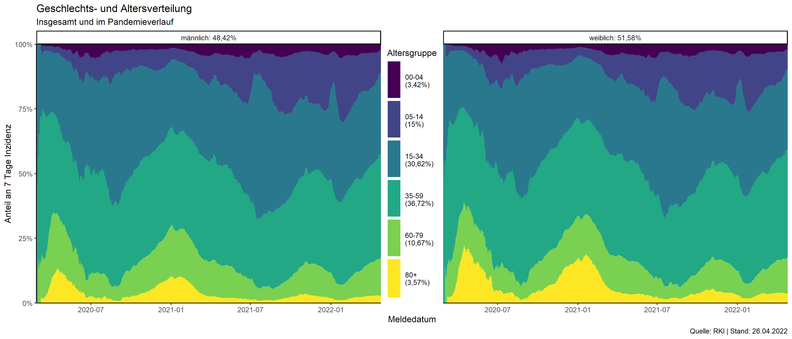

# COVID-19 Infektionen in Deutschland
Das Robert-Koch Institut veröffentlicht seit Anfang März 2020 
auf ihrer [Website](https://www.rki.de/DE/Content/InfAZ/N/Neuartiges_Coronavirus/Fallzahlen.html) tagesaktuell die Anzahl an bekannten Corona-infizierten, aufgeschlüsselt nach Bundesland.
Bis die Daten historiesiert zur Verfügung gestellt wurden, diente dieses Repo dazu, die Tabelle der Website täglich to archivieren. Da dies nicht mehr benötigt wird, wurden die entsprechenden Dateien entfernt.

Stattdessen dient das script dazu, einige grafische Aufarbeitungen der RKI-Daten bereit zu stellen. Der Funktionsumfang kann ggf. erweitert werden. Genutzt werden dabei folgende Daten:
- [RKI Datenhub Covid19](https://npgeo-corona-npgeo-de.hub.arcgis.com/datasets/dd4580c810204019a7b8eb3e0b329dd6_0) für tägliche Infektionen und Todesfälle
- [RKI Impfmonitoring](https://github.com/robert-koch-institut/COVID-19-Impfungen_in_Deutschland) für Impfquoten
- [DIVI Intensivregister](https://www.intensivregister.de/#/aktuelle-lage/downloads) für Belastung der Intensivstationen
- [ESRI Kreisgrenzen](https://npgeo-corona-npgeo-de.hub.arcgis.com/datasets/esri-de-content::kreisgrenzen-2019/explore?location=51.164254%2C10.454033%2C7.21) zur Kartendarstellung

## Grafiken
Montalich wird ein GIF animiert, welche mehrere Visualisierungen im Zeitverlauf darstellt:
- die 7-Tage Inzidenz des Corona-Virus nach Landkreisen[^1][^2]
- die Todesfälle nach Kalenderwoche[^3] 
- die Impfquote nach Bundesländern[^4]
- die Auslastung der Intensivstationen

[^1]: Landkreise mit Inzendenz < 4/100.000EW werden grau dargestellt
[^2]: Bezirke Berlins wurden zusammengefasst
[^3]: Für 2020 wurden die KW53 und KW52 zusammengefasst
[^4]: J&J hat keine Zweitimpfung
